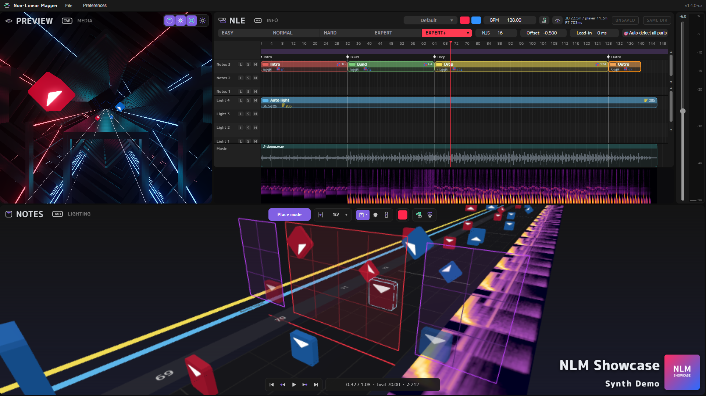

# Non-Linear Mapper (NLM) — Oz-Co2 edition

A map editor for Beat Saber. It runs as a desktop app on Windows (pywebview + WebView2).

日本語: [README.md](README.md)



## What is this

This repository is a fork of **Non-Linear Mapper 0.8 beta** by [helba](https://helba.flashhub.net/nlm/).
helba kindly gave permission (in the comments on note) to publish, modify and redistribute it as this fork.

- **Original / official site**: https://helba.flashhub.net/nlm/ (Japanese)
- **Reference manual**: https://helba.flashhub.net/nlm/manual/ (Japanese)
- **Original changelog**: https://helba.flashhub.net/nlm/changelog.html (Japanese)
- **Tutorials for this fork** (with screenshots): [basic](docs/tutorial.en.md) — from loading a song to placing notes, exporting and saving /
  [advanced](docs/tutorial-advanced.en.md) — faster workflows, tempo, lights, the INFO screen and the checks before publishing

The screenshots in the tutorials still show the Japanese UI for now; English screenshots will be added later.

## Highlights

- **Video-editor-style timeline (NLE)**: notes and lights are stored in clips on lanes, so you can split, copy, move and mirror whole sections of a map.
  Markers, tempo parts (BPM changes), the waveform and a spectrogram are shown on the same timeline.
- **3D placement view** and a **game-like 3D preview** with the environment and lights (ported from [ArcViewer](https://github.com/AllPoland/ArcViewer/))
- **INFO screen**: song info, difficulties, cover image, the song select preview section and export settings are connected as nodes
- **Map check (BeatLeader criteria)**: a port of [BS Map Check](https://github.com/KivalEvan/BeatSaber-MapCheck) by Kival Evan (BeatLeader preset).
  Click a beat in the results to jump to those notes.
- **NLM BL criteria list**: NLM's own checklist that follows the written BeatLeader Ranking Criteria in their numbered order.
  It is only a guide, not an official judgement.
- **Estimate difficulty (approx. BeatLeader stars)**: shows ★ and Pass / Tech / Acc with the optional plugin [nlm-rating](https://github.com/Oz-Co-two/nlm-rating).
  The values are approximations and this is **not an official BeatLeader tool**.
- **Auto lighting**: generates basic vanilla lights from your notes on a new lane, so your own lights are kept
- **Cover image fix**: makes the cover square / at least 256×256 / png when exporting, without changing the original file
- **song.egg export**: converts non-OGG audio with ffmpeg and writes the lead-in silence and the Music clip placement into the audio
- **In-app updates** (from v1.3.0-oz)

See [CHANGELOG.en.md](CHANGELOG.en.md) for the changes in each version.

## Installation and updates

### Installation

1. Download the latest `NonLinearMapper-v〇.〇.〇-oz.zip` from [Releases](https://github.com/Oz-Co-two/nlm-oz-co2/releases)
2. Extract it to a place you can write to (Desktop, Documents, etc.)
3. Run `NonLinearMapper.exe` (it needs the `_internal` folder next to it)

The exe is not code-signed, so Windows SmartScreen may show "Windows protected your PC" on the first launch.
In that case, click "More info" → "Run anyway".

On the first launch, `config/` (preferences), `asset/` (clips you saved with "Save to assets") and `lang/` (translations)
are created next to the exe.

### Switching the UI to English

**The UI starts in Japanese.** Click **環境設定** (Preferences — the second menu at the top left, next to ファイル),
and on the first tab change **言語 / Language** to **English**. The setting is kept for the next launch.

### ffmpeg (needed to write song.egg)

To export song.egg from audio that is not OGG (and to write the lead-in silence into the audio), `ffmpeg` must be on the PATH.
**It is not installed automatically**, so install it beforehand:

```bash
winget install Gyan.FFmpeg
```

If ffmpeg is missing when you export, NLM shows how to install it.
If you install it while NLM is running, close NLM and start it again (NLM looks for ffmpeg when it starts).

### Updating

**From v1.3.0-oz on, you can update inside the app.** When a new version is available, its headlines are shown at startup;
choose "Update" and the app downloads it and restarts. You can also use "Check for updates…" in the File menu.

- `config/`, `asset/`, `lang/` and `plugins/` (preferences, clips, translations, plugins) are kept; only `NonLinearMapper.exe` and `_internal/` are replaced.
- The previous version is kept (one generation only) in `_previous_<version>` next to the exe. If something goes wrong with the new version,
  close the app and copy `NonLinearMapper.exe` and `_internal` from that folder back to the original place (you can delete the folder if you don't need it).
- If you choose "Don't update", you won't be notified at startup again until an even newer version comes out. The startup check can be turned off in Preferences.
- If the app folder is not writable (for example under Program Files), it cannot update itself; use the manual steps below.

To update manually (or from v1.2.0-oz or earlier):

1. Close the app
2. Back up the folder you are using now (copy the whole folder)
3. Download the new zip and extract it **to a different place from your current folder**
   (extracting over the old folder can leave old files behind and cause problems)
4. Copy these folders from the old folder to the new one (next to `NonLinearMapper.exe`):
   - `config/` … preferences, shortcut assignments, etc.
   - `asset/` … clips saved with right-click → "Save to assets" in the NLE (not needed if you never saved any)
   - `lang/` … only if you edited a translation file yourself
5. Start the new `NonLinearMapper.exe` and check that the version in the window title and at the top right of the screen is the new one
   (opening `.nlmf` files by double-click switches to the new exe automatically when it starts)
6. If everything works, you can delete the old folder

Project files (`.nlmf`) are saved wherever you chose, separately from the app folder, so they are not affected.
Projects saved with a newer version can be opened with an older version, but settings of features added in the newer version are ignored.

When updating from v1.1.0-oz or earlier to v1.2.0-oz or later, select the export folder of each existing project once again with
"Reconnect output folder / cover image" (see [v1.2.0-oz in the CHANGELOG](CHANGELOG.en.md#v120-oz)).

## Feedback

Bug reports and suggestions are welcome on [GitHub Issues](https://github.com/Oz-Co-two/nlm-oz-co2/issues) (English is fine).
The author is a Japanese speaker and uses translation, so replies may take a while.

## License

Released under the **GNU General Public License v3.0 (GPLv3)**. See [LICENSE](LICENSE) for details.

GPLv3 (rather than MIT) was chosen because the 3D preview engine (`preview-v4/`) contains a port (code and environment scene data)
of the Beat Saber map viewer [ArcViewer](https://github.com/AllPoland/ArcViewer/) by AllPoland, which is released under GPLv3.
Because GPLv3 is a copyleft license, the whole project, which includes that part, is released under GPLv3.

The full license texts of bundled third-party components (three.js, pywebview, etc.) are in [THIRD_PARTY_NOTICES.txt](THIRD_PARTY_NOTICES.txt).
The map check (BeatLeader criteria) is a port of [BS Map Check](https://github.com/KivalEvan/BeatSaber-MapCheck) (MIT) by Kival Evan.

The add-on plugin [nlm-rating](https://github.com/Oz-Co-two/nlm-rating) used by "Estimate difficulty" is a separate program (MIT) that is not included in NLM.
It uses BeatLeader's [RatingAPI](https://github.com/BeatLeader/RatingAPI) and [beatleader-analyzer](https://github.com/BeatLeader/beatleader-analyzer) (MIT).

- Original author: [helba](https://helba.flashhub.net/nlm/)
- Improvements in this fork: Oz-Co2

## Building and running from source

The development notes ([CLAUDE.md](CLAUDE.md), Japanese) describe the build steps and the internals in detail. In short:

```bash
# Development venv (Python 3.14; 3.15 or later is not supported yet because of pythonnet)
py -3.14 -m venv .venv-build
.venv-build/Scripts/python -m pip install pywebview pythonnet pyinstaller

# Build
.venv-build/Scripts/python -m PyInstaller --noconfirm --clean nlm.spec
# → NonLinearMapper.exe + _internal/ are written to dist/NonLinearMapper/
```

For quick checks during development, start the local server with `python serve.py` and open
`http://127.0.0.1:8138/editor.html` in your browser (DevTools are available).

- Opening the page with `?dev=1` in the URL enables the developer hooks (`window._dbg` / `window._dbgApp`) in the DevTools console.
  They are not created in the distributed exe or without `?dev=1`.

`tools/` contains scripts used during development (tempo / beat grid analysis, build and deploy, JS syntax check, automated tests,
map check comparison tests, release file creation, tutorial screenshots). They are not meant for regular users,
and their documentation ([tools/README.md](tools/README.md), [tests/README.md](tests/README.md)) is in Japanese.

## Using it on Linux and other non-Windows systems (for reference, untested)

> **This section is for reference only.** The author does not have Linux or similar environments and **has not tested any of this**.
> It describes what should probably work technically. If something does not work, the author basically cannot help.
> The source code is published under GPLv3, so please fork and modify it yourself if you need to.
> There is no plan for official support at the moment, but to gauge interest, please comment or react (👍 etc.) on
> [Issue #1 "Linux support"](https://github.com/Oz-Co-two/nlm-oz-co2/issues/1).

The desktop version (exe) is Windows only. On Linux, pywebview (used to make it a desktop app) does not work well with the
File System Access API that the editor relies on, and replacing all of it with native dialogs would take work.

Instead, **running the local server and opening the editor in a browser** should work with the current code.
**No build is needed**, and no extra pip packages are required.

```bash
git clone https://github.com/Oz-Co-two/nlm-oz-co2.git
cd nlm-oz-co2
python3 serve.py
```

Then open `http://127.0.0.1:8138/editor.html` in Chrome, Chromium or Edge. Press `Ctrl+C` in the terminal to stop it.

**Things to note (expected)**

- **A Chromium-based browser is required.** Firefox lacks the required API, so files cannot be saved or loaded.
  Brave may also have the API disabled depending on its settings.
- **ffmpeg** is needed to export `song.egg` (install it with `sudo apt install ffmpeg` etc.; not needed if your audio is OGG).
- **Limitations**: automatic reconnection of the output folder and cover image is desktop-only. In the browser you need to select them
  again each time you open a project.
- **"Estimate difficulty" is not available**, because the add-on plugin (nlm-rating) is a Windows exe only.
- **Keep the terminal open.** Closing it stops the server. Opening `editor.html` directly with `file://` does not work either.
- **Where things are saved**: preferences and clips saved with "Save to assets" go to `config/` and `asset/` in the cloned folder.
- Only access via `127.0.0.1` / `localhost` is accepted. If you get "403 Forbidden" when accessing it by another name,
  see Troubleshooting below.

## Troubleshooting

### "403 Forbidden" when using the editor started with `python serve.py`

For safety, the local server only accepts access by the names `127.0.0.1` / `localhost` / `[::1]`
(to prevent other websites from reading and writing through it). If you access it by another name through Docker or WSL port forwarding,
a reverse proxy, etc., set the allowed names, comma-separated, in the environment variable `NLM_ALLOWED_HOSTS`.

```bash
NLM_ALLOWED_HOSTS=nlm.local,192.168.0.10 python serve.py
```

### "Failed to resolve Python.Runtime.Loader.Initialize from ...\Python.Runtime.dll" at startup

When you download the zip with a web browser, Windows marks it as "downloaded from the internet" (Mark of the Web).
The mark is carried over to the DLLs when you extract it with Explorer, and the .NET runtime may refuse to load them.

**The app removes this mark automatically at startup, so this normally does not happen.** If it still happens, remove it manually:

1. Right-click the downloaded zip and open "Properties"
2. At the bottom of the "General" tab, check "Unblock" and click OK
3. Extract the unblocked zip again and start the app
