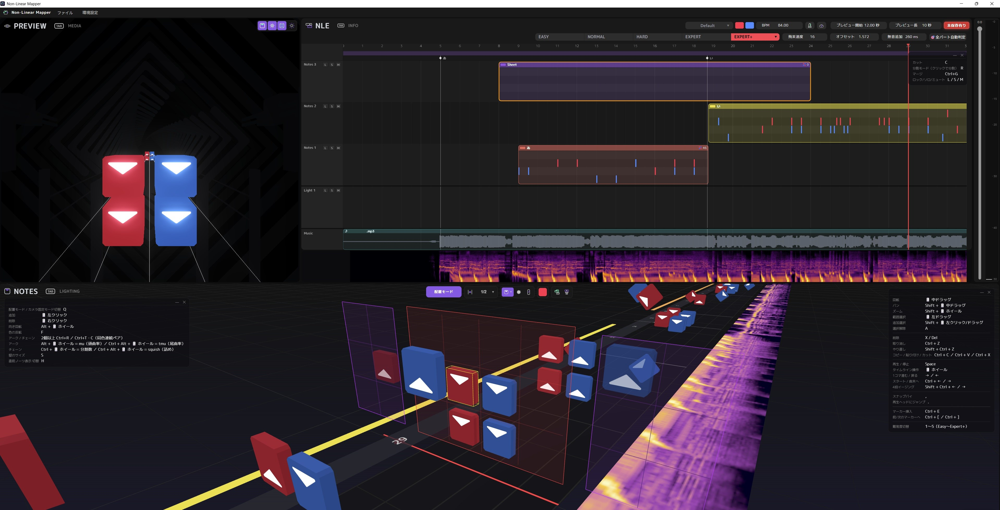

# Non-Linear Mapper (NLM) — Oz-Co2版

Beat Saber の譜面エディタです。デスクトップアプリ（Windows / pywebview + WebView2）として動作します。

English: [README.en.md](README.en.md)



## これは何か

このリポジトリは、[helba](https://helba.flashhub.net/nlm/) さんが開発された **Non-Linear Mapper 0.8 beta**
の派生版（フォーク）です。

はじめて使う方は、まず **[チュートリアル](docs/tutorial.md)** をどうぞ。曲の読み込みからノーツ配置、
Beat Saber で遊べる形への書き出し・保存までを、画像付きで順番に説明しています。
慣れてきたら **[上級編チュートリアル](docs/tutorial-advanced.md)** もどうぞ。作業を速くする操作や、公開前のチェック・★の測定などを説明しています。
各パネルの細かい操作は、原作サイトのリファレンスマニュアルが詳しいです。

- **チュートリアル（画像付き・基本の流れ）**: [docs/tutorial.md](docs/tutorial.md)
- **上級編チュートリアル（作業を速くする操作・公開前のチェック・★の測定など）**: [docs/tutorial-advanced.md](docs/tutorial-advanced.md)
- **原作 / 公式ドキュメント**: https://helba.flashhub.net/nlm/
- **リファレンスマニュアル**: https://helba.flashhub.net/nlm/manual/
- **原作の修正履歴**: https://helba.flashhub.net/nlm/changelog.html

note のコメント欄にて helba さんご本人から、本フォークとしての公開・改変・再配布について
快諾をいただいています。

## インストール・アップデート

### インストール

1. [Releases](https://github.com/Oz-Co-two/nlm-oz-co2/releases) から最新の `NonLinearMapper-v〇.〇.〇-oz.zip` をダウンロード
2. 書き込みできる場所（デスクトップやドキュメントなど）に展開する
3. `NonLinearMapper.exe` を起動する（`_internal` フォルダとセットで動きます）

初回起動時に、exe と同じフォルダへ `config/`（環境設定）・`asset/`（「アセットへ保存」したクリップ）・`lang/`（翻訳）が作られます。

### アップデート（旧バージョンからの更新）

**v1.3.0-oz 以降はアプリ内から更新できます。** 起動時に新しいバージョンが出ていれば更新内容が表示されるので、
「更新する」を選ぶとダウンロード後にアプリが再起動して更新されます（ファイルメニューの「更新を確認…」からも確認できます）。

- `config/`・`asset/`・`lang/`・`plugins/`（環境設定・クリップ・翻訳・プラグイン）はそのまま残り、`NonLinearMapper.exe` と `_internal/` だけが入れ替わります。
- 入れ替える前の版は exe と同じフォルダの `_previous_<版>` に 1 世代だけ残ります。新しい版で問題があった時は、
  アプリを閉じてから、その中の `NonLinearMapper.exe` と `_internal` を元の場所へ戻せば前の版に戻せます（不要なら削除して構いません）。
- 「更新しない」を選んだ版は、それより新しい版が出るまで起動時には知らせません。起動時の確認は環境設定で OFF にできます。
- アプリのフォルダに書き込めない場所（Program Files など）に置いている場合は自動では更新できないので、下の手順で更新してください。

v1.2.0-oz 以前からの更新や、手動で更新する場合は次の手順です。
環境設定と、「アセットへ保存」したクリップ（ノーツ・ライトの配置パターン）は exe と同じフォルダに保存されているので、それを新しいフォルダへ移します。
プロジェクトファイル（`.nlmf`）は各自が保存した場所にあり、アプリのフォルダとは別なので影響しません。

1. アプリを閉じる
2. 念のため、今使っているフォルダをまるごとコピーしてバックアップしておく
3. 新しい zip をダウンロードし、**今のフォルダとは別の場所**に展開する
   （古いフォルダへ上書き展開すると、古いファイルが残って不具合の原因になることがあります）
4. 古いフォルダから次のフォルダを、新しいフォルダ（`NonLinearMapper.exe` と同じ場所）へコピーする
   - `config/` … 環境設定・ショートカットの割り当てなど
   - `asset/` … NLE のクリップを右クリック→「アセットへ保存」したもの（保存したことがなければ同梱の見本だけなので不要）
   - `lang/` … 翻訳ファイルを自分で編集した場合のみ（編集していなければ不要）
5. 新しいフォルダの `NonLinearMapper.exe` を起動し、ウィンドウのタイトルや画面右上の版番号が新しくなっていることを確認する
   （`.nlmf` のダブルクリックで開く設定も、起動時に新しい exe へ自動で切り替わります）
6. 問題なく使えたら、古いフォルダは削除して構いません

v1.1.0-oz 以前から v1.2.0-oz 以降へ更新した場合は、既存プロジェクトの書き出し先フォルダを最初の1回だけ
「🔌 出力フォルダ/カバー画像を再接続」で選び直す必要があります（[CHANGELOG の v1.2.0-oz](CHANGELOG.md#v120-oz)を参照）。

新しいバージョンで保存したプロジェクトを古いバージョンで開くこともできますが、新しいバージョンで
追加された機能の設定は無視されます。

## このフォークでの変更点

原作からの主な変更点は、版ごとに [CHANGELOG.md](CHANGELOG.md)（English: [CHANGELOG.en.md](CHANGELOG.en.md)）にまとめています。
基本操作は上記の[チュートリアル](docs/tutorial.md)・[上級編チュートリアル](docs/tutorial-advanced.md)と原作マニュアルを参照してください。

### 開発用ツール（`tools/`）

一般利用者向けではありませんが、開発時に使うスクリプトを同梱しています。

- テンポ・拍グリッド解析ツール一式（MP3 のテンポ変化検出、NLM に設定する BPM／無音追加の
  逆算）。詳細は [tools/README.md](tools/README.md) を参照
- ビルド＆配布フォルダ反映スクリプト（`build_and_deploy.py`）
- JS 構文・初期ロードチェックツール（`check_js.py`、Node.js 不使用のためヘッドレス Edge で検証）
- 自動検証ツール（`cdp.py`）とテスト素材（`fixtures/`）: ヘッドレス Edge でエディタを実際に操作・撮影して確認する
- テスト一式（`run_tests.py` と `tests/`）: エディタを実際に操作して、基本の機能が壊れていないか・書き出しの中身や画面が
  変わっていないかを自動で確かめる（追加ライブラリ不要。使い方は [tests/README.md](tests/README.md)）
- 譜面チェックの突き合わせテスト（`mapcheck_difftest.py`）: 譜面チェック（BeatLeader基準）が原作 BS Map Check と同じ結果になるかを確認する
- NLM版 BeatLeader評価リストの自己テスト（`blcriteria_test.py`）: 基準の違反を1つずつ仕込んだ譜面で、該当項目が指摘されるかを確認する
- リリース用ファイルの作成（`make_release.py`）: 配布 zip と、アプリ内の自動更新が読む `update.json` を作る
- 自動更新の自己テスト（`update_test.py`）: ローカルの偽の配布元で、確認・ダウンロード・照合・差し替え・復元を通しで確かめる
- チュートリアルの画像の撮影（`make_tutorial_shots.py`・`make_advanced_shots.py`）: エディタを実際に操作して、基本編・上級編の画像を撮り直す

## ライセンス

**GNU General Public License v3.0 (GPLv3)** で公開しています。詳細は [LICENSE](LICENSE) を
参照してください。

MIT ではなく GPLv3 を選んだ理由は、3D プレビュー描画エンジン（`preview-v4/`）が、GPLv3 で
公開されている Beat Saber 譜面ビューア [ArcViewer](https://github.com/AllPoland/ArcViewer/)
（AllPoland 作）の移植（コードおよび環境シーンデータ）を含むためです。GPLv3 はコピーレフト
ライセンスのため、この部分を含むプロジェクト全体を GPLv3 としています。

同梱する第三者コンポーネント（three.js、pywebview 等）のライセンス全文は
[THIRD_PARTY_NOTICES.txt](THIRD_PARTY_NOTICES.txt) を参照してください。譜面チェック（BeatLeader基準）は
Kival Evan 作の [BS Map Check](https://github.com/KivalEvan/BeatSaber-MapCheck)（MIT）の移植です。

「難易度を測る」で使う追加プラグイン [nlm-rating](https://github.com/Oz-Co-two/nlm-rating) は NLM 本体に含まれない
別配布のプログラム（MIT）で、BeatLeader の [RatingAPI](https://github.com/BeatLeader/RatingAPI)・
[beatleader-analyzer](https://github.com/BeatLeader/beatleader-analyzer)（MIT）を使っています。

- 原作者: [helba](https://helba.flashhub.net/nlm/)
- 本フォークでの改良: Oz-Co2

## ビルド・実行

開発メモ（[CLAUDE.md](CLAUDE.md)）にビルド手順や内部実装の詳細をまとめています。要点のみ:

```bash
# 開発用venv（Python 3.14。pythonnet の対応範囲の都合で 3.15 以降は未対応）
py -3.14 -m venv .venv-build
.venv-build/Scripts/python -m pip install pywebview pythonnet pyinstaller

# ビルド
.venv-build/Scripts/python -m PyInstaller --noconfirm --clean nlm.spec
# → dist/NonLinearMapper/ に NonLinearMapper.exe + _internal/ が出力されます
```

開発中の動作確認は `python serve.py` でローカルサーバーを起動し、ブラウザで
`http://127.0.0.1:8138/editor.html` を開く方法が手早く確認できます（DevTools が使えます）。

- URL に `?dev=1` を付けて開くと、DevTools のコンソールから開発用の窓口（`window._dbg` / `window._dbgApp`）が
  使えます。配布版（exe）と `?dev=1` なしの通常利用では作られません。
- 自動検証ツール（ヘッドレス Edge での撮影・操作）は [tools/README.md](tools/README.md) を参照してください。

### ffmpeg（song.egg 変換に必要）

song.egg への書き出し（OGG 以外の音源の変換、無音追加の焼き込み）には、PATH 上に
`ffmpeg` が必要です。**自動ではインストールされない**ため、事前に導入しておいてください。

```bash
winget install Gyan.FFmpeg
```

未インストールのまま書き出すと、エラーメッセージでインストール方法が案内されます。
NLM を起動したままインストールした場合は、NLM を一度閉じて起動し直してください（起動時の設定で ffmpeg を探すため）。

## Linux など Windows 以外での利用（参考情報・動作未確認）

> **この節は参考情報です。** 作者は Linux 等の環境を持っておらず、**動作確認をしていません**。
> 下記は「技術的にはおそらく動くはず」という見込みを整理したものです。
> 不具合が出ても、基本的に作者側での対応はできません。本プロジェクトは GPLv3 でソースコードを
> 公開していますので、必要な方はご自身でフォーク・改修していただけると助かります。
> 公式対応の予定は現時点でありませんが、需要の把握のため、希望される方は
> [Issue #1「Linux 対応について」](https://github.com/Oz-Co-two/nlm-oz-co2/issues/1)
> にコメントやリアクション（👍など）をお寄せください。

デスクトップ版（exe）は Windows 専用です。デスクトップアプリ化に使っている pywebview の Linux 環境では、
エディタが多用している File System Access API との相性に問題があり、すべてをネイティブのダイアログへ
置き換えるには作業が必要なためです。

代わりに、**ローカルサーバーを起動してブラウザからアクセスする形**であれば、今のコードのままで
動く見込みです。**ビルドは不要**で、追加の pip パッケージも要りません。

```bash
git clone https://github.com/Oz-Co-two/nlm-oz-co2.git
cd nlm-oz-co2
python3 serve.py
```

起動したら、Chrome / Chromium / Edge のいずれかで `http://127.0.0.1:8138/editor.html` を開きます。
終了するときはターミナルで `Ctrl+C` を押してください。

**注意点（見込み）**

- **Chromium 系ブラウザが必要です。** Firefox には必要な API がないため、ファイルの保存・読込ができません。
  Brave も設定によっては API が無効になっている場合があります。
- **ffmpeg**: `song.egg` の書き出しに必要です（`sudo apt install ffmpeg` などで導入。元の音源が OGG なら不要）。
- **機能の制限**: 出力フォルダやカバー画像の「自動再接続」はデスクトップ版専用です。ブラウザでは、
  プロジェクトを開くたびに選び直す必要があります。
- **「難易度を測る」は使えません。** 追加プラグイン（nlm-rating）が Windows 用の exe しか無いためです。
- **ターミナルは開いたままにしてください。** 閉じるとサーバーが止まります。また、`file://` で
  `editor.html` を直接開いても動きません。
- **保存場所**: 環境設定と「アセットへ保存」したクリップは、クローンしたフォルダ内の `config/` と `asset/` に保存されます。
- アクセスは `127.0.0.1` / `localhost` からのみ受け付けます。別の名前でアクセスして「403 Forbidden」に
  なる場合は、下のトラブルシューティングを参照してください。

## トラブルシューティング

### `python serve.py` で起動したエディタが「403 Forbidden」になる

ローカルサーバーは、安全のため `127.0.0.1` / `localhost` / `[::1]` という名前でのアクセスだけを受け付けます
（他の Web サイトからの不正な読み書きを防ぐため）。Docker や WSL のポート転送、リバースプロキシなどを通して
別の名前でアクセスしている場合は、環境変数 `NLM_ALLOWED_HOSTS` に許可する名前をカンマ区切りで指定してください。

```bash
NLM_ALLOWED_HOSTS=nlm.local,192.168.0.10 python serve.py
```

### 起動時に "Failed to resolve Python.Runtime.Loader.Initialize from ...\Python.Runtime.dll" と出る

配布 ZIP を Web ブラウザでダウンロードすると、Windows が「インターネットから来たファイル」の
印（Mark of the Web）を付けます。これがエクスプローラーで展開した後の DLL にも引き継がれ、
.NET ランタイムが DLL のロードを拒否してしまうことがあります。

**起動時に自動でこの印を取り除く処理を入れているため、通常は発生しません。** それでも直らない
場合は、以下の手順で手動解除してください。

1. ダウンロードした ZIP を右クリックし「プロパティ」を開く
2. 「全般」タブの一番下、「許可する（ブロック解除）」にチェックを入れて OK
3. 解除した ZIP を再度展開し直してから起動する
