[日本語](tutorial-advanced.md) | **English**

# Tutorial (advanced): faster work and maps ready to publish

For those who have finished the [basic tutorial](tutorial.en.md). This tutorial explains faster ways to work,
the checks before publishing a map, and how to measure the difficulty (★).

> The screenshots show the English UI (v1.4.1-oz). The numbers (①, ②, …) in the screenshots match the tables in the text.

## Contents

1. [Working faster](#1-working-faster)
2. [Displays that help placement](#2-displays-that-help-placement)
3. [Making the most of the NLE](#3-making-the-most-of-the-nle)
4. [Making several difficulties efficiently](#4-making-several-difficulties-efficiently)
5. [Songs with tempo changes, and fixing beat offsets](#5-songs-with-tempo-changes-and-fixing-beat-offsets)
6. [Advanced lighting](#6-advanced-lighting)
7. [More about the INFO nodes](#7-more-about-the-info-nodes)
8. [Checks before publishing](#8-checks-before-publishing)
9. [Customizing the settings](#9-customizing-the-settings)
10. [Troubleshooting](#10-troubleshooting)

---

## 1. Working faster

### Moving in time

| Action | What it does |
|---|---|
| **← / →**, wheel | Move forward / back by the snap (1/2 beat, etc.) |
| **Shift + Ctrl + ← / →** | Move smoothly by 4 beats |
| **Ctrl + ← / →** | Jump to the start / end of the song |
| **.** (period) | Bring the view back to the playhead (the current beat) |

"**.**" is handy when the current beat has gone off screen while you moved the view in Camera-lock mode.
In the 3D view it moves the view to the current beat while keeping the camera angle.
In the NLE it scrolls so that the current beat is in the center.

### Changing the snap quickly

Press the **"," (comma) key** to open a circular menu (pie menu) for choosing the snap (how far each step moves).
You can switch to a finer snap only while placing 1/4-beat patterns, without moving the mouse to the toolbar.

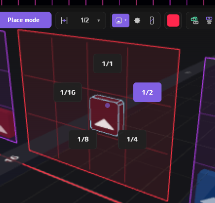

Hold the key, move the mouse toward the item you want, and release the key to choose it.

In the same way, the **W key** opens a pie menu to choose select / note / bomb / wall.

### Editing selected notes without leaving Place mode

Even in Place mode, **point at the selected notes** and press the following keys to edit all selected notes at once.
This saves switching to Camera-lock mode.

| Action | What it does |
|---|---|
| **F** | Swap the color (red ⇄ blue) |
| **Alt + wheel** | Rotate the cut direction |
| **D** | Make them dot notes (no direction) |

When the mouse is not over the selected notes, these change the color / direction of the note you are about to place (the brush), as before.

**Alt + wheel** rotates only through the 8 arrow directions, without the dot.
So when you rotate several selected notes together, their relative directions (for example, left-right symmetry) are kept.
Use the **D key** to make dot notes. Pressing D for the brush switches between the dot and the last arrow direction.

### Fine-tuning the shape of arcs and chains

With an arc or chain selected, combine the wheel with these keys to change its shape.

| Target | Action | What changes |
|---|---|---|
| Arc | **Alt + wheel** | How much the head curves |
| Arc | **Ctrl + Alt + wheel** | How much the tail curves |
| Chain | **Shift + wheel** | Number of slices (links) |
| Chain | **Ctrl + Alt + wheel** | Squish (how far the links are pulled toward the head) |

### Marking sections of the song with markers

**Ctrl + E** places a marker at the mouse position (or at the current beat if the mouse is not over the timeline).
If you put markers at the start of choruses and breaks, you can jump to the previous / next marker with **Ctrl + [ / Ctrl + ]**.

In the top row of the NLE (the marker band), you can drag markers to move them and double-click a name to rename it.
Right-click a marker to also:

- **▶ Set as song preview start**: make the marker position the start of the part played on the song select screen
- Rename / delete it

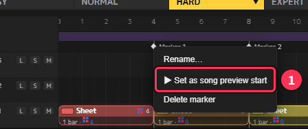

You can also right-click a clip in the NLE → "**Cut at markers**" to split the clip at every marker inside it ([chapter 3](#3-making-the-most-of-the-nle)).

### Customizing shortcuts

You can change the key assignments in the **Shortcuts** tab of **Preferences**.

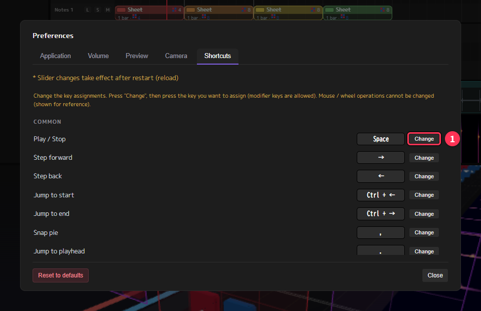

1. Press the **Change** button of the action you want to change
2. Press the new key (combinations with Ctrl, Alt and Shift are possible). Press Esc to cancel

- If the key is already used by another action, its frame turns red to let you know
- Changed actions get a **Default** button so you can reset them one by one. **Reset all to default** resets them all at once
- Only keyboard actions can be changed (mouse and wheel actions cannot)
- The assignments are saved with your preferences, so they are kept after restarting the app

<!-- chapter-nav -->
> **Go to chapter:** [1. Working faster](#1-working-faster) ｜ [2. Displays that help placement](#2-displays-that-help-placement) ｜ [3. Making the most of the NLE](#3-making-the-most-of-the-nle) ｜ [4. Making several difficulties efficiently](#4-making-several-difficulties-efficiently) ｜ [5. Songs with tempo changes, and fixing beat offsets](#5-songs-with-tempo-changes-and-fixing-beat-offsets) ｜ [6. Advanced lighting](#6-advanced-lighting) ｜ [7. More about the INFO nodes](#7-more-about-the-info-nodes) ｜ [8. Checks before publishing](#8-checks-before-publishing) ｜ [9. Customizing the settings](#9-customizing-the-settings) ｜ [10. Troubleshooting](#10-troubleshooting) ｜ [▲ Contents](#contents)
<!-- /chapter-nav -->

---

## 2. Displays that help placement

These displays help you decide "which way the next swing goes" and "whether the speed is comfortable to play" while placing notes.

### Previous notes display

Outside the placement frame (the red frame in Place mode, the yellow frame in Camera-lock mode), **to its left and right**, there are helper grids
that show the **last red and blue notes you placed**, with their position and direction, semi-transparently.

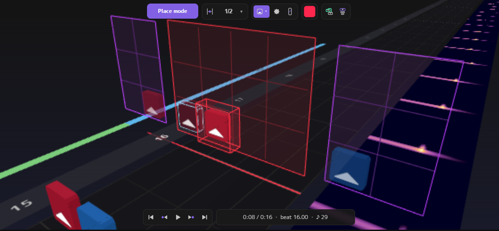

In the image, the left purple frame shows the previous red note (up), and the right purple frame shows the previous blue note.
The note inside the red frame in the middle was placed facing up, the same as the previous red note, so it has the red frame of the "Same-direction warning" described next.

Use it to choose a direction that swings back naturally from the previous note. For example, if the previous blue note was down, the next blue note is naturally up.

- Toggle it with the **H key** (or **Previous notes display** in Preferences)
- When the previous red and blue notes are on the same cell, both are drawn smaller and split diagonally (red = top left, blue = bottom right)

### Same-direction warning

When you place a note whose **cut direction is within 45° of the previous or next note of the same color**, you are told in three ways.
Swinging the same way twice in a row means you cannot swing back, and the flow after it breaks.

- The note gets a **red frame**
- The **SAME DIR** lamp at the top of the screen lights up
- A short warning sound plays

The red frame is on the middle note in the image above, and the lamp is ② in the image in "JD / RT display" below.

Which note gets the red frame:

- When it matches the direction of the previous note, **the note you just placed**
- When it matches the direction of the next note, **the next note** (for example, when you re-placed a note in the middle)

**Click the lamp to jump to the first note with a red frame.**
The red frames and the lamp disappear automatically when you fix the direction or delete the note.

It is not checked in these cases (they are usually intended):

- Dot notes
- Notes less than 1/5 beat apart (treated as one swing, like sliders)
- A bomb between them (treated as a bomb reset)

A chain is treated as one swing from its head to its tail, in the head's direction.

When you rotate selected notes with Alt + wheel or swap their color with F, nothing sounds while you rotate;
they are checked together **when you deselect them**.

If you don't need the warning, turn off **Same-direction warning** in Preferences.

> This warning is a rough guide while placing and is not as strict as the map check in [chapter 8](#8-checks-before-publishing).
> Use the map check before publishing as well.

### JD / RT display

To the right of the BPM field in the header, three values related to how notes appear are shown.

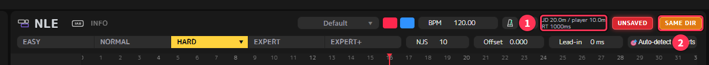

| Display | Meaning |
|---|---|
| **JD** (m) | The distance from where notes appear to where they disappear |
| **player** (m) | The distance from where notes appear to the player position (half of JD) |
| **RT** (ms) | The time from when notes appear until they reach the player position (reaction time) |

They are calculated from BPM, NJS and offset with the same formula as Beat Saber.
This field is display only. To change the values, adjust **NJS** or **Offset** in the header.

- The shorter the RT, the more suddenly notes seem to appear. The longer it is, the earlier you can see them and the easier they are to read, but more notes are on screen at once
- NJS and offset are per difficulty, so the values change when you switch difficulties
- The calculation uses the base BPM of Info.dat (changing the BPM partway with tempo parts does not change this display)

### Spectrogram (frequency display)

When you load a song, the strength of each frequency is shown as a colored band (weak → strong: black → purple → red → orange → white).

- **NLE**: below the waveform in the Music row
- **3D view**: outside the space where you place notes

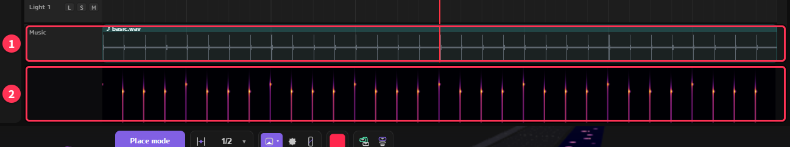

The song in the image is a click track made for the explanation, so vertical lines appear on every beat. In a real song, the whole band gets brighter where the song builds up.

Thick parts like the chorus look bright and quiet parts look dark, so you can grasp the structure of the song at a glance.
It helps you decide where to make the notes dense and where to give the player a rest.

<!-- chapter-nav -->
> **Go to chapter:** [1. Working faster](#1-working-faster) ｜ [2. Displays that help placement](#2-displays-that-help-placement) ｜ [3. Making the most of the NLE](#3-making-the-most-of-the-nle) ｜ [4. Making several difficulties efficiently](#4-making-several-difficulties-efficiently) ｜ [5. Songs with tempo changes, and fixing beat offsets](#5-songs-with-tempo-changes-and-fixing-beat-offsets) ｜ [6. Advanced lighting](#6-advanced-lighting) ｜ [7. More about the INFO nodes](#7-more-about-the-info-nodes) ｜ [8. Checks before publishing](#8-checks-before-publishing) ｜ [9. Customizing the settings](#9-customizing-the-settings) ｜ [10. Troubleshooting](#10-troubleshooting) ｜ [▲ Contents](#contents)
<!-- /chapter-nav -->

---

## 3. Making the most of the NLE

The NLE is a timeline where you arrange the map in **clips** (colored bands).
For songs that reuse the same patterns, such as repeated choruses, copying and arranging clips makes the work much faster.

### Parts of the NLE

From top to bottom, these rows are shown.

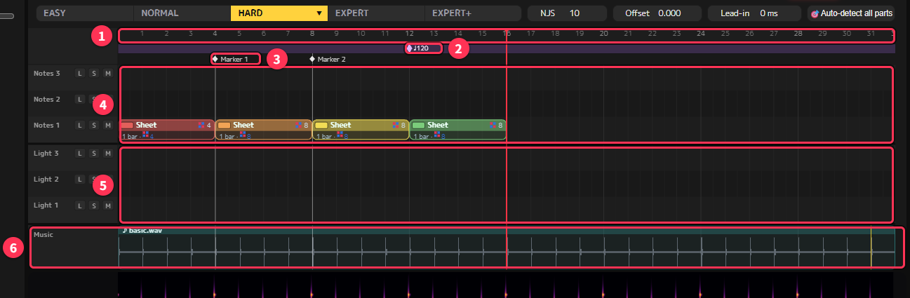

| No. | Row | What you can do |
|---|---|---|
| ① | Number scale (ruler) | Click or drag to move the playback position |
| ② | Tempo part band (purple) | Change the BPM partway through the song ([chapter 5](#5-songs-with-tempo-changes-and-fixing-beat-offsets)). In the image there is a ◆ at beat 12 |
| ③ | Marker band | Move and rename markers ([chapter 1](#marking-sections-of-the-song-with-markers)) |
| ④ | Notes lanes | Clips (colored bands) of notes, bombs, walls, arcs and chains |
| ⑤ | Light lanes | Clips of lights |
| ⑥ | Music | The waveform of the song, with the spectrogram below it |

The **L / S / M** buttons at the left end of each lane are lock, solo and mute (see "Adding lanes, lock, solo and mute" below).

**Clips are separate for each difficulty.** When you switch difficulties, the clips of that difficulty are shown instead.
How to copy content to another difficulty is explained in [chapter 4](#4-making-several-difficulties-efficiently).

### Selecting and moving clips

| Action | What it does |
|---|---|
| **Left-click** a clip | Select it |
| **Shift + left-click** | Add to the selection (click again to remove) |
| **Left-drag** from an empty spot | Select all clips inside the box |
| **A** | Clear the selection |
| **Drag** a clip | Move it (selected clips move together) |
| **Drag the left / right edge** of a clip | Change its length |
| **X / Delete** | Delete |

Clips cannot overlap within the same lane.

### Splitting and joining

| Action | What it does |
|---|---|
| Select a clip, point at the beat where you want to split, and press **C** | Split it there |
| **R** | Split mode on / off. While on, clicking a clip splits it at that position |
| Right-click → "**Cut at markers**" | Split at every marker inside the clip |
| Select two or more and press **Ctrl + G** | Join them into one clip |

- The clip after the split gets "'" added to its name and a different color
- **Ctrl + G** joins note clips with note clips and light clips with light clips, even if they are on different lanes or far apart.
  Notes where the clips overlapped in time stay overlapped, so check them with the map check in [chapter 8](#8-checks-before-publishing)

If you put markers at the sections of the song (such as the start of each chorus) and then use "Cut at markers", the clips are split to match the structure of the song.

### Copy and paste

1. Select clips and press **Ctrl + C** (**Ctrl + X** to cut)
2. Press **Ctrl + V** and the clips to be pasted follow the mouse
3. **Click** where you want to paste them (Esc or right-click to cancel)

If you copy several clips, they are pasted keeping their arrangement.
You can copy only within the difficulty that is open.

### The right-click menu of a clip

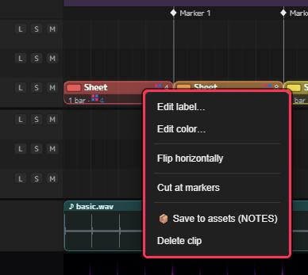

| Item | What it does |
|---|---|
| Edit label… | Rename the clip ("Chorus 1", etc.) |
| Edit color… | Change the color of the clip (you can also click the small color square at the top left of the clip) |
| **Flip horizontally** | Mirror the content left-right and swap red and blue |
| Cut at markers | See "Splitting and joining" above |
| **📦 Save to assets** | See "Assets" below |
| Delete clip | Delete the clip |

Right-click an empty spot to get **Create empty clip** (16 beats) and **Create marker**.

> **Example: making the second chorus**
> Ctrl + C the clip of the first chorus → Ctrl + V at the second chorus → right-click → "Flip horizontally".
> Just swapping the left and right of the same pattern gives the second chorus some variation.

### Adding lanes, lock, solo and mute

Right-click an empty spot at the left end of the lanes to **add or remove a lane at the top**, for notes and for lights.

- Up to 10 lanes
- You can remove a lane only when the top lane is empty (including in the other difficulties)
- The number of lanes is shared by all difficulties

Point at a lane and press one of these keys (or click the buttons at the left end of the lane) to change its state.

| Key | State | What it does |
|---|---|---|
| **L** | Lock | The content is dimmed and cannot be selected or edited in the 3D view |
| **M** | Mute | The content is not shown in the 3D view |
| **S** | Solo | Only that lane is shown in the 3D view |

Mute and solo **only change what is shown**. The export always includes the content of every lane.
Locking the note lanes while making lights prevents you from moving notes by accident.
Lane states are saved with the project.

### The Music clip

Right-click the Music row to create **clips as long as the song** (notes and lights, notes only, or lights only) in one go.
You can also make the whole song in one clip and split it later with "Cut at markers".

You can also select the Music and split it with C, or delete part of it with X / Delete (for example, to cut off the fade-out at the end).
Split Music clips can be joined again by selecting two or more and pressing Ctrl + G.

### Assets (saving patterns to reuse)

Right-click a clip → "**📦 Save to assets**" to save its content as a reusable part.

- Saved assets appear in the **MEDIA** list. Drag one onto a lane in the NLE to place it there as a clip
- You can use them in other projects and other songs
- Right-click an asset in MEDIA to rename it
- Assets are saved as `.nlmclip` files in the `asset` folder of the app

Saving rhythm patterns and light effects you use often as assets is handy when you start a new song.

### Adding folders to MEDIA

Use **Add folder to MEDIA…** in the File menu to register Beat Saber's CustomLevels or your music folder in MEDIA.
You can drag songs and maps from the registered folders into the NLE as material.

<!-- chapter-nav -->
> **Go to chapter:** [1. Working faster](#1-working-faster) ｜ [2. Displays that help placement](#2-displays-that-help-placement) ｜ [3. Making the most of the NLE](#3-making-the-most-of-the-nle) ｜ [4. Making several difficulties efficiently](#4-making-several-difficulties-efficiently) ｜ [5. Songs with tempo changes, and fixing beat offsets](#5-songs-with-tempo-changes-and-fixing-beat-offsets) ｜ [6. Advanced lighting](#6-advanced-lighting) ｜ [7. More about the INFO nodes](#7-more-about-the-info-nodes) ｜ [8. Checks before publishing](#8-checks-before-publishing) ｜ [9. Customizing the settings](#9-customizing-the-settings) ｜ [10. Troubleshooting](#10-troubleshooting) ｜ [▲ Contents](#contents)
<!-- /chapter-nav -->

---

## 4. Making several difficulties efficiently

When you make several difficulties, it is faster to finish one difficulty first, copy its content to another difficulty and then adjust it.

### Opening the send / receive menu

Among the difficulty buttons at the top of the screen (EASY to EXPERT+), **click the button of the difficulty that is already selected** to open a menu.

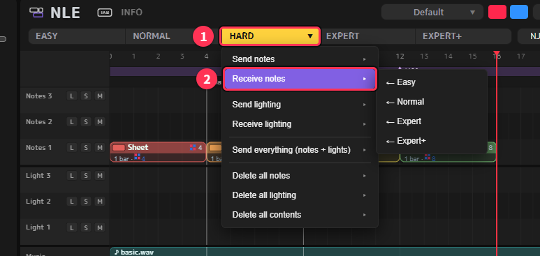

| Item | What it does |
|---|---|
| **Send notes** → destination | Copy the notes of this difficulty to the chosen difficulty |
| **Receive notes** ← source | Copy the notes of the chosen difficulty to this difficulty |
| Send lighting / Receive lighting | The same for lights |
| Send everything (notes + lights) | Copy both notes and lights |
| Delete all notes / Delete all lighting / Delete all contents | Delete the content of this difficulty |

- "Notes" also include bombs, walls, arcs and chains
- Copying **replaces the content of the same kind in the destination** (it does not add to it). If the destination has content, you are asked to confirm
- The arrangement of clips in the NLE is copied too
- Only the content is copied. NJS and offset keep each difficulty's own values
- The delete items ask for confirmation first. Only the content is deleted; the clip frames in the NLE stay

> **We recommend "Receive".**
> Operations on the difficulty that is open (receive, delete) **can be undone with Ctrl + Z**.
> On the other hand, operations on another difficulty that is not on screen (send) **cannot be undone**.
> If you use send, save the project first (Ctrl + S) to be safe.

### Example: making Expert from Expert+

1. Finish Expert+
2. Switch to Expert with the **4 key** (or the EXPERT button)
3. Click the EXPERT button again → "**Receive notes**" → "**← Expert+**"
4. Thin out the notes and make the hard parts easier for Expert (if it goes wrong, Ctrl + Z returns to before receiving)
5. Set Expert's **NJS and offset** in the header (while watching JD / RT in [chapter 2](#jd--rt-display))
6. Continue the same way to the lower difficulties: Expert to Hard, Hard to Normal, …

Finally, use "Estimate difficulty" in [chapter 8](#8-checks-before-publishing) to check that higher difficulties have higher ★.

### Copy the lights at the end

Lights often don't need to differ between difficulties, so finish them in one difficulty and then
copy them to the others with "**Send lighting**" to save effort.
Only the lights are copied, so the notes of the destination stay as they are.

You don't need to copy the lights again every time you edit the notes. Send them again only when you change the lights.

Lights made with [auto lighting](#auto-lighting-making-lights-from-the-notes) (chapter 6) are added to every difficulty from the start, so no sending is needed.

### Emptying difficulties you won't publish

Every difficulty with content (notes or lights) is exported.
If you don't want to publish an unfinished difficulty, open it and empty it with "**Delete all contents**".
If you might continue it later, keep it first as a separate project with "Save As…" before emptying it.

<!-- chapter-nav -->
> **Go to chapter:** [1. Working faster](#1-working-faster) ｜ [2. Displays that help placement](#2-displays-that-help-placement) ｜ [3. Making the most of the NLE](#3-making-the-most-of-the-nle) ｜ [4. Making several difficulties efficiently](#4-making-several-difficulties-efficiently) ｜ [5. Songs with tempo changes, and fixing beat offsets](#5-songs-with-tempo-changes-and-fixing-beat-offsets) ｜ [6. Advanced lighting](#6-advanced-lighting) ｜ [7. More about the INFO nodes](#7-more-about-the-info-nodes) ｜ [8. Checks before publishing](#8-checks-before-publishing) ｜ [9. Customizing the settings](#9-customizing-the-settings) ｜ [10. Troubleshooting](#10-troubleshooting) ｜ [▲ Contents](#contents)
<!-- /chapter-nav -->

---

## 5. Songs with tempo changes, and fixing beat offsets

### First, find out how it is off

Turn on the metronome to the right of the BPM, play, and compare the clicks with the song. How to fix it depends on how it is off.

| How it is off | Cause | Fix |
|---|---|---|
| Off by the same amount from start to end | The start of the song is not aligned | **Lead-in** (see "How lead-in works" below) |
| In sync at first, then drifts more and more | The BPM is wrong | Pick another Detect BPM candidate, or type the number |
| In sync up to a point, then suddenly off | The tempo changes partway through the song | **Tempo parts** |

If the top of the **Detect BPM** candidates says "⚠ The song tempo may not be constant",
the tempo may differ between the first and second half of the song. Use tempo parts.

### Using tempo parts

Tempo parts change the BPM partway through the song.
They are shown with ◆ and the BPM on the **purple band** (the tempo part band) right below the number scale of the NLE.
Each tempo part sets the BPM of the section from its ◆ to the next ◆.

**Adding a tempo part**

- **Right-click** an empty spot on the band → "**+ Add tempo part here**": adds one at the mouse position
- **Right-click** an empty spot on the band → "**+ Specify in seconds…**": enter the seconds from the start of the song to add one exactly there
- You can also **double-click** an empty spot on the band

Right after adding, it takes over the BPM at that position, so adding alone does not change how the song lines up.

**Setting the BPM**

- **Right-click** a ◆ → "**🎯 Auto-detect**": analyzes the audio of that section and sets the BPM
- **Right-click** a ◆ → "**Enter BPM…**", or **double-click** the ◆: type the number
- "**🎯 Auto-detect all parts**" in the header: auto-detects all tempo parts at once
- To delete one, right-click the ◆ → "**Delete tempo part**"

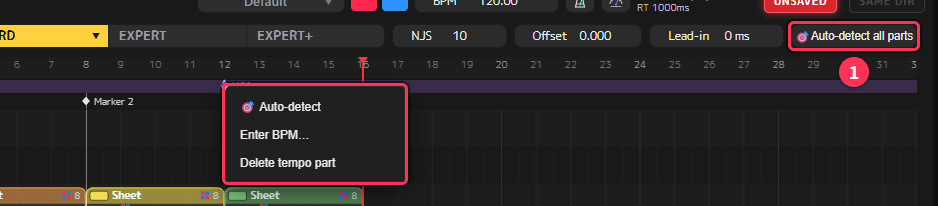

**Example workflow**

1. Turn on the metronome, play, and find where it starts to drift
2. Add a tempo part there
3. Set the BPM with "🎯 Auto-detect"
4. Listen with the metronome again, and type the value if it still doesn't fit
5. Repeat 1–4 until the end of the song

Tempo parts are exported as Beat Saber BPM changes (bpmEvents), so the tempo also changes in the game.

> The JD / RT display in the header ([chapter 2](#jd--rt-display)) is calculated with the base BPM (the value in the BPM field of the header).
> Changing the BPM partway with tempo parts does not change this display.

### How lead-in works

**Lead-in** (ms) in the header adds silence to the start of the song.
The whole song moves later by that amount, so you can put the first beat of the song exactly on a beat line.

For example, in a song at BPM 120 (1 beat = 500 ms) whose first beat is 300 ms from the start,
adding 200 ms of silence puts the first beat at 500 ms (on the line of beat 1).

- You can only add silence (you cannot cut the start of the song)
- The silence is written into the audio of song.egg itself when exporting, so ffmpeg is needed for the conversion ([chapter 10](#a-message-says-ffmpeg-was-not-found))
- The song preview section (the part played on the song select screen) is corrected automatically for the added silence when exporting
- When the time to the first note is short ("Hot start" in the map check), adding silence also gives you room

<!-- chapter-nav -->
> **Go to chapter:** [1. Working faster](#1-working-faster) ｜ [2. Displays that help placement](#2-displays-that-help-placement) ｜ [3. Making the most of the NLE](#3-making-the-most-of-the-nle) ｜ [4. Making several difficulties efficiently](#4-making-several-difficulties-efficiently) ｜ [5. Songs with tempo changes, and fixing beat offsets](#5-songs-with-tempo-changes-and-fixing-beat-offsets) ｜ [6. Advanced lighting](#6-advanced-lighting) ｜ [7. More about the INFO nodes](#7-more-about-the-info-nodes) ｜ [8. Checks before publishing](#8-checks-before-publishing) ｜ [9. Customizing the settings](#9-customizing-the-settings) ｜ [10. Troubleshooting](#10-troubleshooting) ｜ [▲ Contents](#contents)
<!-- /chapter-nav -->

---

## 6. Advanced lighting

For the basics of placing lights, see [chapter 6](tutorial.en.md#6-lighting) of the basic tutorial. This chapter explains how to work faster and in more detail.

### Light lanes

In LIGHTING mode, you place lights on these 10 lanes.

| Lane | Content |
|---|---|
| BACK, RINGS, CENTER, L LASER, R LASER | On / off and color of the lights in each place |
| L SPEED, R SPEED | Rotation speed of the left / right lasers |
| RING ROT, RING ZOOM | Ring rotation / zoom |
| BOOST | Switching colors (boost colors). Shown only when the light color mode is vanilla |

### Choosing quickly with keys

| Action | What it does |
|---|---|
| **W** (hold, choose, release) | Behavior pie menu (select, on, off, flash, fade, transition) |
| **C** (hold, choose, release) | Color pie menu (left note color, right note color, saved colors) |
| **F** | Cycle through the colors to place |

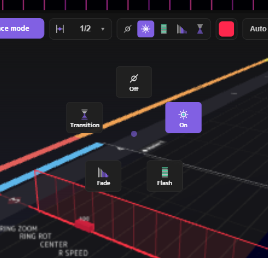 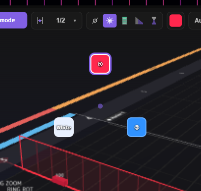

On the left is the behavior pie menu of the W key, on the right the color pie menu of the C key (it shows the left note color, the right note color and your saved colors).
Hold the key, move the mouse toward the item you want, and release the key to choose it.

### Changing brightness and speed

Point at a light, or at selected lights, and turn **Alt + wheel** to change the value.
When there is no light under the mouse, the value of the light you are about to place changes.

| Target | Alt + wheel | Ctrl + Alt + wheel |
|---|---|---|
| Lights that turn on | Brightness ±10 | Brightness ±1 |
| L SPEED, R SPEED | Laser speed ±1 (0–50) | Same |

### Selecting and editing together

Click a light you placed to select it. **Shift + drag** selects all lights inside the box.
Selected lights can be edited together, for example with Alt + wheel.

### Light color mode (Chroma and vanilla)

Choose how lights are colored with **Light color mode** in Preferences.

| Mode | Colors | What players need |
|---|---|---|
| **Vanilla** (the default) | Red, blue, white, and boost colors switched with the BOOST lane | No mods; everyone sees the same colors |
| **Chroma** | Any color for each light | Players need the Chroma mod to see the colors |

The base light colors and boost colors are set on the **Settings** node of the INFO screen ([chapter 7](#7-more-about-the-info-nodes)).
If you are thinking of a ranked submission, or want many people to see the same look, vanilla is the safe choice.

### Auto lighting (making lights from the notes)

NLM can make lights automatically from the positions of the notes. Use it as a base when you make lights from scratch,
or to quickly clear "not enough lights" in the map check.

#### Starting it

You can start it from any of these:

- **Auto light** on the LIGHTING mode toolbar (①)
- **Auto lighting…** in the File menu
- **💡 Auto lighting…**, shown next to map check items about too few lights ([chapter 8](#common-items-and-how-to-fix-them))

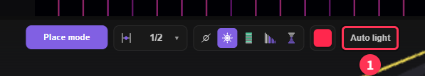

A confirmation shows the source difficulty, the difficulties that get the lights, the stage, and the number of lights to be made. Press **Create** to make them.

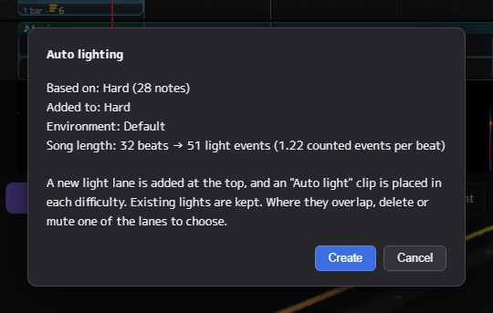

#### The lights it makes

| Kind | Content |
|---|---|
| Base | Keeps BACK on from the start of the song until a little after the last note (so bombs are always lit). Switches between blue and red every 16 beats (or at each marker, if there are markers) |
| Following the notes | L LASER lights up on red notes, R LASER on blue notes. Flashes where notes are dense, fades where they are spaced out |
| Accents | Ring zoom and rotation at the start of each section, CENTER at the start of each bar. Laser speed changes with the number of notes in each bar |
| Filling the count | Where there are few lights (intro, outro, etc.), RINGS lights up on every beat so the whole song has at least 1.2 lights per beat |

- Only **vanilla red and blue** are used (no Chroma colors). The actual colors are set by the light colors of the Settings node
- Some lights are skipped on closely spaced notes, so the same laser does not keep blinking rapidly
- Behaviors that the chosen stage does not have (such as the laser speed of Kaleidoscope) are not made

#### Where they go

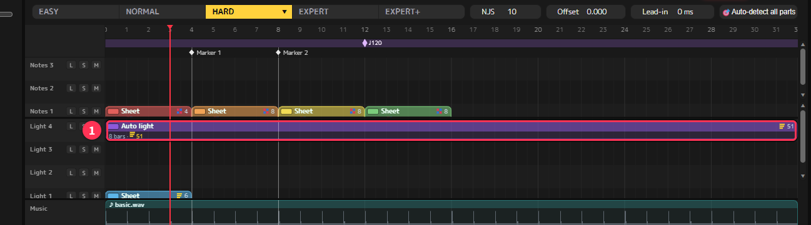

- One light lane is added at the top, with an "**Auto light**" clip (①) from the start to the end of the song
- The lights are made from **the difficulty with the most notes**, and the same lights go into **every difficulty** that has content (notes, bombs, walls, etc.)
- Your existing lights are kept
- **One Ctrl + Z** undoes it for all difficulties at once
- It cannot be made when the light lanes are at the maximum (10). Remove an empty lane first

#### Tips

- **When it overlaps your own lights**: stop one of them with the lane's **M** (mute), compare them in PREVIEW, and delete the clip you don't need.
  When lights overlap on the same beat and the same lane, a duplicate light notice appears
- **Use it as a base and finish it yourself**: keep the auto lights and add your own lights on another lane only where you want to stand out, such as the chorus
- **After editing the notes**: auto lights do not follow later note edits. If you change the notes a lot,
  delete the old "Auto light" clip and make it again (you can remove the empty lane as described in [chapter 3](#adding-lanes-lock-solo-and-mute))

### Checking and finishing

- Check it in **PREVIEW**, which looks close to the game. The buttons at the top right of PREVIEW toggle the lights and structures,
  and the ambient light (brightens the structures so you can see the motion)
- Choose the stage (environment) in the field at the top of the NLE, to the left of the BPM field ("Default" at first). How the lights look depends on the stage
- Finishing the lights in one difficulty and then copying them with "Send lighting" is faster ([chapter 4](#copy-the-lights-at-the-end))
- Before publishing, check that "Insufficient light events" and "Unlit bomb" do not appear in the map check ([chapter 8](#8-checks-before-publishing)).
  If they do, you can fix them quickly with [auto lighting](#auto-lighting-making-lights-from-the-notes)

<!-- chapter-nav -->
> **Go to chapter:** [1. Working faster](#1-working-faster) ｜ [2. Displays that help placement](#2-displays-that-help-placement) ｜ [3. Making the most of the NLE](#3-making-the-most-of-the-nle) ｜ [4. Making several difficulties efficiently](#4-making-several-difficulties-efficiently) ｜ [5. Songs with tempo changes, and fixing beat offsets](#5-songs-with-tempo-changes-and-fixing-beat-offsets) ｜ [6. Advanced lighting](#6-advanced-lighting) ｜ [7. More about the INFO nodes](#7-more-about-the-info-nodes) ｜ [8. Checks before publishing](#8-checks-before-publishing) ｜ [9. Customizing the settings](#9-customizing-the-settings) ｜ [10. Troubleshooting](#10-troubleshooting) ｜ [▲ Contents](#contents)
<!-- /chapter-nav -->

---

## 7. More about the INFO nodes

On the INFO screen (Tab over the NLE), the information of the exported song is defined by combining **nodes**.

### Kinds of nodes

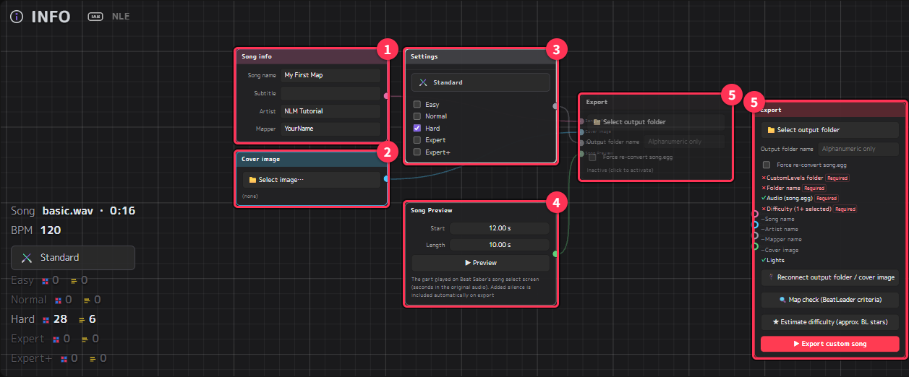

| Node | Color | What it sets |
|---|---|---|
| **Song info** | Pink | Song name, subtitle, artist, mapper |
| **Cover image** | Blue | The cover on the song select screen (if its shape or size is not right, it can be [fixed when exporting](#fixing-the-cover-image)) |
| **Settings** | Gray | Note colors, light colors, boost colors, stage, and the difficulty checks required for export |
| **Song Preview** | Green | The part played on the song select screen (start in seconds and length) |
| **Export** | — | Output folder, output folder name and the export button |

When the four nodes on the left are connected to the **Export** node with lines, their values are used for the export.

### Connecting and disconnecting

- **Drag** from a node's connector (round dot) to the export node to connect them. There is only one line of each kind; connecting another replaces it
- Drag a line to an empty spot and release to disconnect it
- **Right-click** an empty spot to add a new node
- Select a node and press **Ctrl + C → Ctrl + V** to duplicate it, **X** to delete it
- Zoom with the **wheel**, and press **.** (period) to bring all nodes back into view

### Using several export nodes

You can make several export nodes. For example:

- **Separate output folder names for testing and publishing**: export under another name while testing, so you don't overwrite the folder for publishing
- **Make versions with a different cover or colors**: prepare an export node connected to another Settings node or Cover image node

A newly added export node has nothing connected yet (⑤ on the right in the image above). Connect lines from the Song info node and the others.

**Click an export node to choose the one to use** (the chosen one becomes "Active"; the others show "Inactive (click to activate)").
The note colors and stage in the editor, the map check and Estimate difficulty all use the values connected to the active export node.
The exported map (notes and lights) is the same whichever export node you use.

The last remaining export node cannot be deleted.

> The stage and note color fields at the top of the NLE (to the left of the BPM field) directly change the values of the **Settings** node connected to the active export node.
> You can change colors and the stage without switching to the INFO screen.

### The Song Preview node

Sets the part played when the song is selected on the song select screen. The seconds are **seconds in the original song** (the lead-in silence is added automatically when exporting).

- **▶ Preview** loops that part with fades so you can check it
- Right-click a marker in the NLE → "**▶ Set as song preview start**" to start it at the marker, such as the start of the chorus
- If no Song Preview node is connected, it is exported as 10 seconds from 12 s (the map check shows "Preview time is still the default")

### Re-creating song.egg

To make exporting faster, the song.egg conversion is skipped if the song is the same as last time.
If the song sounds wrong or you want to re-create it, check "**Force re-convert song.egg**" on the export node and export.

<!-- chapter-nav -->
> **Go to chapter:** [1. Working faster](#1-working-faster) ｜ [2. Displays that help placement](#2-displays-that-help-placement) ｜ [3. Making the most of the NLE](#3-making-the-most-of-the-nle) ｜ [4. Making several difficulties efficiently](#4-making-several-difficulties-efficiently) ｜ [5. Songs with tempo changes, and fixing beat offsets](#5-songs-with-tempo-changes-and-fixing-beat-offsets) ｜ [6. Advanced lighting](#6-advanced-lighting) ｜ [7. More about the INFO nodes](#7-more-about-the-info-nodes) ｜ [8. Checks before publishing](#8-checks-before-publishing) ｜ [9. Customizing the settings](#9-customizing-the-settings) ｜ [10. Troubleshooting](#10-troubleshooting) ｜ [▲ Contents](#contents)
<!-- /chapter-nav -->

---

## 8. Checks before publishing

Before publishing a map, you can check these three things inside NLM.

| Feature | What it tells you |
|---|---|
| **Map check** (same as BS Map Check) | Mistakes, awkward patterns, and places that do not meet BeatLeader's ranking criteria |
| **NLM BL criteria list** | A checklist that lists the written BeatLeader ranking criteria item by item |
| **Estimate difficulty** | An approximation of BeatLeader's ★ (stars) |

Even if you won't submit the map for ranking, the map check is useful for finding mistakes.

All of them check **the same content as the export** (all exported difficulties and the values of Info.dat), so you can use them before exporting.
You can also keep the panel open while you fix the map and check again with one button.

### Recommended order

1. Clear "🚧 Unrankable" and "❌ Error" in the **Map check**
2. Look at the ★ of each difficulty with **Estimate difficulty**
3. If you are thinking of a ranked submission, check the remaining items in the **NLM BL criteria list** (the ★ values are used here too)
4. Finally, check for anything you missed with the "Checklist before publishing" below

### Map check (same as BS Map Check)

Open it from **Map check (BeatLeader criteria)…** in the File menu, or from
**🔍 Map check (BeatLeader criteria)** on the export node of the INFO screen. The check starts as soon as it opens.

The judgement is the same as [BS Map Check](https://github.com/KivalEvan/BeatSaber-MapCheck)
(with the BeatLeader preset), which is used in BeatLeader's ranking review.

#### Reading the results

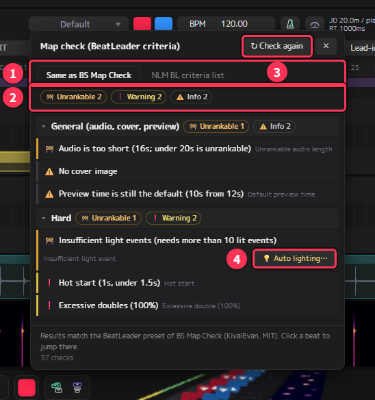

The image shows the check of a short map made for the explanation (16 seconds, few lights).

| No. | Name | Description |
|---|---|---|
| ① | Tabs | Switch between "Same as BS Map Check" and "NLM BL criteria list" |
| ② | Summary | The number of items for each mark |
| ③ | ↻ Check again | Refresh the results after fixing the map |
| ④ | 💡 Auto lighting… | Shown only on items about too few lights. Starts [auto lighting](#auto-lighting-making-lights-from-the-notes) (chapter 6) and checks again afterwards. On cover image items, [🖼 Fix cover image…](#fixing-the-cover-image) appears in the same place |

The results are split into "General (audio, cover, preview)" and a section for each difficulty. The mark at the start of each item shows how serious it is.

| Mark | Meaning | What to do |
|---|---|---|
| 🚧 Unrankable | Does not meet the ranking criteria | Always fix it if you submit for ranking |
| ❌ Error | A big problem | Fix it unless you have a reason |
| ❗ Warning | Possibly a problem | Check it and fix it if needed |
| ⚠️ Info | A minor problem, or not a problem | For reference |

If there is no unrankable item or error, "✓ No unrankable issues or errors" is shown at the top.

The numbers under each item are the **beats** where the problem is.

- Point at a number to see the time from the start of the song (min:sec)
- **Click a number to switch to that difficulty, move to that beat, and select the notes etc. in question.**
  You can fix them right away
- For items with many beats, click "{n} more" to show them all

After fixing, press **↻ Check again** at the top right of the panel to refresh the results.
You can drag the panel by its heading to move it anywhere.

#### Common items and how to fix them

| Item | Fix |
|---|---|
| Hot start (under 1.5 s) | Move the first note later, or add silence at the start of the song with **Lead-in** in the header |
| Preview time is still the default | Set the part played on the song select screen with the **Song Preview** node of the INFO screen |
| No cover image | Choose a square image of at least 256×256 with **Cover image** on the INFO screen |
| Cover image is not square / too small | Use **🖼 Fix cover image…** next to the item to make it square and at least 256×256 when exporting ([below](#fixing-the-cover-image)) |
| Jump distance (JD) / reaction time too short / too long | Adjust **NJS** and **Offset** in the header, while watching the JD / RT display in the header |
| Off-beat precision (not on 1/8 or 1/6) | A note placed with too fine a snap or at an off position. Click the beat to check the position |
| Insufficient light events | Add lights (more than 10 lit events are needed). **💡 Auto lighting…** next to the item makes them automatically |
| Unlit bomb | Turn on a light before the bomb. Lights made by auto lighting always light bombs |

#### Fixing the cover image

The cover image must be a **square of at least 256×256** in **png or jpg** format.
If an image is only slightly off, like 512×510, you can fix it inside NLM without making the image again.

When the map check shows a cover image item (not square / too small), or R1.A.4 (cover image) of the NLM BL criteria list is a violation,
**🖼 Fix cover image…** appears on that row. Press it to open a confirmation.

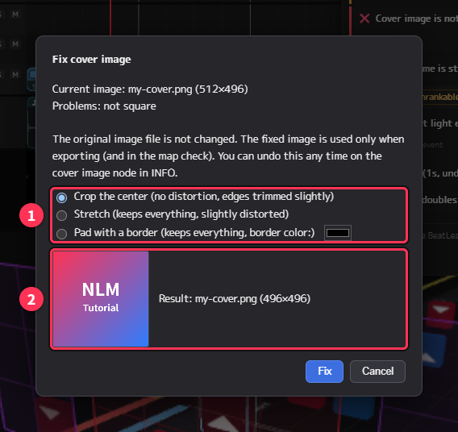

| No. | Name | Description |
|---|---|---|
| ① | How to fix | Can be chosen only when the image is not square (see the table below) |
| ② | Preview | The image after fixing, with its file name and size |

| How to fix | Content |
|---|---|
| **Crop the center** (the default) | Crops the middle to fit the short side. The picture is not distorted, but the ends of the long side are trimmed slightly |
| **Stretch** | Stretches to fit the long side. The whole picture is kept, but slightly distorted |
| **Pad with a border** | Fits the long side and fills the rest with a border. The whole picture is kept. You can choose the border color |

- Images smaller than 256×256 are enlarged to 256×256
- Formats other than png and jpg (webp, etc.) are converted to png (jpg stays jpg)
- When a lot is cut off (5% or more of the long side), a warning is shown. If too much of the picture is lost, choose "Pad with a border"

Press **Fix** and the map check runs again; the cover image item disappears.

**The original image file is not changed.** Only when exporting is the fixed image written to the output folder as `cover.png` (`cover.jpg` for jpg).
The map check also judges the fixed image.

The cover image node on the INFO screen shows what is fixed (①) and **Stop fixing** (②).

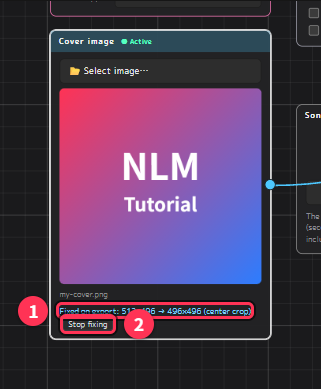

- Press **Stop fixing** to export the original image. **Ctrl + Z** also undoes it
- The fix setting is saved in the project
- Choosing another image on the cover image node removes the fix setting (if the new image does not fit either, fix it again)

> Images with a very different shape look better if you remake them in an image editor.
> This fix is for quickly correcting images that are "only slightly off".

### NLM BL criteria list

The second tab of the map check panel. **Its frame and background turn teal.**

It lists the written ranking criteria on the official BeatLeader website (Ranking Criteria) in the order of their item numbers (R1.A.1, etc.),
with NLM's own judgement for each item. **It is not an official result from BeatLeader or BS Map Check.**
The colors are different from the map check so they are not mistaken for each other.

#### Marks and kinds

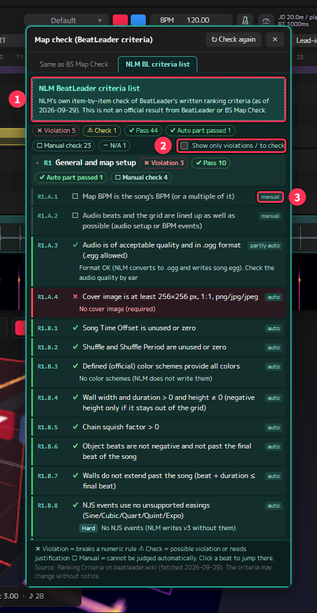

| No. | Name | Description |
|---|---|---|
| ① | Notice band | Shows that the list is made by NLM (it is not an official result) |
| ② | Show only violations / to check | Narrow it down to the items that probably need fixing |
| ③ | Kind of judgement | auto / partly auto / candidates / manual / N/A |

The mark at the start of each item is the result.

| Mark | Meaning |
|---|---|
| ✖ Violation | Breaks a numeric rule of the criteria |
| ⚠ Check | A possible violation. Fix it, or be ready to explain why it is fine |
| ✔ Pass / Auto part passed | It meets the criteria (for some items, only the part that could be judged automatically passed) |
| ☐ Manual check | Cannot be judged automatically. Check it yourself |
| － N/A | Does not apply to this map |

The kind of judgement (auto / partly auto / candidates / manual / N/A) is shown at the right end of each item.
"Candidates" are items that depend on diagrams or the reviewers' judgement; NLM interprets them and lists suspicious places.
How NLM interpreted an item is written in the "＊" note under the item.

Check **Show only violations / to check** at the top to narrow the list down to the items that probably need fixing.

When R10.A (at least one light per beat) or R7.B (bomb lighting) is a violation or "Check", **💡 Auto lighting…** appears on that row.
It starts [auto lighting](#auto-lighting-making-lights-from-the-notes) (chapter 6) and checks again afterwards.
When R1.A.4 (size, shape and format of the cover image) is a violation, **🖼 Fix cover image…** appears ([Fixing the cover image](#fixing-the-cover-image)).

#### The item that needs ★ and Tech (R5.A)

R5.A (whether notes are visible long enough to react) is judged with a formula that uses BeatLeader's ★ and Tech values.
The item has input fields for each difficulty (①); enter the values from "Estimate difficulty" below.
The values are remembered only while the app is open.

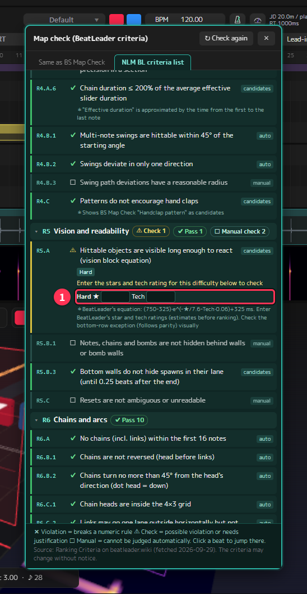

### Estimate difficulty (approximate BeatLeader ★)

Open it from **Estimate difficulty (approx. BeatLeader stars)…** in the File menu, or from
**★ Estimate difficulty (approx. BL stars)** on the export node of the INFO screen.

#### The first time: install the plugin

The calculation needs the add-on plugin [nlm-rating](https://github.com/Oz-Co-two/nlm-rating) (about 19 MB, Windows only).
It is not included in NLM, so press **Install from GitHub** in the panel to install it.

- The downloaded file is checked against the publisher's information (SHA-256) before use
- The installed plugin is saved in the `plugins` folder of the app. It is kept when you update NLM
- NLM connects to the internet only when you press the button
- When the installation finishes, the measurement starts right away

Use **Check for updates** to look for a newer version of the plugin.
If you have installed two or more versions, a field to choose the version appears, so you can go back to an older one.

#### Reading the results

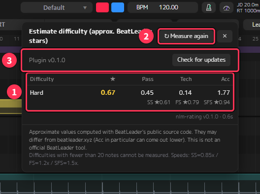

| No. | Name | Description |
|---|---|---|
| ① | Results | ★ and Pass / Tech / Acc for each difficulty. The lower row shows ★ with speed modifiers |
| ② | ↻ Measure again | Measure again after fixing the map |
| ③ | Plugin | The version of the plugin in use, and the update check |

It measures every time you open the panel. If you fix the map with the panel open, press **↻ Measure again**.

| Column | Meaning |
|---|---|
| ★ | Overall difficulty (BeatLeader stars) |
| Pass | How hard it is to clear |
| Tech | Technical difficulty of angles and patterns |
| Acc | How hard it is to get high accuracy |

- Under each difficulty, ★ with speed modifiers is also shown (SS = 0.85×, FS = 1.2×, SFS = 1.5×)
- Point at a row to see the predicted accuracy (%)
- **Difficulties with fewer than 20 notes cannot be measured**

> **These are approximations.** They are calculated with the source code published by BeatLeader, but may differ from the values on the BeatLeader website
> (Acc in particular can come out lower). This is not an official BeatLeader tool.

#### Ways to use it

- **Check the order of ★ across difficulties**: check that higher difficulties have higher ★
  (ranking criterion R11.H.5 requires difficulties to be in ascending order of ★, with an inversion of up to 0.5★ allowed)
- **Adjust the gaps between difficulties**: use it as a guide when neighboring difficulties are too close or too far apart in ★
- **Enter the values into R5.A of the NLM BL criteria list**: copy the ★ and Tech values into the input fields

### Checklist before publishing

- [ ] **Song info**: entered the song name, subtitle, artist and mapper (your mapper name)
- [ ] **Exported difficulties**: no notes or lights are left in unfinished difficulties you won't publish
  (every difficulty with content is exported, regardless of the checks on the Settings node)
- [ ] **Cover image**: chose a square image of at least 256×256
- [ ] **Preview section**: set the part played on the song select screen with the Song Preview node (and checked it with ▶ Preview)
- [ ] **Start of the song**: at least 1.5 seconds before the first note (2 seconds or more is recommended)
- [ ] **NJS and offset**: chose comfortable values for each difficulty while watching JD / RT in the header
- [ ] **Lights**: every difficulty has lights, and you checked how they look in PREVIEW (if there are not enough, auto lighting can make a base)
- [ ] **Map check**: no unrankable items or errors (and you looked through the warnings)
- [ ] **Order of ★**: measured the difficulty, and higher difficulties have higher ★
- [ ] **Test play**: exported the map and played every difficulty all the way through in Beat Saber
- [ ] **Project saved**: saved the `.nlmf` (you need it to make fixes later)

<!-- chapter-nav -->
> **Go to chapter:** [1. Working faster](#1-working-faster) ｜ [2. Displays that help placement](#2-displays-that-help-placement) ｜ [3. Making the most of the NLE](#3-making-the-most-of-the-nle) ｜ [4. Making several difficulties efficiently](#4-making-several-difficulties-efficiently) ｜ [5. Songs with tempo changes, and fixing beat offsets](#5-songs-with-tempo-changes-and-fixing-beat-offsets) ｜ [6. Advanced lighting](#6-advanced-lighting) ｜ [7. More about the INFO nodes](#7-more-about-the-info-nodes) ｜ [8. Checks before publishing](#8-checks-before-publishing) ｜ [9. Customizing the settings](#9-customizing-the-settings) ｜ [10. Troubleshooting](#10-troubleshooting) ｜ [▲ Contents](#contents)
<!-- /chapter-nav -->

---

## 9. Customizing the settings

In **Preferences** in the menu, you can adjust how the app feels and looks.
The settings are divided into five tabs.

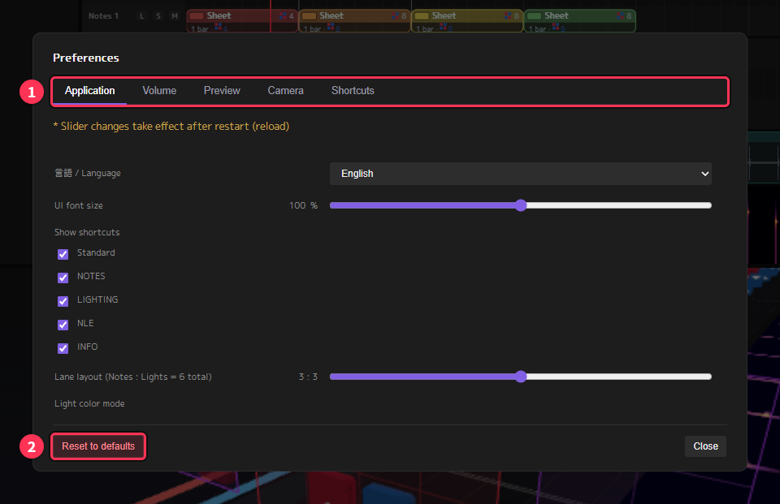

> Slider changes take effect after restarting the app (the Preview settings take effect when you open PREVIEW).

### Application

| Item | Content |
|---|---|
| 言語 / Language | Switch between Japanese and English |
| UI font size | The size of the text on screen (80–120%) |
| Show shortcuts | Show or hide the floating shortcut windows by kind (Standard, NOTES, LIGHTING, NLE, INFO) |
| Lane layout | The ratio of note lanes to light lanes in the NLE (6 in total). Applied to the current project and used as the default for new projects (it cannot be set if the top lane has a clip) |
| Light color mode | How lights are colored ([chapter 6](#6-advanced-lighting)) |
| Previous notes display | Whether to show the helper display of [chapter 2](#previous-notes-display) (also toggled with the H key) |
| Same-direction warning | Whether to show the warning of [chapter 2](#same-direction-warning) |
| Update check | Whether to check for a new version at startup (connects to GitHub) |

Once you have learned the shortcuts, hiding the floating windows gives you more room on screen.

### Volume

You can set the volume of master, music (the song), note hits and the metronome separately.
When placing notes, turning up the note hit sound makes it easier to check the timing.

### Preview

Fine-tunes the look of PREVIEW (100% is the standard).

| Item | Content |
|---|---|
| Bloom strength / radius / threshold | How the lights glow and bleed |
| Ambient level | The brightness of the whole stage |
| Emission | The strength of the glow of lights and notes |
| Reflection | The strength of reflections on the floor, etc. |

Try lowering them if your PC is slow, or if the glow is so bright that notes are hard to see.

### Camera

| Item | Content |
|---|---|
| Rotation, zoom, pan | The speed of moving the view in the 3D view (50–150%) |
| Invert 3D view wheel scroll | Reverse the direction you move in time when turning the wheel in the 3D view |
| Invert 2D view (NLE / Music) wheel scroll | Reverse the direction you move in time when turning the wheel in the NLE and Music |

The wheel direction can be set separately for the 3D view and the 2D views (NLE, Music).

### Shortcuts

Change the key assignments ([chapter 1](#customizing-shortcuts)).

### Reset to defaults

**Reset to defaults** at the bottom left of Preferences returns all the settings here to their initial state.
Projects, assets and plugins are not deleted.

<!-- chapter-nav -->
> **Go to chapter:** [1. Working faster](#1-working-faster) ｜ [2. Displays that help placement](#2-displays-that-help-placement) ｜ [3. Making the most of the NLE](#3-making-the-most-of-the-nle) ｜ [4. Making several difficulties efficiently](#4-making-several-difficulties-efficiently) ｜ [5. Songs with tempo changes, and fixing beat offsets](#5-songs-with-tempo-changes-and-fixing-beat-offsets) ｜ [6. Advanced lighting](#6-advanced-lighting) ｜ [7. More about the INFO nodes](#7-more-about-the-info-nodes) ｜ [8. Checks before publishing](#8-checks-before-publishing) ｜ [9. Customizing the settings](#9-customizing-the-settings) ｜ [10. Troubleshooting](#10-troubleshooting) ｜ [▲ Contents](#contents)
<!-- /chapter-nav -->

---

## 10. Troubleshooting

### The song, output folder or cover image is not connected after opening a project

A project (`.nlmf`) saves the **locations** of the song, the output folder and the cover image, and connects them automatically when opened.
They are not connected automatically in these cases:

- You moved or renamed the files or folders
- You opened the project on another PC
- You updated from a version before v1.2.0-oz (only the first time)
- You opened a project you received from someone else

For safety, an output folder is connected automatically only if it is **a folder you have selected once in the folder dialog on this PC**.
This is so that NLM never writes to an unknown export location planted in a project you received.

**How to fix**

- Output folder and cover image: select them again with "**🔌 Reconnect output folder / cover image**" on the export node of the INFO screen
- Song: select it again with **File → Load music file…**

Once you have selected them again, they are connected automatically from the next time.

### "Cannot export" appears when pressing the export button

Some "Required" items in the export node's checklist have a ✕.

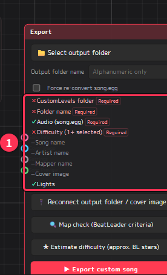

| Item | Fix |
|---|---|
| CustomLevels folder | Choose Beat Saber's CustomLevels with "Select output folder" |
| Folder name | Enter the output folder name (letters and numbers only) |
| Audio (song.egg) | Load the song |
| Difficulty (1+ selected) | Check at least one difficulty on the Settings node |

### A message says ffmpeg was not found

To export songs other than ogg (mp3, wav, etc.), or to use lead-in, **ffmpeg** is needed to convert the song.
ffmpeg is not installed together with NLM.

1. Open Windows "Terminal" (or PowerShell) and run this to install it

   ```
   winget install Gyan.FFmpeg
   ```

2. **Close NLM and start it again** (otherwise the newly installed ffmpeg is not found)
3. Export again

### The exported song sounds wrong although you haven't changed it

To make exporting faster, the song.egg conversion is skipped if the song is the same as last time.
If it still sounds wrong, check "**Force re-convert song.egg**" on the export node and export again.

### Keys do nothing

- Shortcuts apply to **the area under the mouse** (3D view, NLE, PREVIEW, etc.). Put the mouse over the area you want to operate, then press the key
- If you changed shortcut assignments, check them in the **Shortcuts** tab of **Preferences**. **Reset all to default** returns them to the defaults
- Note operations in the 3D view do not work if the lane is **locked** ([chapter 3](#adding-lanes-lock-solo-and-mute))

### An operation cannot be undone

Most operations can be undone with Ctrl + Z, but **"Send" to another difficulty cannot** ([chapter 4](#4-making-several-difficulties-efficiently)).
Save with Ctrl + S before big changes to be safe.

### Resetting the preferences

**Preferences → Reset to defaults** returns all preferences — screen ratio, volume, camera speed, shortcuts and so on — to their initial state.
Projects and assets are not deleted.

### "Estimate difficulty" shows an error

| Message | Fix |
|---|---|
| Could not connect to GitHub | Check your internet connection |
| The downloaded file does not match the release information | The download may be broken. Wait a while and install again |
| This plugin version cannot be used with this version of NLM | Update NLM to a newer version |
| Cannot measure: fewer than 20 notes | That difficulty cannot be measured (it can be once it has more notes) |

### NLM does not start and shows "Failed to resolve Python.Runtime.Loader.Initialize ..."

It is caused by the "downloaded from the internet" mark that Windows adds to the downloaded zip.
NLM normally removes it automatically at startup; if it still does not start, remove it as follows.

1. Right-click the downloaded zip → "Properties"
2. At the bottom of the "General" tab, check "Unblock" and click OK
3. Extract the zip again and start the app

### Things are not working well after an update

If you updated inside the app, the previous version is kept in `_previous_<version>` in the app folder.
Close NLM and copy `NonLinearMapper.exe` and `_internal` from that folder back to the original place to return to the previous version.

If NLM is in a place that cannot be written to, such as Program Files, it cannot update itself.
Update it manually as described in the [README](../README.en.md).

### If nothing helps

Please let us know on [GitHub Issues](https://github.com/Oz-Co-two/nlm-oz-co2/issues) (English is fine).
It helps if you include the **version number** shown at the top right of the screen (for example, v1.4.0-oz) and what happened after which operation.

<!-- chapter-nav -->
> **Go to chapter:** [1. Working faster](#1-working-faster) ｜ [2. Displays that help placement](#2-displays-that-help-placement) ｜ [3. Making the most of the NLE](#3-making-the-most-of-the-nle) ｜ [4. Making several difficulties efficiently](#4-making-several-difficulties-efficiently) ｜ [5. Songs with tempo changes, and fixing beat offsets](#5-songs-with-tempo-changes-and-fixing-beat-offsets) ｜ [6. Advanced lighting](#6-advanced-lighting) ｜ [7. More about the INFO nodes](#7-more-about-the-info-nodes) ｜ [8. Checks before publishing](#8-checks-before-publishing) ｜ [9. Customizing the settings](#9-customizing-the-settings) ｜ [10. Troubleshooting](#10-troubleshooting) ｜ [▲ Contents](#contents)
<!-- /chapter-nav -->
