# チュートリアル（上級編）：もっと速く・公開できる譜面へ

[基本のチュートリアル](tutorial.md) を一通り終えた人向けに、作業を速くする操作や、
譜面を公開する前のチェック、難易度（★）の測り方を説明します。

## 目次

1. [作業を速くする操作](#1-作業を速くする操作)
2. [配置を助ける表示](#2-配置を助ける表示)
3. [NLE を使いこなす](#3-nle-を使いこなす)
4. [難易度をまとめて作る](#4-難易度をまとめて作る)
5. [テンポが変わる曲と、拍のずれの直し方](#5-テンポが変わる曲と拍のずれの直し方)
6. [ライティングの応用](#6-ライティングの応用)
7. [INFO ノードの応用](#7-info-ノードの応用)
8. [公開前のチェック](#8-公開前のチェック)
9. [自分に合わせた設定](#9-自分に合わせた設定)
10. [困ったとき](#10-困ったとき)

---

## 1. 作業を速くする操作

### 時間を移動する

| 操作 | 動き |
|---|---|
| **← / →**・ホイール | スナップの細かさ（1/2 拍など）ずつ進む・戻る |
| **Shift + Ctrl + ← / →** | 4 拍ずつ、なめらかに進む・戻る |
| **Ctrl + ← / →** | 曲の頭・曲の終わりへ移動 |
| **.**（ピリオド） | 表示を再生ヘッド（いまの拍）へ戻す |

「**.**」は、カメラ固定モードで視点を動かしているうちに、いまの拍が画面の外に出てしまった時に便利です。
3D ビューではカメラの角度はそのままで、いまの拍の位置まで平行に移動します。
NLE では、いまの拍が中央に来るように表示をずらします。

### スナップの細かさを素早く変える

**「,」（カンマ）キー**を押すと、スナップ（進む拍の細かさ）を選ぶ円形のメニュー（パイメニュー）が出ます。
1/4 拍の刻みを置く時だけ細かくする、といった切り替えがツールバーまでマウスを動かさずにできます。

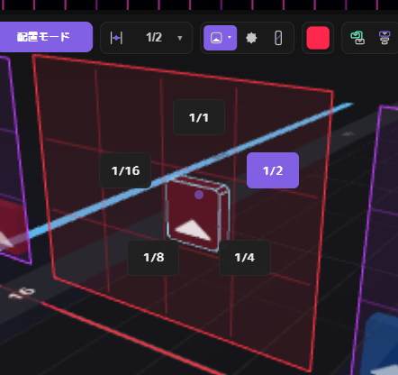

キーを押したままマウスを選びたい項目の方へ動かし、キーを離すと決まります。

同じように **W キー**で、選択 / ノーツ / ボム / 壁 を選ぶパイメニューが出ます。

### 配置モードのまま、選んだノーツを直す

配置モードでも、**選んでいるノーツの上にマウスを合わせて**次のキーを押すと、選んだノーツ全部をまとめて直せます。
カメラ固定モードへ切り替える手間が省けます。

| 操作 | 動き |
|---|---|
| **F** | 色を反転する（赤 ⇄ 青） |
| **Alt + ホイール** | 切る向きを回す |
| **D** | ドット（向きなし）にする |

マウスが選んだノーツの上に無い時は、これまでどおり「これから置くノーツ（ブラシ）」の色・向きが変わります。

**Alt + ホイール** で回る向きは、ドットを含まない 8 方向だけです。
そのため、複数のノーツを選んでまとめて回しても、ノーツ同士の向きの関係（例：左右対称）が崩れません。
ドットにしたい時は **D キー**を使います。ブラシに対して D キーを押すと、ドットと直前の矢印の向きが切り替わります。

### アーク・チェーンの形を細かく調整する

アークやチェーンを選んだ状態で、ホイールに次のキーを組み合わせると形を変えられます。

| 対象 | 操作 | 変わるもの |
|---|---|---|
| アーク | **Alt + ホイール** | 頭側の曲がり具合 |
| アーク | **Ctrl + Alt + ホイール** | 尾側の曲がり具合 |
| チェーン | **Shift + ホイール** | 分割数（リンクの数） |
| チェーン | **Ctrl + Alt + ホイール** | 詰め具合（squish。リンクを頭側へ寄せる量） |

### マーカーで曲の区切りに印を付ける

**Ctrl + E** で、マウスのある位置（マウスが無ければいまの拍）にマーカー（目印）を置きます。
サビやブレイクの始まりに置いておくと、**Ctrl + [ / Ctrl + ]** で前後のマーカーへ移動できます。

NLE の上の段（マーカーの帯）で、マーカーをドラッグして動かしたり、名前をダブルクリックして名前を変えたりできます。
マーカーを右クリックすると、次のこともできます。

- **▶ 試聴の開始に転送**：選曲画面で流れる区間の開始位置を、マーカーの位置にする
- 名前の変更・削除

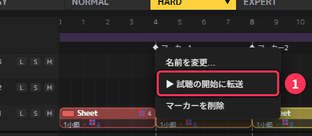

また、NLE のクリップを右クリック →「**マーカーでカット**」で、クリップの中にあるマーカーの位置すべてでクリップを分割できます（[3 章](#3-nle-を使いこなす)）。

### ショートカットを自分用に変える

メニューの **環境設定 → ショートカット編集** タブで、キーの割り当てを変えられます。

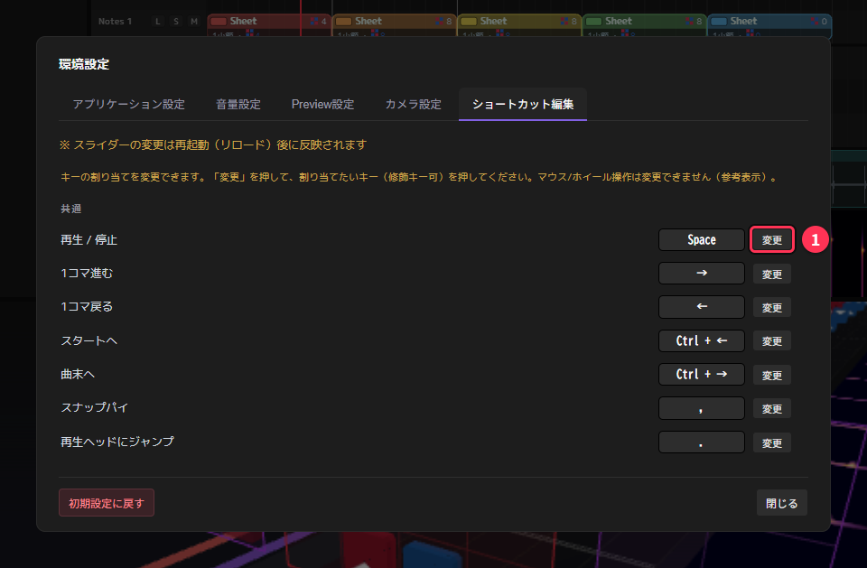

1. 変えたい操作の **変更** ボタンを押す
2. 新しく割り当てたいキー（Ctrl・Alt・Shift との組み合わせも可）を押す。やめる時は Esc

- 他の操作と同じキーになった時は、キーの枠が赤くなって知らせます
- 変えた操作には **既定** ボタンが出て、個別に元に戻せます。**全て既定に戻す** で全部まとめて戻せます
- 変えられるのはキーボードの操作だけです（マウスやホイールの操作は変えられません）
- 割り当ては環境設定と一緒に保存されるので、アプリを再起動しても残ります

<!-- 章ナビ -->
> **ほかの章へ：** [1. 作業を速くする操作](#1-作業を速くする操作) ｜ [2. 配置を助ける表示](#2-配置を助ける表示) ｜ [3. NLE を使いこなす](#3-nle-を使いこなす) ｜ [4. 難易度をまとめて作る](#4-難易度をまとめて作る) ｜ [5. テンポが変わる曲と、拍のずれの直し方](#5-テンポが変わる曲と拍のずれの直し方) ｜ [6. ライティングの応用](#6-ライティングの応用) ｜ [7. INFO ノードの応用](#7-info-ノードの応用) ｜ [8. 公開前のチェック](#8-公開前のチェック) ｜ [9. 自分に合わせた設定](#9-自分に合わせた設定) ｜ [10. 困ったとき](#10-困ったとき) ｜ [▲ 目次](#目次)
<!-- /章ナビ -->

---

## 2. 配置を助ける表示

ノーツを置く時に「次はどの向きに振るか」「遊びやすい速さか」を判断しやすくする表示です。

### 直前ノーツの補助表示

配置する枠（配置モードでは赤枠、カメラ固定モードでは黄色枠）の **左右の外側** に補助のマスがあり、
赤・青それぞれ **直前に置いたノーツ** を、位置と向きごと半透明で表示します。

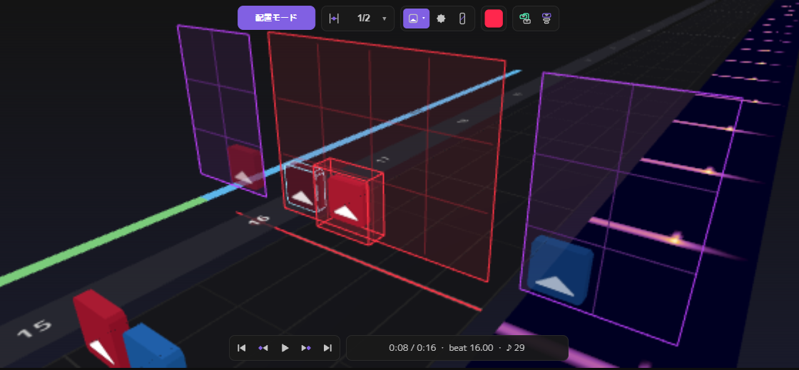

画像では、左の紫の枠に赤の直前のノーツ（上向き）、右の紫の枠に青の直前のノーツが出ています。
中央の赤枠の中のノーツは、直前の赤と同じ上向きに置いたため、次の「同じ向きの連続の警告」の赤枠が付いています。

前のノーツから自然に振り返せる向きを選ぶのに使います。たとえば直前の青が下向きなら、次の青は上向きが自然です。

- **H キー**で表示の ON / OFF を切り替えます（環境設定の「直前ノーツ表示」でも切り替えられます）
- 赤と青の直前ノーツが同じマスに来た時は、両方を小さくして斜めにずらして表示します（赤＝左上、青＝右下）

### 同じ向きの連続の警告

ノーツを置いた時、**同じ色の前後のノーツと切る向きの差が 45° 以内**だと、次の 3 つで知らせます。
同じ向きに 2 回続けて振ると、振り返しができず、そこから先の流れが崩れるためです。

- 問題のノーツに **赤枠** が付く
- 画面上部の **「同じ向き」ランプ** が点灯する
- 短い警告音が鳴る

赤枠は上の画像の中央のノーツ、ランプは次の「JD / RT の表示」の画像の②です。

赤枠が付くノーツは、次のように決まります。

- 前のノーツと同じ向きになった時は、**いま置いたノーツ** に付きます
- 後ろのノーツと同じ向きになった時は、**後ろのノーツ** に付きます（途中のノーツを置き直した時など）

**ランプをクリックすると、赤枠のノーツのうち一番前の位置へ移動** します。
向きを直したり消したりすると、赤枠とランプは自動で消えます。

次の場合は判定しません（意図した配置であることが多いため）。

- ドットのノーツ
- 前後の間隔が 1/5 拍未満（スライダーなど、ひと振りで切る配置とみなします）
- 間にボムがある（ボムで振りをリセットしているとみなします）

チェーンは、頭の向きで尾までひと振りとして判定します。

選んだノーツを Alt + ホイールで回したり F で色を反転したりした時は、回している途中では鳴らさず、
**選択を外した時点** でまとめて判定します。

警告が要らない時は、環境設定の「同じ向きの連続の警告」で OFF にできます。

> この警告は配置中の目安で、[8 章](#8-公開前のチェック) の譜面チェックほど厳密ではありません。
> 公開前には譜面チェックも使ってください。

### JD / RT の表示

ヘッダーの BPM 欄の右に、ノーツの見え方に関わる 3 つの値が出ます。

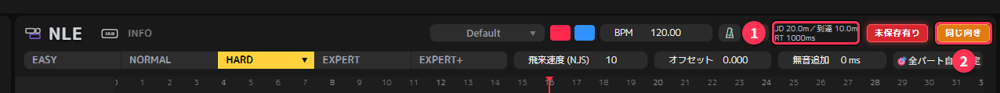

| 表示 | 意味 |
|---|---|
| **JD**（m） | ノーツが出現してから消えるまでの距離 |
| **到達**（m） | ノーツの出現位置から、プレイヤーの位置までの距離（JD の半分） |
| **RT**（ms） | ノーツが出現してから、プレイヤーの位置に届くまでの時間（反応時間） |

BPM・NJS（飛来速度）・オフセットから、Beat Saber 本体と同じ式で計算しています。
この欄は表示だけです。値を変えたい時は、ヘッダーの **NJS** や **オフセット** を調整します。

- RT が短いほど、ノーツが急に現れるように感じます。長いほど、遠くから見えていて読みやすい反面、画面にノーツが多く並びます
- 難易度ごとに NJS とオフセットが別なので、難易度を切り替えると値も変わります
- 計算には Info.dat の基準の BPM を使います（テンポパートで途中の BPM を変えても、この表示は変わりません）

### スペクトログラム（周波数の表示）

曲を読み込むと、音の周波数の強さを色の帯で表示します（弱い → 強い：黒 → 紫 → 赤 → 橙 → 白）。

- **NLE**：Music の段の波形の下
- **3D ビュー**：ノーツを置く空間の外側

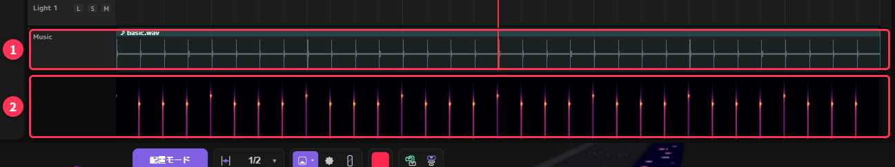

画像の曲は説明用のクリック音なので、拍ごとに縦の線が並んでいます。普通の曲では、盛り上がる所ほど帯全体が明るくなります。

サビなど音が厚い所は明るく、静かな所は暗く見えるので、曲の構成をひと目でつかめます。
ノーツを密にする所・休ませる所を決める目安になります。

<!-- 章ナビ -->
> **ほかの章へ：** [1. 作業を速くする操作](#1-作業を速くする操作) ｜ [2. 配置を助ける表示](#2-配置を助ける表示) ｜ [3. NLE を使いこなす](#3-nle-を使いこなす) ｜ [4. 難易度をまとめて作る](#4-難易度をまとめて作る) ｜ [5. テンポが変わる曲と、拍のずれの直し方](#5-テンポが変わる曲と拍のずれの直し方) ｜ [6. ライティングの応用](#6-ライティングの応用) ｜ [7. INFO ノードの応用](#7-info-ノードの応用) ｜ [8. 公開前のチェック](#8-公開前のチェック) ｜ [9. 自分に合わせた設定](#9-自分に合わせた設定) ｜ [10. 困ったとき](#10-困ったとき) ｜ [▲ 目次](#目次)
<!-- /章ナビ -->

---

## 3. NLE を使いこなす

NLE は、譜面を **クリップ**（色の付いた帯）単位で並べるタイムラインです。
サビのくり返しなど、同じ配置を何度も使う曲では、クリップをコピーして並べると早く作れます。

### NLE の各部

上から順に、次の段が並んでいます。

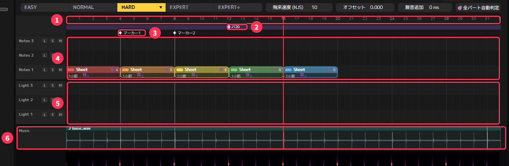

| 番号 | 段 | できること |
|---|---|---|
| ① | 数字の目盛り（ルーラー） | クリック・ドラッグで再生位置を動かす |
| ② | テンポパートの帯（紫） | 曲の途中で BPM を変える（[5 章](#5-テンポが変わる曲と拍のずれの直し方)）。画像では 12 拍目に ◆ がある |
| ③ | マーカーの帯 | マーカーの移動・名前の変更（[1 章](#マーカーで曲の区切りに印を付ける)） |
| ④ | Notes のレーン | ノーツ・ボム・壁・アーク・チェーンのクリップ（色の付いた帯） |
| ⑤ | Light のレーン | ライトのクリップ |
| ⑥ | Music | 曲の波形。その下はスペクトログラム |

レーンの左端の **L / S / M** のボタンは、レーンのロック・ソロ・ミュートです（下の「レーンを増やす・ロック・ソロ・ミュート」）。

**クリップは難易度ごとに別々** です。難易度を切り替えると、その難易度のクリップに入れ替わります。
別の難易度へ中身を写す方法は [4 章](#4-難易度をまとめて作る) で説明します。

### クリップを選ぶ・動かす

| 操作 | 動き |
|---|---|
| クリップを **左クリック** | 選ぶ |
| **Shift + 左クリック** | 選んだものに追加する（もう一度で外す） |
| 何もない所から **左ドラッグ** | 囲んだクリップをまとめて選ぶ |
| **A** | 選択を解除する |
| クリップを **ドラッグ** | 動かす（選んだクリップはまとめて動く） |
| クリップの **左右の端をドラッグ** | 長さを変える |
| **X / Delete** | 消す |

同じレーンの中でクリップを重ねることはできません。

### 分ける・つなげる

| 操作 | 動き |
|---|---|
| クリップを選び、分けたい拍にマウスを置いて **C** | その位置で分ける |
| **R** | 分割モードの ON / OFF。ON の間は、クリップをクリックした位置で分ける |
| 右クリック →「**マーカーでカット**」 | クリップの中のマーカーの位置すべてで分ける |
| 2 つ以上選んで **Ctrl + G** | 1 つのクリップにつなげる |

- 分けた後ろ側のクリップは、名前の後ろに「'」が付き、別の色になります
- **Ctrl + G** は、ノーツ同士・ライト同士なら、別のレーンにあっても、離れていても 1 つにつなげます。
  時間が重なっていた所のノーツはそのまま重なるので、[8 章](#8-公開前のチェック) の譜面チェックで確かめてください

サビの始まりなど曲の区切りにマーカーを置いてから「マーカーでカット」を使うと、クリップを曲の構成どおりに分けられます。

### コピーと貼り付け

1. クリップを選んで **Ctrl + C**（切り取りは **Ctrl + X**）
2. **Ctrl + V** を押すと、貼り付ける予定のクリップがマウスについてくる
3. 貼り付けたい位置で **クリック**（やめる時は Esc か右クリック）

複数のクリップを選んでコピーすると、並び方を保ったまま貼り付けられます。
コピーできるのは、いま開いている難易度の中だけです。

### クリップの右クリックメニュー

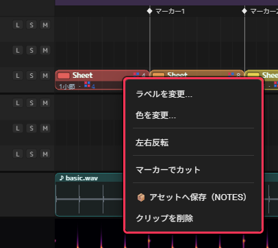

| 項目 | 動き |
|---|---|
| ラベルを変更… | クリップの名前を変える（「サビ1」など） |
| 色を変更… | クリップの色を変える（クリップの左上の色の四角をクリックしても変えられます） |
| **左右反転** | 中身を左右に反転し、赤と青を入れ替える |
| マーカーでカット | 上の「分ける・つなげる」を参照 |
| **📦 アセットへ保存** | 下の「アセット」を参照 |
| クリップを削除 | クリップを消す |

何もない所を右クリックすると、**空のクリップを作成**（16 拍）と **マーカーを作成** が出ます。

> **例：2 回目のサビを作る**
> 1 回目のサビのクリップを Ctrl + C → 2 回目のサビの位置で Ctrl + V → 右クリック →「左右反転」。
> 同じ配置の左右を入れ替えるだけで、2 回目に変化が付きます。

### レーンを増やす・ロック・ソロ・ミュート

レーンの左端の何もない所を右クリックすると、ノーツ・ライトそれぞれのレーンを **一番上に追加・削除** できます。

- レーンは最大 10 本です
- 削除できるのは、一番上のレーンが空の時だけです（他の難易度も含めて空である必要があります）
- レーンの本数は全難易度で共通です

レーンにマウスを置いて次のキーを押す（またはレーン左端のボタンを押す）と、レーンの状態を切り替えられます。

| キー | 状態 | 動き |
|---|---|---|
| **L** | ロック | 中身が暗くなり、3D ビューで選んだり直したりできなくなる |
| **M** | ミュート | 中身を 3D ビューに表示しない |
| **S** | ソロ | そのレーンだけを 3D ビューに表示する |

ミュートとソロは **表示を切り替えるだけ** です。書き出しには、全部のレーンの中身が入ります。
ライトを作る時に、ノーツのレーンをロックしておけば、うっかりノーツを動かしてしまうのを防げます。
レーンの状態は、プロジェクトと一緒に保存されます。

### Music（曲）のクリップ

Music の段を右クリックすると、**曲の長さぶんのクリップ**（ノーツとライト、ノーツだけ、ライトだけ）を一度に作れます。
曲全体を 1 つのクリップで作り、あとからマーカーでカットして分ける、という作り方もできます。

Music も、選んでから C で分けたり、選んで X / Delete で一部を消したりできます（曲の終わりの余韻を切る時など）。
分けた Music は、2 つ以上選んで Ctrl + G でつなげ直せます。

### アセット（配置パターンを保存して使い回す）

クリップを右クリック →「**📦 アセットへ保存**」で、クリップの中身を部品として保存できます。

- 保存したアセットは **MEDIA** の一覧に出ます。NLE のレーンへドラッグすると、その位置にクリップとして置けます
- 別のプロジェクト・別の曲でも使えます
- MEDIA でアセットを右クリックすると、名前を変えられます
- アセットは、アプリのフォルダの `asset` に `.nlmclip` ファイルとして保存されます

よく使うリズムの型や、ライトの演出をアセットにしておくと、新しい曲を作る時に便利です。

### MEDIA にフォルダを追加

ファイルメニューの **MEDIAにフォルダを追加…** で、Beat Saber の CustomLevels や音楽のフォルダを MEDIA に登録できます。
登録したフォルダの中の曲や譜面を、素材として NLE へドラッグできます。

<!-- 章ナビ -->
> **ほかの章へ：** [1. 作業を速くする操作](#1-作業を速くする操作) ｜ [2. 配置を助ける表示](#2-配置を助ける表示) ｜ [3. NLE を使いこなす](#3-nle-を使いこなす) ｜ [4. 難易度をまとめて作る](#4-難易度をまとめて作る) ｜ [5. テンポが変わる曲と、拍のずれの直し方](#5-テンポが変わる曲と拍のずれの直し方) ｜ [6. ライティングの応用](#6-ライティングの応用) ｜ [7. INFO ノードの応用](#7-info-ノードの応用) ｜ [8. 公開前のチェック](#8-公開前のチェック) ｜ [9. 自分に合わせた設定](#9-自分に合わせた設定) ｜ [10. 困ったとき](#10-困ったとき) ｜ [▲ 目次](#目次)
<!-- /章ナビ -->

---

## 4. 難易度をまとめて作る

複数の難易度を作る時は、1 つの難易度を作り込んでから、その中身を別の難易度へ写して手直しすると早く作れます。

### 転送・受信のメニューを開く

画面上部の難易度のボタン（EASY 〜 EXPERT+）のうち、**いま選んでいる難易度のボタンをもう一度クリック** すると、メニューが出ます。

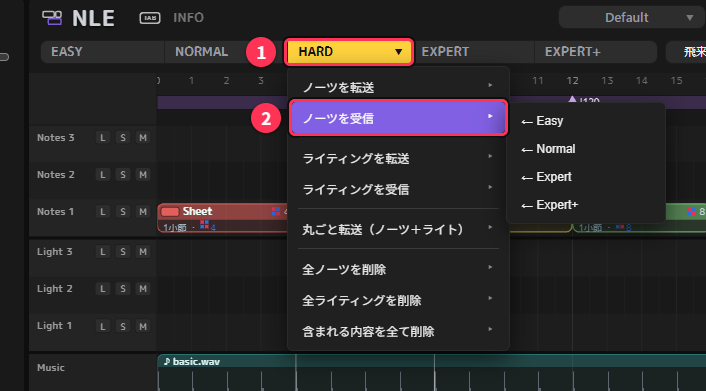

| 項目 | 動き |
|---|---|
| **ノーツを転送** → 送り先 | この難易度のノーツを、選んだ難易度へ写す |
| **ノーツを受信** ← 送り元 | 選んだ難易度のノーツを、この難易度へ写す |
| ライティングを転送／受信 | ライトについて同じことをする |
| 丸ごと転送（ノーツ＋ライト） | ノーツとライトの両方を写す |
| 全ノーツを削除／全ライティングを削除／含まれる内容を全て削除 | この難易度の中身を消す |

- 「ノーツ」には、ボム・壁・アーク・チェーンも含まれます
- 写すと、**写し先の同じ種類の中身は置き換わります**（足し合わせではありません）。写し先に中身がある時は、確認が出ます
- NLE のクリップの並びも一緒に写ります
- 写すのは中身だけです。NJS とオフセットは難易度ごとの値のまま変わりません
- 削除の項目は、実行前に確認が出ます。消えるのは中身だけで、NLE のクリップの枠は残ります

> **「受信」を使うのがおすすめです。**
> いま開いている難易度への操作（受信・削除）は **Ctrl + Z で元に戻せます**。
> 一方、画面に出ていない別の難易度への操作（転送）は **元に戻せません**。
> 転送を使う時は、先にプロジェクトを保存（Ctrl + S）しておくと安心です。

### 例：Expert+ から Expert を作る

1. Expert+ を作り込む
2. **4 キー**（または EXPERT のボタン）で Expert に切り替える
3. EXPERT のボタンをもう一度クリック →「**ノーツを受信**」→「**← Expert+**」
4. Expert でノーツを間引く・難しい所を易しくする（失敗したら Ctrl + Z で受信前に戻せます）
5. ヘッダーで Expert の **NJS とオフセット** を決める（[2 章](#jd--rt-の表示) の JD / RT を見ながら）
6. 同じように Expert から Hard、Hard から Normal… と下の難易度へ続ける

最後に [8 章](#8-公開前のチェック) の「難易度を測る」で、上の難易度ほど★が高くなっているか確かめます。

### ライトは最後にまとめて写す

ライトは難易度ごとに変える必要が無いことが多いので、1 つの難易度で作り終えてから、
「**ライティングを転送**」で他の難易度へ写すと手間が省けます。
ライトだけを写すので、写し先のノーツはそのまま残ります。

ノーツを直すたびにライトを写し直す必要はありません。ライトを直した時だけ、もう一度転送します。

[自動ライティング](#自動ライティングノーツからライトを作る)（6 章）で作ったライトは、最初から全難易度に入るので、転送はいりません。

### 公開しない難易度を空にする

中身（ノーツやライト）が入っている難易度は、すべて書き出されます。
作りかけの難易度を公開したくない時は、その難易度を開いて「**含まれる内容を全て削除**」で空にします。
あとで続きを作るかもしれない時は、空にする前に「名前を付けて保存」で別のプロジェクトとして残しておくと安心です。

<!-- 章ナビ -->
> **ほかの章へ：** [1. 作業を速くする操作](#1-作業を速くする操作) ｜ [2. 配置を助ける表示](#2-配置を助ける表示) ｜ [3. NLE を使いこなす](#3-nle-を使いこなす) ｜ [4. 難易度をまとめて作る](#4-難易度をまとめて作る) ｜ [5. テンポが変わる曲と、拍のずれの直し方](#5-テンポが変わる曲と拍のずれの直し方) ｜ [6. ライティングの応用](#6-ライティングの応用) ｜ [7. INFO ノードの応用](#7-info-ノードの応用) ｜ [8. 公開前のチェック](#8-公開前のチェック) ｜ [9. 自分に合わせた設定](#9-自分に合わせた設定) ｜ [10. 困ったとき](#10-困ったとき) ｜ [▲ 目次](#目次)
<!-- /章ナビ -->

---

## 5. テンポが変わる曲と、拍のずれの直し方

### まず、ずれ方を見分ける

BPM の右のメトロノームを ON にして再生し、クリック音と曲を聴き比べます。ずれ方で直し方が変わります。

| ずれ方 | 原因 | 直し方 |
|---|---|---|
| 最初から最後まで、同じだけずれている | 曲の頭の位置が合っていない | **無音追加**（下の「無音追加の考え方」） |
| 最初は合っているのに、だんだんずれていく | BPM が違う | BPM 測定の候補から選び直す・数字を直接入れる |
| 途中まで合っていて、ある所から急にずれる | 曲の途中でテンポが変わっている | **テンポパート** |

**BPM 測定** の候補の一番上に「⚠ テンポが一定でない曲の可能性があります」と出た時は、
曲の前半と後半でテンポが違う可能性があります。テンポパートを使ってください。

### テンポパートを使う

テンポパートは、曲の途中から BPM を変える仕組みです。
NLE の目盛りのすぐ下にある **紫の帯**（テンポパートの帯）に、◆ と BPM で表示されます。
1 つのテンポパートは、その ◆ から次の ◆ までの区間の BPM を決めます。

**テンポパートを追加する**

- 帯の何もない所を **右クリック** →「**＋ ここにテンポパートを追加**」：マウスの位置に追加します
- 帯の何もない所を **右クリック** →「**＋ 秒で指定…**」：曲の頭からの秒数を入れて、その位置に正確に追加します
- 帯の何もない所を **ダブルクリック** しても追加できます

追加した直後は、その位置の BPM を引き継ぐので、追加しただけでは曲とのずれは変わりません。

**BPM を決める**

- ◆ を **右クリック** →「**🎯 自動判定**」：その区間の音を解析して BPM を決めます
- ◆ を **右クリック** →「**BPMを手入力…**」、または ◆ を **ダブルクリック**：数字を入れます
- ヘッダーの「**🎯 全パート自動判定**」：全部のテンポパートをまとめて自動判定します
- 消す時は ◆ を右クリック →「**テンポパートを削除**」

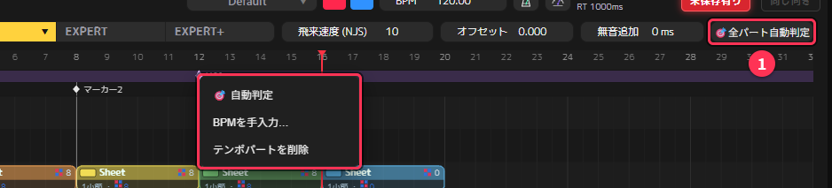

**作業の流れの例**

1. メトロノームを ON にして再生し、ずれ始める所を探す
2. その位置にテンポパートを追加する
3. 「🎯 自動判定」で BPM を決める
4. もう一度メトロノームで聴いて、合わなければ手入力で直す
5. 曲の終わりまで、1〜4 をくり返す

テンポパートは書き出し時に Beat Saber の BPM の変化（bpmEvents）として書き出されるので、ゲームの中でもテンポが変わります。

> ヘッダーの JD / RT の表示（[2 章](#jd--rt-の表示)）は、基準の BPM（ヘッダーの BPM 欄の値）で計算します。
> テンポパートで途中の BPM を変えても、この表示は変わりません。

### 無音追加の考え方

ヘッダーの **無音追加**（ms）は、曲の先頭に無音を足します。
足した分だけ曲全体が後ろへずれるので、曲の最初の拍を、拍の線にちょうど乗せられます。

たとえば BPM 120（1 拍＝500ms）の曲で、最初の拍が曲の頭から 300ms の所にある場合、
200ms の無音を足すと、最初の拍が 500ms（1 拍目の線）に乗ります。

- 無音は足すことしかできません（曲の頭を削ることはできません）
- 書き出す時に、song.egg の音そのものに無音を書き込みます。そのため変換に ffmpeg が必要です（[10 章](#ffmpeg-が見つかりませんと出る)）
- 試聴区間（選曲画面で流れる区間）は、足した無音の分を自動で補正して書き出します
- 最初のノーツまでの時間が短い（譜面チェックの「開始直後にノーツ」）時にも、無音を足すと余裕を作れます

<!-- 章ナビ -->
> **ほかの章へ：** [1. 作業を速くする操作](#1-作業を速くする操作) ｜ [2. 配置を助ける表示](#2-配置を助ける表示) ｜ [3. NLE を使いこなす](#3-nle-を使いこなす) ｜ [4. 難易度をまとめて作る](#4-難易度をまとめて作る) ｜ [5. テンポが変わる曲と、拍のずれの直し方](#5-テンポが変わる曲と拍のずれの直し方) ｜ [6. ライティングの応用](#6-ライティングの応用) ｜ [7. INFO ノードの応用](#7-info-ノードの応用) ｜ [8. 公開前のチェック](#8-公開前のチェック) ｜ [9. 自分に合わせた設定](#9-自分に合わせた設定) ｜ [10. 困ったとき](#10-困ったとき) ｜ [▲ 目次](#目次)
<!-- /章ナビ -->

---

## 6. ライティングの応用

基本の置き方は基本編の [6 章](tutorial.md#6-ライティング) を見てください。ここでは、速く・細かく作るための操作を説明します。

### ライトのレーン

LIGHTING モードでは、次の 10 本のレーンにライトを置きます。

| レーン | 内容 |
|---|---|
| BACK・RINGS・CENTER・L LASER・R LASER | 各場所のライトの点灯・消灯・色 |
| L SPEED・R SPEED | 左右のレーザーの回る速さ |
| RING ROT・RING ZOOM | リングの回転・ズーム |
| BOOST | 色の切り替え（ブースト色）。ライト配色モードが「バニラ」の時だけ表示 |

### キーで素早く選ぶ

| 操作 | 動き |
|---|---|
| **W**（押したまま選んで離す） | 動きのパイメニュー（選択・点灯・消灯・フラッシュ・フェード・トランジション） |
| **C**（押したまま選んで離す） | 色のパイメニュー（左のノーツの色・右のノーツの色・登録した色） |
| **F** | 置く色を順に切り替える |

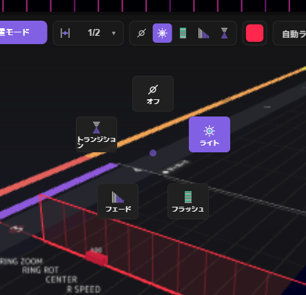 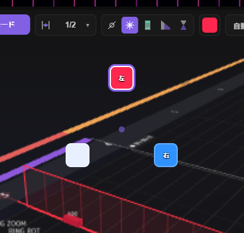

左が W キーの動きのパイメニュー、右が C キーの色のパイメニューです（色は左のノーツ・右のノーツの色と、登録した色が並びます）。
キーを押したまま選びたい方へマウスを動かし、キーを離すと決まります。

### 明るさと速さを変える

ライトの上、または選んだライトの上にマウスを置いて **Alt + ホイール** を回すと、値を変えられます。
マウスの下にライトが無い時は、これから置くライトの値が変わります。

| 対象 | Alt + ホイール | Ctrl + Alt + ホイール |
|---|---|---|
| 点灯するライト | 明るさを 10 ずつ増減 | 明るさを 1 ずつ増減 |
| L SPEED・R SPEED | レーザーの速さを 1 ずつ増減（0〜50） | 同じ |

### 選んでまとめて直す

置いたライトをクリックすると選べます。**Shift + ドラッグ** で範囲を囲んでまとめて選べます。
選んだライトは、Alt + ホイールなどでまとめて直せます。

### ライト配色モード（Chroma とバニラ）

環境設定の「**ライト配色モード**」で、ライトの色の付け方を選びます。

| モード | 色 | 遊ぶ人の環境 |
|---|---|---|
| **バニラ**（最初はこちら） | 赤・青・白と、BOOST レーンで切り替えるブースト色 | MOD 無しで、誰でも同じ色で見える |
| **Chroma** | ライトごとに好きな色を付けられる | 色を見るには、遊ぶ人に Chroma（MOD）が必要 |

ライトの基本の色とブースト色は、INFO 画面の **設定** ノードで決めます（[7 章](#7-info-ノードの応用)）。
ランク申請を考えている場合や、多くの人に同じ見た目で遊んでほしい場合は、バニラを選ぶと確実です。

### 自動ライティング（ノーツからライトを作る）

ノーツの位置から、ライトを自動で作れます。ライトを一から作る時の下地にしたり、
譜面チェックの「ライトが足りない」を手早く無くしたりする時に使います。

#### 始め方

次のどれからでも始められます。

- LIGHTING モードのツールバーの **自動ライト**（①）
- ファイルメニューの **自動ライティング…**
- 譜面チェックで、ライトが足りない項目の横に出る **💡 自動ライティング…**（[8 章](#よく出る項目と直し方の例)）

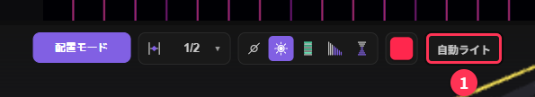

確認の画面に、元にする難易度・ライトを入れる難易度・ステージ・作るライトの数が出ます。**作成** を押すと作られます。

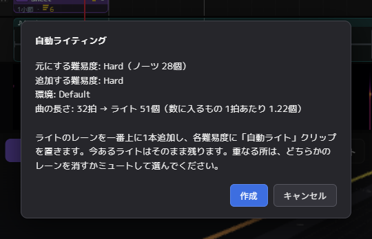

#### 作られるライト

| 種類 | 内容 |
|---|---|
| ベース | BACK を、曲の頭から最後のノーツの少し後まで点けたままにする（ボムがいつも照らされる）。16 拍ごと（マーカーがあればマーカーごと）に青と赤を切り替える |
| ノーツに合わせて | 赤のノーツで L LASER、青のノーツで R LASER が光る。ノーツが詰まった所はフラッシュ、間がある所はフェード |
| アクセント | 区切りの頭でリングのズームと回転、小節の頭で CENTER が光る。レーザーの速さは、小節ごとのノーツの多さで変わる |
| 数を満たす | ライトが少ない所（イントロやアウトロなど）は RINGS を拍ごとに光らせ、曲全体で 1 拍に 1.2 個以上にする |

- 色は **バニラの赤と青だけ** です（Chroma の色は付けません）。実際の色は、設定ノードのライトの色で決まります
- 同じレーザーが細かく点滅し続けないように、間隔の詰まったノーツでは光らせない所があります
- 選んだステージに無い動き（Kaleidoscope のレーザーの速さなど）は作りません

#### 入る場所

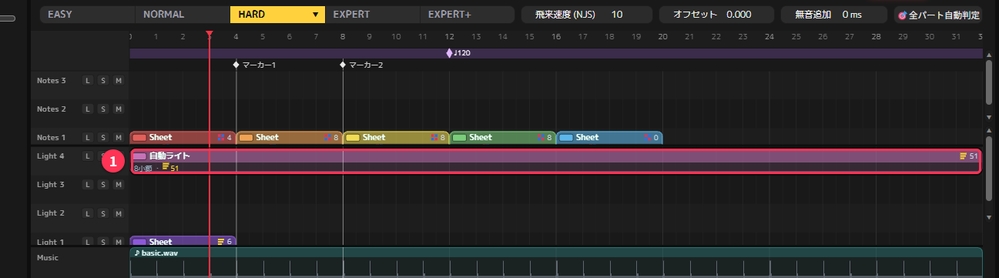

- ライトのレーンが一番上に 1 本増え、曲の頭から終わりまでの「**自動ライト**」クリップ（①）が入ります
- ライトは **ノーツが一番多い難易度** を元に作り、中身（ノーツ・ボム・壁など）のある **全難易度** に同じものが入ります
- 今あるライトは、そのまま残ります
- **Ctrl + Z を 1 回** 押すと、全難易度の分がまとめて元に戻ります
- ライトのレーンが上限（10 本）の時は作れません。空いているレーンを減らしてから作ります

#### 使い方のコツ

- **自分のライトと重なる時**：レーンの **M**（ミュート）で片方を止めて PREVIEW で見比べ、要らない方のクリップを消します。
  同じ拍・同じレーンにライトが重なると、「重複ライト」の表示が出ます
- **下地にして仕上げる**：自動ライトを残したまま、サビなど目立たせたい所だけ、別のレーンに自分でライトを置き足します
- **ノーツを直した後**：自動ライトは、後からノーツを直しても追いかけません。ノーツを大きく直した時は、
  古い「自動ライト」のクリップを消してから、もう一度作ります（空いたレーンは [3 章](#レーンを増やすロックソロミュート) の方法で減らせます）

### 確かめる・仕上げる

- **PREVIEW** で、ゲームに近い見た目で確かめます。PREVIEW 右上のボタンで、ライト・構造物の表示や、
  環境ライト（構造物を明るくして、動きを見やすくする）を切り替えられます
- ステージ（背景）は、NLE の上部、BPM 欄の左にある欄（最初は「Default」）で選びます。ステージによってライトの見え方が変わります
- ライトは 1 つの難易度で作り終えてから、「ライティングを転送」で他の難易度へ写すと早く作れます（[4 章](#ライトは最後にまとめて写す)）
- 公開前には譜面チェックで「ライトイベントが足りない」「照らされていないボム」が出ていないか確かめます（[8 章](#8-公開前のチェック)）。
  出ていたら、[自動ライティング](#自動ライティングノーツからライトを作る) で手早く直せます

<!-- 章ナビ -->
> **ほかの章へ：** [1. 作業を速くする操作](#1-作業を速くする操作) ｜ [2. 配置を助ける表示](#2-配置を助ける表示) ｜ [3. NLE を使いこなす](#3-nle-を使いこなす) ｜ [4. 難易度をまとめて作る](#4-難易度をまとめて作る) ｜ [5. テンポが変わる曲と、拍のずれの直し方](#5-テンポが変わる曲と拍のずれの直し方) ｜ [6. ライティングの応用](#6-ライティングの応用) ｜ [7. INFO ノードの応用](#7-info-ノードの応用) ｜ [8. 公開前のチェック](#8-公開前のチェック) ｜ [9. 自分に合わせた設定](#9-自分に合わせた設定) ｜ [10. 困ったとき](#10-困ったとき) ｜ [▲ 目次](#目次)
<!-- /章ナビ -->

---

## 7. INFO ノードの応用

INFO 画面（NLE の上で Tab）では、書き出す曲の情報を **ノード** の組み合わせで決めます。

### ノードの種類

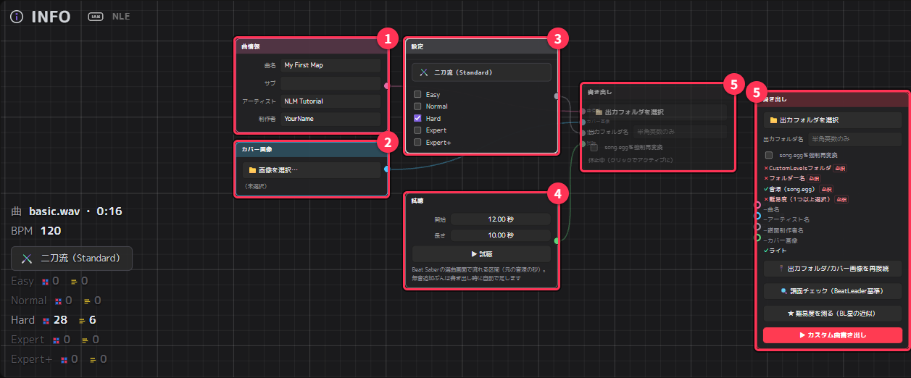

| ノード | 色 | 決めること |
|---|---|---|
| **曲情報** | ピンク | 曲名・サブタイトル・アーティスト・制作者 |
| **カバー画像** | 青 | 選曲画面のジャケット画像（形や大きさが合わない時は [書き出す時に補正](#カバー画像を補正する) できる） |
| **設定** | 灰 | ノーツの色・ライトの色・ブースト色・ステージ・書き出しに必要な難易度のチェック |
| **試聴** | 緑 | 選曲画面で流れる区間（開始の秒数と長さ） |
| **書き出し** | — | 出力フォルダ・出力フォルダ名・書き出しのボタン |

左の 4 つのノードを、線で **書き出し** ノードにつなぐと、その値が書き出しに使われます。

### つなぐ・外す

- ノードの接続口（丸い点）から書き出しノードへ **ドラッグ** するとつながります。同じ種類の線は 1 本だけで、つなぎ直すと入れ替わります
- 線を何もない所へドラッグして離すと、外れます
- 何もない所を **右クリック** すると、新しいノードを追加できます
- ノードを選んで **Ctrl + C → Ctrl + V** で複製、**X** で削除します
- **ホイール** で拡大縮小、**.**（ピリオド）で全部のノードが見える位置へ戻ります

### 書き出しノードを複数使う

書き出しノードは複数作れます。たとえば次のような使い方ができます。

- **テスト用と公開用で、出力フォルダ名を分ける**：テスト中は別の名前で書き出しておき、公開用のフォルダを上書きしない
- **カバー画像や色違いの版を作る**：別の設定ノード・カバー画像ノードをつないだ書き出しノードを用意する

新しく追加した書き出しノードには、まだ何もつながっていません（上の画像の右の⑤）。曲情報などのノードから線をつないでください。

使う書き出しノードは、**クリックして選びます**（選んだものが「アクティブ」になります。アクティブでないノードには「休止中」と出ます）。
エディタの画面のノーツの色・ステージ、譜面チェック、難易度を測るは、アクティブな書き出しノードにつながった値で動きます。
どの書き出しノードでも、書き出す譜面（ノーツ・ライト）は同じです。

最後の 1 つの書き出しノードは削除できません。

> NLE の上部（BPM 欄の左）にあるステージとノーツの色の欄は、アクティブな書き出しノードにつながった **設定** ノードの値を直接変えます。
> INFO 画面へ切り替えずに、色やステージを変えられます。

### 試聴ノード

選曲画面で曲を選んだ時に流れる区間を決めます。秒数は **元の曲の秒数** です（無音追加の分は書き出し時に自動で足します）。

- **▶ 試聴** で、その区間をフェード付きでくり返し再生して確かめられます
- NLE のマーカーを右クリック →「**▶ 試聴の開始に転送**」で、サビの頭などマーカーの位置を開始にできます
- 試聴ノードがつながっていない時は、12 秒目から 10 秒間で書き出します（譜面チェックで「試聴区間が初期値のまま」と出ます）

### song.egg を作り直す

書き出しを速くするため、曲が前回と同じなら song.egg の変換を省きます。
曲がおかしい時や、作り直したい時は、書き出しノードの「**song.eggを強制再変換**」にチェックを入れて書き出します。

<!-- 章ナビ -->
> **ほかの章へ：** [1. 作業を速くする操作](#1-作業を速くする操作) ｜ [2. 配置を助ける表示](#2-配置を助ける表示) ｜ [3. NLE を使いこなす](#3-nle-を使いこなす) ｜ [4. 難易度をまとめて作る](#4-難易度をまとめて作る) ｜ [5. テンポが変わる曲と、拍のずれの直し方](#5-テンポが変わる曲と拍のずれの直し方) ｜ [6. ライティングの応用](#6-ライティングの応用) ｜ [7. INFO ノードの応用](#7-info-ノードの応用) ｜ [8. 公開前のチェック](#8-公開前のチェック) ｜ [9. 自分に合わせた設定](#9-自分に合わせた設定) ｜ [10. 困ったとき](#10-困ったとき) ｜ [▲ 目次](#目次)
<!-- /章ナビ -->

---

## 8. 公開前のチェック

譜面を公開する前に、NLM の中で次の 3 つを確かめられます。

| 機能 | 分かること |
|---|---|
| **譜面チェック**（BS Map Check と同じ判定） | ミス配置や遊びにくい配置、BeatLeader のランク基準に合わない所 |
| **NLM版 BL評価リスト** | BeatLeader のランク基準の文章を項目ごとに並べた確認表 |
| **難易度を測る** | BeatLeader の★（星）の近似値 |

ランク申請をしない譜面でも、譜面チェックはミス配置を見つけるのに役立ちます。

どれも **書き出すのと同じ内容**（書き出される全難易度と Info.dat の値）を調べるので、書き出す前に使えます。
また、パネルを開いたまま譜面を直し、ボタン 1 つでチェックし直せます。

### おすすめの順番

1. **譜面チェック**で「🚧 ランク不可」と「❌ エラー」を無くす
2. **難易度を測る**で各難易度の★を見る
3. ランク申請を考えているなら、**NLM版 BL評価リスト**で残りの項目を確かめる（★の値もここで使います）
4. 最後に、下の「公開前チェックリスト」で漏れが無いか確かめる

### 譜面チェック（BS Map Check と同じ判定）

ファイルメニューの **譜面チェック（BeatLeader基準）…**、または INFO 画面の書き出しノードにある
**🔍 譜面チェック（BeatLeader基準）** から開きます。開くとすぐにチェックが始まります。

判定は、BeatLeader のランク審査で使われている [BS Map Check](https://github.com/KivalEvan/BeatSaber-MapCheck)
（BeatLeader の設定）と同じです。

#### 結果の見方

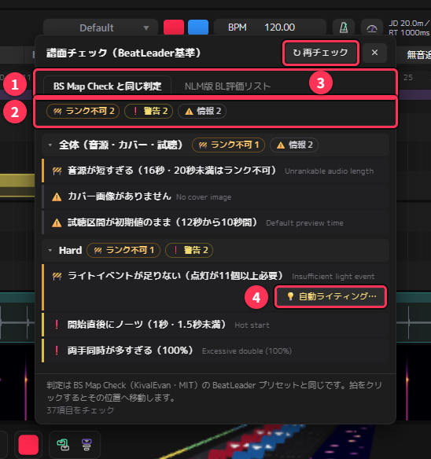

画像は説明用の短い譜面（16 秒・ライトが少ない）をチェックしたところです。

| 番号 | 名前 | 説明 |
|---|---|---|
| ① | タブ | 「BS Map Check と同じ判定」と「NLM版 BL評価リスト」を切り替える |
| ② | 集計 | 印ごとの項目の数 |
| ③ | ↻ 再チェック | 譜面を直した後に、結果を更新する |
| ④ | 💡 自動ライティング… | ライトが足りない項目にだけ出る。[自動ライティング](#自動ライティングノーツからライトを作る)（6 章）を始め、作った後にチェックし直す。カバー画像の項目には、同じ場所に [🖼 カバー画像を補正…](#カバー画像を補正する) が出る |

結果は「全体（音源・カバー・試聴）」と、難易度ごとの欄に分かれています。各項目の先頭の印は、問題の重さです。

| 印 | 意味 | どうするか |
|---|---|---|
| 🚧 ランク不可 | ランク基準を満たさない | ランク申請をするなら必ず直す |
| ❌ エラー | 大きな問題 | 理由が無ければ直す |
| ❗ 警告 | 問題の可能性がある | 確認して、必要なら直す |
| ⚠️ 情報 | 軽い問題、または問題ではない | 参考程度に見る |

ランク不可とエラーが 1 つも無ければ、一番上に「✓ ランク不可・エラーはありません」と出ます。

各項目の下に並ぶ数字は、問題のある **拍** です。

- 数字の上にマウスを置くと、曲の頭からの時間（分:秒）が出ます
- **数字をクリックすると、その難易度に切り替わり、その拍へ移動して該当のノーツなどを選んだ状態**になります。
  そのまま直せます
- 数が多い項目は「他 N 件」をクリックすると全部表示されます

直したら、パネル右上の **↻ 再チェック** で結果を更新します。
パネルは見出しをドラッグして好きな場所へ動かせます。

#### よく出る項目と直し方の例

| 項目 | 直し方 |
|---|---|
| 開始直後にノーツ（1.5 秒未満） | 最初のノーツを後ろへずらすか、ヘッダーの **無音追加** で曲の頭に無音を足す |
| 試聴区間が初期値のまま | INFO 画面の **試聴** ノードで、選曲画面で流す区間を設定する |
| カバー画像がありません | 256×256 以上の正方形の画像を、INFO 画面の **カバー画像** で選ぶ |
| カバー画像が正方形でない／小さい | 項目の横の **🖼 カバー画像を補正…** で、書き出す時に正方形・256×256 以上へ直せる（[下](#カバー画像を補正する)） |
| 飛来距離（JD）・反応時間が短すぎる／長すぎる | ヘッダーの **NJS** と **オフセット** を調整する。ヘッダーの JD / RT の表示を見ながら合わせる |
| 1/8・1/6 の拍に乗っていない | スナップが細かすぎる・ずれた位置に置いたノーツ。拍をクリックして位置を確かめる |
| ライトイベントが足りない | ライトを足す（点灯が 11 個以上必要）。項目の横の **💡 自動ライティング…** で自動で作れる |
| 照らされていないボム | ボムの手前でライトを点けておく。自動ライティングのライトは、ボムをいつも照らす |

#### カバー画像を補正する

カバー画像は **256×256 以上の正方形** で、形式が **png か jpg** である必要があります。
512×510 のように少しだけ合わない画像なら、画像を作り直さなくても NLM の中で直せます。

譜面チェックでカバー画像の項目（正方形でない／小さい）が出た時と、NLM版 BL評価リストの R1.A.4（カバー画像）が違反の時は、
その行に **🖼 カバー画像を補正…** が出ます。押すと確認の画面が開きます。

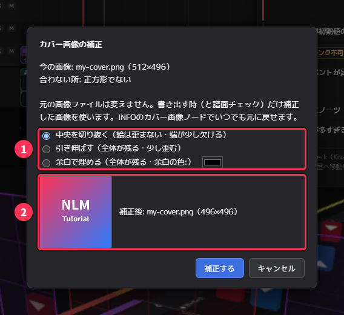

| 番号 | 名前 | 説明 |
|---|---|---|
| ① | 補正のしかた | 正方形でない時だけ選べる（下の表） |
| ② | 見本 | 補正した後の画像と、ファイル名・大きさ |

| 補正のしかた | 内容 |
|---|---|
| **中央を切り抜く**（最初はこれ） | 短い辺に合わせて、真ん中を切り抜く。絵は歪まないが、長い辺の端が少し欠ける |
| **引き伸ばす** | 長い辺に合わせて引き伸ばす。絵は全部残るが、少し歪む |
| **余白で埋める** | 長い辺に合わせ、足りない所を余白で埋める。絵は全部残る。余白の色を選べる |

- 256×256 より小さい画像は、256×256 に拡大します
- png・jpg 以外（webp など）は png にします（jpg は jpg のまま）
- 切り落とす所が多い時（長い辺の 5% 以上）は、画面に注意が出ます。絵が大きく欠ける時は「余白で埋める」を選びます

**補正する** を押すと、譜面チェックがやり直され、カバー画像の項目が消えます。

**元の画像ファイルは変わりません。** 書き出す時だけ、補正した画像を `cover.png`（jpg の時は `cover.jpg`）として出力フォルダに書き出します。
譜面チェックも、補正した後の画像で判定します。

INFO 画面のカバー画像ノードには、補正の内容（①）と **補正をやめる**（②）が出ます。

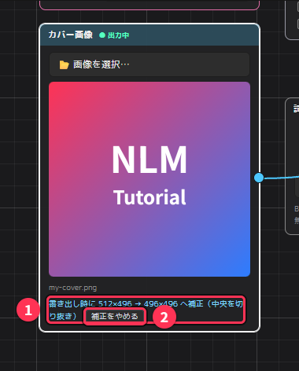

- **補正をやめる** を押すと、元の画像のまま書き出します。**Ctrl + Z** でも戻せます
- 補正の設定はプロジェクトに保存されます
- カバー画像ノードで別の画像を選び直すと、補正の設定は外れます（新しい画像も合わない時は、もう一度補正します）

> 大きく形の違う画像は、画像編集ソフトで作り直す方がきれいに仕上がります。
> この補正は「少しだけ合わない」時に、手早く直すためのものです。

### NLM版 BL評価リスト

譜面チェックのパネルの 2 つ目のタブです。**枠と背景が青緑**になります。

BeatLeader 公式サイトに書かれているランク基準の文章（Ranking Criteria）を、項目番号（R1.A.1 など）の順に並べ、
NLM が項目ごとに判定した表です。**BeatLeader や BS Map Check の公式な結果ではありません。**
見間違えないように、譜面チェックとは色を変えています。

#### 印と種類

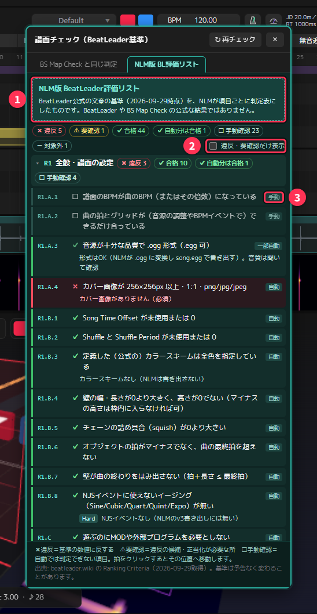

| 番号 | 名前 | 説明 |
|---|---|---|
| ① | 説明の帯 | NLM が作った表であることの表示（公式の結果ではありません） |
| ② | 違反・要確認だけ表示 | 直す必要がありそうな項目だけに絞る |
| ③ | 判定の種類 | 自動／一部自動／候補／手動／対象外 |

各項目の先頭の印は、判定の結果です。

| 印 | 意味 |
|---|---|
| ✖ 違反 | 基準の数値に反している |
| ⚠ 要確認 | 違反の候補。直すか、理由を説明できるようにしておく所 |
| ✔ 合格／自動分は合格 | 合っている（一部の項目は、自動で判定できた分だけ合格） |
| ☐ 手動確認 | 自動では判定できない。自分の目で確かめる |
| － 対象外 | この譜面には関係しない |

項目の右端には判定の種類（自動／一部自動／候補／手動／対象外）が出ます。
「候補」は、図や審査員の判断に頼る項目を NLM が解釈して、怪しい所を挙げたものです。
NLM がどう解釈したかは、項目の下の「＊」の注記に書いてあります。

上にある **違反・要確認だけ表示** にチェックを入れると、直す必要がありそうな項目だけに絞れます。

R10.A（1 拍に 1 個以上のライト）と R7.B（ボムの照明）が違反・要確認の時は、その行に **💡 自動ライティング…** が出ます。
押すと [自動ライティング](#自動ライティングノーツからライトを作る)（6 章）を始め、作った後にチェックし直します。
R1.A.4（カバー画像の大きさ・形・形式）が違反の時は **🖼 カバー画像を補正…** が出ます（[カバー画像を補正する](#カバー画像を補正する)）。

#### ★と Tech を入れる項目（R5.A）

R5.A（ノーツが反応に十分な時間見えているか）は、BeatLeader の★と Tech の値を使う式で判定します。
項目の中に難易度ごとの入力欄（①）があるので、次の「難易度を測る」で出た値を入れてください。
入れた値は、アプリを開いている間だけ覚えています。

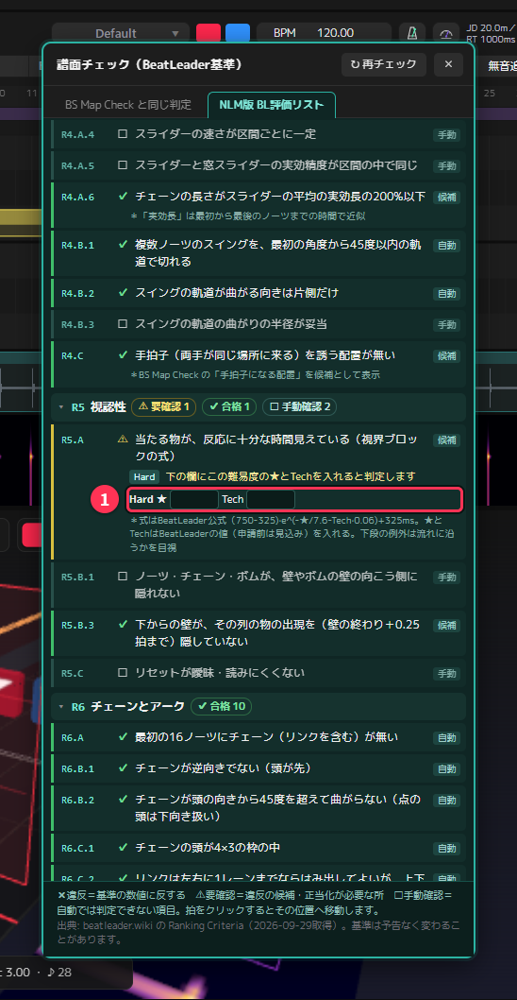

### 難易度を測る（BeatLeader の★の近似）

ファイルメニューの **難易度を測る（BeatLeaderの星の近似）…**、または INFO 画面の書き出しノードにある
**★ 難易度を測る（BL星の近似）** から開きます。

#### 初めて使う時：プラグインを取り込む

計算には追加プラグイン [nlm-rating](https://github.com/Oz-Co-two/nlm-rating) が必要です（約 19MB・Windows 専用）。
NLM 本体には入っていないので、パネルの **GitHub から取り込む** を押して取り込みます。

- ダウンロードしたファイルは、配布元の情報（SHA-256）と照合してから使います
- 取り込んだプラグインは、アプリのフォルダの `plugins` に保存されます。NLM 本体を更新しても残ります
- インターネットに接続するのは、ボタンを押した時だけです
- 取り込みが終わると、そのまま測定が始まります

プラグインの新しい版は **更新を確認** で確かめられます。
取り込んだ版が 2 つ以上ある時は、版を選ぶ欄が出て、前の版に戻せます。

#### 結果の見方

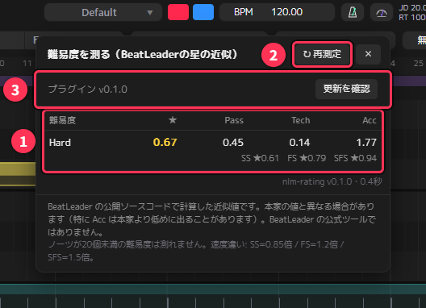

| 番号 | 名前 | 説明 |
|---|---|---|
| ① | 結果 | 難易度ごとの★と Pass / Tech / Acc。下の段は速度を変えた時の★ |
| ② | ↻ 再測定 | 譜面を直した後に、測り直す |
| ③ | プラグイン | 使っているプラグインの版と、更新の確認 |

パネルを開くたびに測定します。開いたまま譜面を直した時は **↻ 再測定** を押します。

| 列 | 意味 |
|---|---|
| ★ | 総合の難しさ（BeatLeader の星） |
| Pass | クリアするための難しさ |
| Tech | 角度や配置の技術的な難しさ |
| Acc | 高い精度を出す難しさ |

- 各難易度の下には、速度を変えた時の★も出ます（SS＝0.85 倍、FS＝1.2 倍、SFS＝1.5 倍）
- 行にマウスを置くと、予測される精度（%）が出ます
- **ノーツが 20 個未満の難易度は測れません**

> **近似値です。** BeatLeader が公開しているソースコードで計算していますが、本家サイトの値と異なる場合があります
> （特に Acc は本家より低めに出ることがあります）。BeatLeader の公式ツールではありません。

#### 使い方の例

- **難易度ごとの★の並びを確かめる**：上の難易度ほど★が高くなっているかを見ます
  （ランク基準 R11.H.5 では、★の昇順に並んでいること（0.5★までの逆転は許容）が求められます）
- **難易度の差を調整する**：隣り合う難易度の★が近すぎる・離れすぎている時の目安にします
- **NLM版 BL評価リストの R5.A に入れる**：★と Tech の値をそのまま入力欄へ写します

### 公開前チェックリスト

- [ ] **曲情報**：曲名・サブタイトル・アーティスト・制作者（マッパー名）を入れた
- [ ] **書き出す難易度**：公開しない作りかけの難易度に、ノーツやライトが残っていない
  （中身のある難易度は、設定ノードのチェックに関係なくすべて書き出されます）
- [ ] **カバー画像**：256×256 以上の正方形の画像を選んだ
- [ ] **試聴区間**：試聴ノードで、選曲画面で流す区間を決めた（▶ 試聴で確認した）
- [ ] **曲の頭**：最初のノーツまで 1.5 秒以上ある（2 秒以上がおすすめ）
- [ ] **NJS とオフセット**：ヘッダーの JD / RT を見て、難易度ごとに遊びやすい値にした
- [ ] **ライト**：全難易度にライトが入っていて、PREVIEW で見た目を確かめた（足りなければ自動ライティングで下地を作れる）
- [ ] **譜面チェック**：ランク不可・エラーが無い（警告も一通り見た）
- [ ] **★の並び**：難易度を測って、上の難易度ほど★が高くなっている
- [ ] **試しプレイ**：書き出して、Beat Saber 本体で全難易度を通しで遊んだ
- [ ] **プロジェクトの保存**：`.nlmf` を保存した（あとで直す時に必要です）

<!-- 章ナビ -->
> **ほかの章へ：** [1. 作業を速くする操作](#1-作業を速くする操作) ｜ [2. 配置を助ける表示](#2-配置を助ける表示) ｜ [3. NLE を使いこなす](#3-nle-を使いこなす) ｜ [4. 難易度をまとめて作る](#4-難易度をまとめて作る) ｜ [5. テンポが変わる曲と、拍のずれの直し方](#5-テンポが変わる曲と拍のずれの直し方) ｜ [6. ライティングの応用](#6-ライティングの応用) ｜ [7. INFO ノードの応用](#7-info-ノードの応用) ｜ [8. 公開前のチェック](#8-公開前のチェック) ｜ [9. 自分に合わせた設定](#9-自分に合わせた設定) ｜ [10. 困ったとき](#10-困ったとき) ｜ [▲ 目次](#目次)
<!-- /章ナビ -->

---

## 9. 自分に合わせた設定

メニューの **環境設定** で、操作の感じや見た目を自分に合わせて変えられます。
設定はタブで 5 つに分かれています。

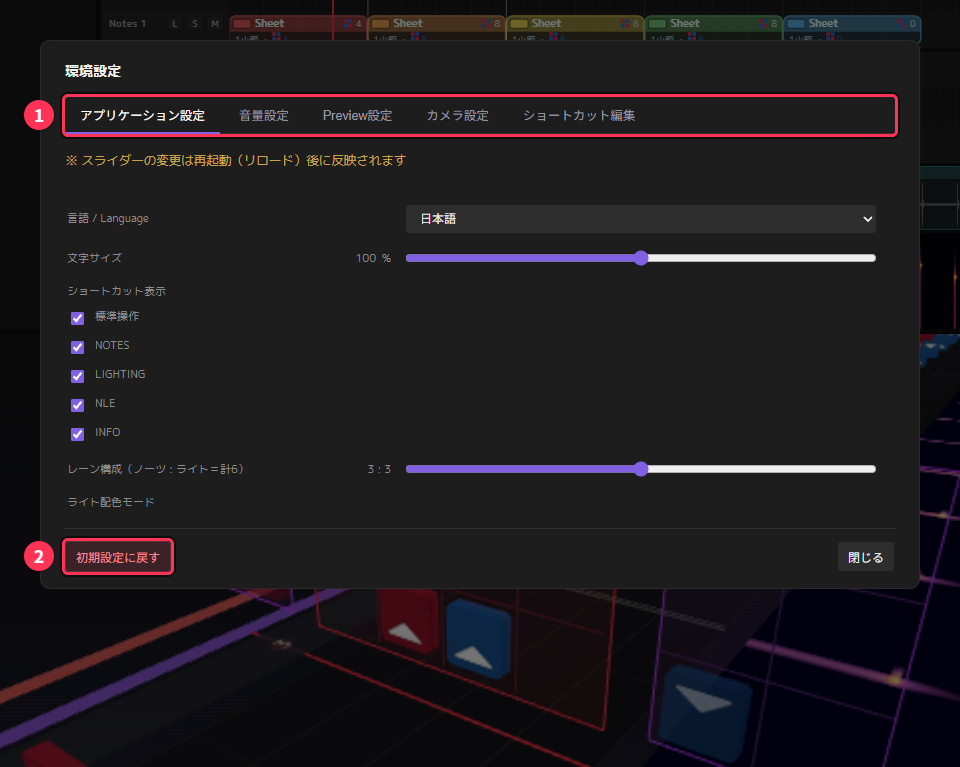

> スライダーの変更は、アプリを起動し直すと反映されます（Preview設定は、PREVIEW を開いた時に反映されます）。

### アプリケーション設定

| 項目 | 内容 |
|---|---|
| 言語 / Language | 日本語・英語を切り替える |
| 文字サイズ | 画面の文字の大きさ（80〜120%） |
| ショートカット表示 | 画面に浮かぶショートカット一覧の小窓を、種類（標準操作・NOTES・LIGHTING・NLE・INFO）ごとに出す・消す |
| レーン構成 | NLE のノーツとライトのレーンの本数の比率（合計 6 本）。いまのプロジェクトに反映され、新しいプロジェクトの初期値にもなる（一番上のレーンにクリップがあると、その比率にできない） |
| ライト配色モード | ライトの色の付け方（[6 章](#6-ライティングの応用)） |
| 直前ノーツ表示 | [2 章](#直前ノーツの補助表示) の補助表示を出すか（H キーでも切り替え） |
| 同じ向きの連続の警告 | [2 章](#同じ向きの連続の警告) の警告を出すか |
| 更新の確認 | 起動時に新しい版が出ていないか確かめるか（GitHub に接続します） |

ショートカット一覧の小窓は、操作を覚えたら消しておくと画面が広く使えます。

### 音量設定

マスター・ミュージック（曲）・ノーツ音・メトロノームの音量を、別々に変えられます。
ノーツを置く時は、ノーツ音を大きめにしておくとタイミングを確かめやすくなります。

### Preview設定

PREVIEW の見た目を細かく調整します（100% が標準）。

| 項目 | 内容 |
|---|---|
| Bloom 強度・半径・閾値 | ライトのにじむような光り方 |
| 環境光の明るさ | ステージ全体の明るさ |
| 発光の強さ | ライトやノーツの光の強さ |
| 反射の強さ | 床などへの映り込みの強さ |

PC が重い時や、光がまぶしくてノーツが見にくい時に下げてみてください。

### カメラ設定

| 項目 | 内容 |
|---|---|
| 回転・ズーム・パン | 3D ビューで視点を動かす速さ（50〜150%） |
| 3D ビューのホイール操作を反転 | 3D ビューでホイールを回した時に進む向きを逆にする |
| 2D 画面のホイール操作を反転 | NLE・Music でホイールを回した時に進む向きを逆にする |

ホイールの向きは、3D ビューと 2D 画面（NLE・Music）で別々に決められます。

### ショートカット編集

キーの割り当てを変えます（[1 章](#ショートカットを自分用に変える)）。

### 初期設定に戻す

環境設定の左下の **初期設定に戻す** で、ここにある設定をすべて最初の状態に戻せます。
プロジェクト・アセット・プラグインは消えません。

<!-- 章ナビ -->
> **ほかの章へ：** [1. 作業を速くする操作](#1-作業を速くする操作) ｜ [2. 配置を助ける表示](#2-配置を助ける表示) ｜ [3. NLE を使いこなす](#3-nle-を使いこなす) ｜ [4. 難易度をまとめて作る](#4-難易度をまとめて作る) ｜ [5. テンポが変わる曲と、拍のずれの直し方](#5-テンポが変わる曲と拍のずれの直し方) ｜ [6. ライティングの応用](#6-ライティングの応用) ｜ [7. INFO ノードの応用](#7-info-ノードの応用) ｜ [8. 公開前のチェック](#8-公開前のチェック) ｜ [9. 自分に合わせた設定](#9-自分に合わせた設定) ｜ [10. 困ったとき](#10-困ったとき) ｜ [▲ 目次](#目次)
<!-- /章ナビ -->

---

## 10. 困ったとき

### プロジェクトを開いたのに、曲・出力フォルダ・カバー画像がつながらない

プロジェクト（`.nlmf`）には、曲・出力フォルダ・カバー画像の **場所** を保存していて、開いた時に自動でつなぎます。
次の場合は自動ではつながりません。

- ファイルやフォルダを移動した・名前を変えた
- 別の PC でプロジェクトを開いた
- v1.2.0-oz より前の版から更新した（最初の 1 回だけ）
- 他の人から受け取ったプロジェクトを開いた

出力フォルダは、安全のため **この PC のフォルダ選択画面で一度選んだことのあるフォルダ** にしか自動でつなぎません。
受け取ったプロジェクトに、知らない書き出し先が仕込まれていても書き込まないためです。

**直し方**

- 出力フォルダ・カバー画像：INFO 画面の書き出しノードにある「**🔌 出力フォルダ/カバー画像を再接続**」で選び直します
- 曲：**ファイル → 音楽ファイルを読み込む…** で選び直します

一度選び直せば、次からはまた自動でつながります。

### 書き出しボタンを押すと「書き出せません」と出る

書き出しノードのチェック一覧で、「必須」の項目に ✕ が付いています。

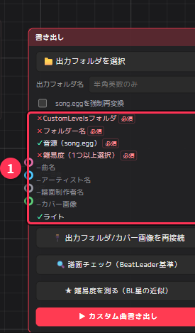

| 項目 | 直し方 |
|---|---|
| CustomLevels フォルダ | 「出力フォルダを選択」で Beat Saber の CustomLevels を選ぶ |
| フォルダー名 | 出力フォルダ名を入れる（半角英数字） |
| 音源（song.egg） | 曲を読み込む |
| 難易度（1 つ以上選択） | 設定ノードで、難易度に 1 つ以上チェックを入れる |

### 「ffmpeg が見つかりません」と出る

ogg 以外の曲（mp3・wav など）を書き出す時や、無音追加を使う時は、曲の変換に **ffmpeg** が必要です。
ffmpeg は NLM と一緒には入りません。

1. Windows の「ターミナル」（または PowerShell）を開き、次を実行してインストールします

   ```
   winget install Gyan.FFmpeg
   ```

2. **NLM を一度閉じて、起動し直します**（起動し直さないと、インストールした ffmpeg が見つかりません）
3. もう一度書き出します

### 曲を変えていないのに、書き出した曲がおかしい

書き出しを速くするため、曲が前回と同じなら song.egg の変換を省いています。
それでもおかしい時は、書き出しノードの「**song.eggを強制再変換**」にチェックを入れて書き出し直してください。

### キーを押しても効かない

- ショートカットは、**マウスが乗っている枠**（3D ビュー・NLE・PREVIEW など）に対して効きます。操作したい枠の上にマウスを置いてから押してください
- ショートカットの割り当てを変えた場合は、**環境設定 → ショートカット編集** で確かめます。「全て既定に戻す」で元に戻せます
- 3D ビューのノーツの操作は、そのレーンが **ロック** されていると効きません（[3 章](#レーンを増やすロックソロミュート)）

### 操作を元に戻せない

ほとんどの操作は Ctrl + Z で戻せますが、**別の難易度への「転送」は戻せません**（[4 章](#4-難易度をまとめて作る)）。
大きな変更の前には Ctrl + S で保存しておくと安心です。

### 環境設定を最初の状態に戻したい

**環境設定 → 初期設定に戻す** で、画面の比率・音量・カメラの速度・ショートカットなど、全部の環境設定が最初の状態に戻ります。
プロジェクトやアセットは消えません。

### 「難易度を測る」でエラーが出る

| 表示 | 直し方 |
|---|---|
| GitHub に接続できませんでした | インターネットの接続を確かめる |
| 配布元の情報と一致しません | ダウンロードが壊れた可能性があります。時間をおいてもう一度取り込む |
| このプラグインの版は、今の NLM では使えません | NLM を新しい版に更新する |
| ノーツが 20 個未満のため測れません | その難易度は測れません（ノーツを増やせば測れます） |

### 起動時に "Failed to resolve Python.Runtime.Loader.Initialize ..." と出て起動しない

ダウンロードした zip に付く「インターネットから来たファイル」の印が原因です。
普通は起動時に自動で外しますが、それでも起動しない時は次の手順で外します。

1. ダウンロードした zip を右クリック →「プロパティ」
2. 「全般」タブの一番下の「許可する」にチェックを入れて OK
3. zip を展開し直して起動する

### 更新したら調子が悪い

アプリ内から更新した場合、前の版がアプリのフォルダの `_previous_<版>` に残っています。
NLM を閉じてから、その中の `NonLinearMapper.exe` と `_internal` を元の場所へ戻すと、前の版に戻せます。

Program Files など、書き込めない場所に NLM を置いている場合は、アプリ内から更新できません。
README の手順で手動で更新してください。

### それでも解決しない時

[GitHub の Issues](https://github.com/Oz-Co-two/nlm-oz-co2/issues) で知らせてください。
画面右上に出ている **版番号**（例：v1.4.0-oz）と、どの操作で何が起きたかを書いてもらえると助かります。

<!-- 章ナビ -->
> **ほかの章へ：** [1. 作業を速くする操作](#1-作業を速くする操作) ｜ [2. 配置を助ける表示](#2-配置を助ける表示) ｜ [3. NLE を使いこなす](#3-nle-を使いこなす) ｜ [4. 難易度をまとめて作る](#4-難易度をまとめて作る) ｜ [5. テンポが変わる曲と、拍のずれの直し方](#5-テンポが変わる曲と拍のずれの直し方) ｜ [6. ライティングの応用](#6-ライティングの応用) ｜ [7. INFO ノードの応用](#7-info-ノードの応用) ｜ [8. 公開前のチェック](#8-公開前のチェック) ｜ [9. 自分に合わせた設定](#9-自分に合わせた設定) ｜ [10. 困ったとき](#10-困ったとき) ｜ [▲ 目次](#目次)
<!-- /章ナビ -->
