[日本語](tutorial.md) | **English**

# Tutorial: making your first map and playing it in Beat Saber

This tutorial walks you step by step through loading a song, placing notes, exporting the map so it can be played in Beat Saber, and saving your project.

> **Switching the UI to English**
> NLM starts in Japanese. Click **環境設定** (Preferences — the second menu at the top left, next to ファイル)
> and set **言語 / Language** to **English** on the first tab. The screenshots in this tutorial show the English UI (v1.4.1-oz).

This tutorial covers only the basic flow. For the details of each panel, see the original
[reference manual](https://helba.flashhub.net/nlm/manual/) (Japanese).
Faster workflows and the checks before publishing are covered in the [advanced tutorial](tutorial-advanced.en.md).

## Contents

1. [The screen layout](#1-the-screen-layout)
2. [Load a song and set the BPM](#2-load-a-song-and-set-the-bpm)
3. [Place notes](#3-place-notes)
4. [Select and edit, arcs and chains](#4-select-and-edit-arcs-and-chains)
5. [Bombs and walls](#5-bombs-and-walls)
6. [Lighting](#6-lighting)
7. [Check it in the preview](#7-check-it-in-the-preview)
8. [Enter the song info and export](#8-enter-the-song-info-and-export)
9. [Save the project](#9-save-the-project)
10. [Where to go next](#10-where-to-go-next)

> **About the images**
> The images were taken in a browser. In the exe version the window has a frame (title bar),
> and selecting files or folders opens the standard Windows dialogs.
> The volume meter at the right edge of the screen is cropped out of the images.

---

## 1. The screen layout

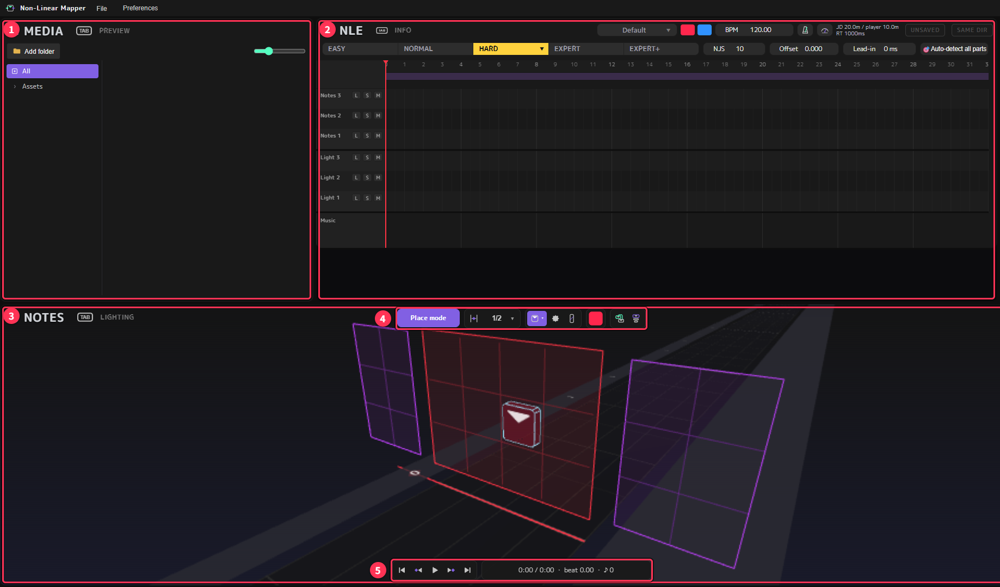

| No. | Name | What it is for |
|---|---|---|
| ① | **MEDIA / PREVIEW** | MEDIA lists songs and assets. Switch to PREVIEW for a preview that looks close to Beat Saber |
| ② | **NLE / INFO** | NLE is a timeline where you arrange the map and the song along time. Switch to INFO to set the song name, the export folder and so on |
| ③ | **NOTES / LIGHTING** | The 3D view. This is where you place notes and lights |
| ④ | Toolbar | Choose what to place (note, bomb, wall), its color and direction |
| ⑤ | Transport bar | Play / stop, and the current time and beat |

The "TAB" next to the headings of ① to ③ means: **put the mouse over that area and press Tab to switch the view**
(for example, Tab over ③ switches NOTES ⇄ LIGHTING).

The small floating windows listing shortcuts can be closed with the ✕ at their top right (you can show them again from Preferences).
They are closed in the rest of the images to keep them easy to read.

---

## 2. Load a song and set the BPM

### Load the song

Choose **File → Load music file…** from the menu and open your song file.

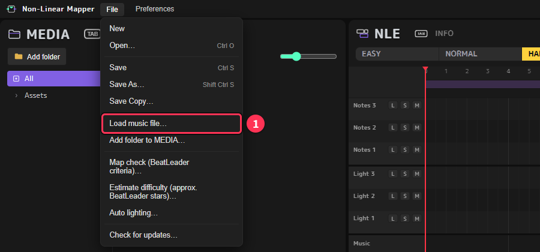

Supported formats include ogg / egg / mp3 / wav / flac / m4a.
Songs in formats other than ogg are converted to the Beat Saber format (song.egg) with ffmpeg when you export.
If you have not installed ffmpeg, install it first as described in the "ffmpeg" section of the [README](../README.en.md).

After loading, the waveform of the song appears in the **Music** row at the bottom of the NLE.

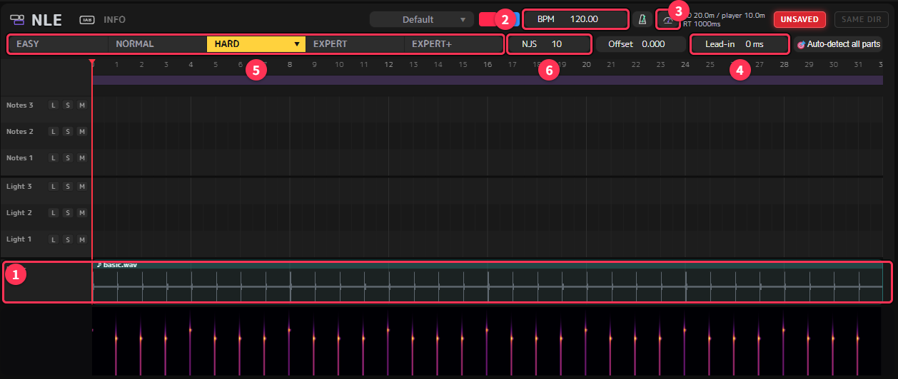

| No. | Name | Description |
|---|---|---|
| ① | Music | The waveform of the song. The colored band below it shows the strength of each frequency (spectrogram), so you can see where the song builds up |
| ② | BPM | The tempo of the song. Click the value to type a number |
| ③ | Detect BPM | Analyzes the song and suggests BPM candidates |
| ④ | Lead-in | Silence (ms) added to the start of the song. Use it when the beat lines and the start of the song do not line up |
| ⑤ | Difficulty | Which difficulty you are editing. Click it or press 1–5 to switch |
| ⑥ | NJS | Note jump speed — how fast the notes fly in. Each difficulty has its own value |

### Set the BPM

Music files do not contain the BPM, so you set it yourself.
Press the **Detect BPM** button (③) to get candidates, and pick the one that fits.

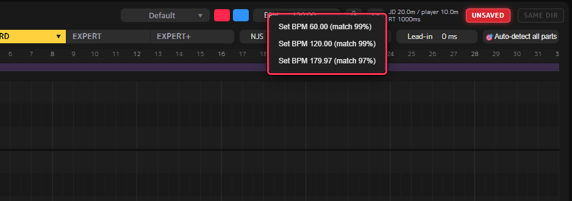

The candidates also include half and double the real BPM. Listen to the song and choose the one that feels natural.
If you know the BPM, you can also type it directly into ②.

To check by ear, turn on the metronome button to the right of the BPM and play with Space.
If the clicks and the beat of the song drift apart little by little, the BPM is wrong.
If they are off by the same amount from the very start, shift the start of the song with **Lead-in** (④).

---

## 3. Place notes

### The place mode screen

Right after startup, the 3D view is in **Place mode**.
The red frame in the middle is **the current beat (playhead)**, and you place notes on its 4×3 grid.

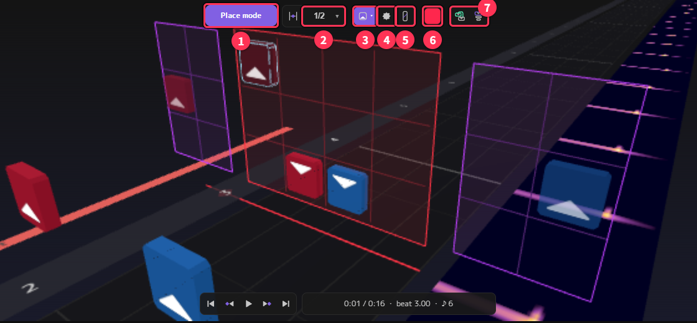

| No. | Name | Description |
|---|---|---|
| ① | Mode | The current mode. Press Q to switch between Place mode ⇄ Camera-lock mode |
| ② | Snap | How far ←/→ and the wheel move (1/2 beat at first). You can also change it with the "," key |
| ③ | Note | Places notes. Use ▾ to choose the cut direction |
| ④ | Bomb | Places bombs |
| ⑤ | Wall | Places walls |
| ⑥ | Color | The color of the notes you place. Press F to switch red ⇄ blue |
| ⑦ | Arc / Chain | Makes an arc or a chain from the selected notes ([chapter 4](#4-select-and-edit-arcs-and-chains)) |

The purple frames to the left and right of the red frame show the last red and blue notes you placed, semi-transparently.
Use them to check that the next swing flows naturally from the previous note (toggle with the H key).

### How to place

1. Move to the beat where you want to place a note with **→ / ←** (or the wheel)
2. Choose the color with **F** (as in Beat Saber, red = left hand, blue = right hand)
3. Choose the cut direction with **▾** on the note button in the toolbar (you can also rotate it with **Alt + wheel**)
4. When you point at a cell, a semi-transparent note with a white frame (where it will be placed) appears. **Left-click** to place it

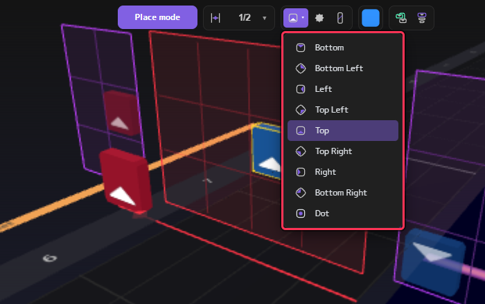

- **Right-click** to delete a note you placed by mistake. **Ctrl + Z** undoes (**Shift + Ctrl + Z** redoes)
- Placing on the same cell at the same beat overwrites the color and direction
- You can also place notes while playing (Space)

As you place notes, colored bands (clips) called "Sheet" are created automatically, one bar at a time, in the **Notes 1** row of the NLE.
The notes you place go into these clips. Clips can be moved, copied and split later,
but you don't need to worry about them at first.

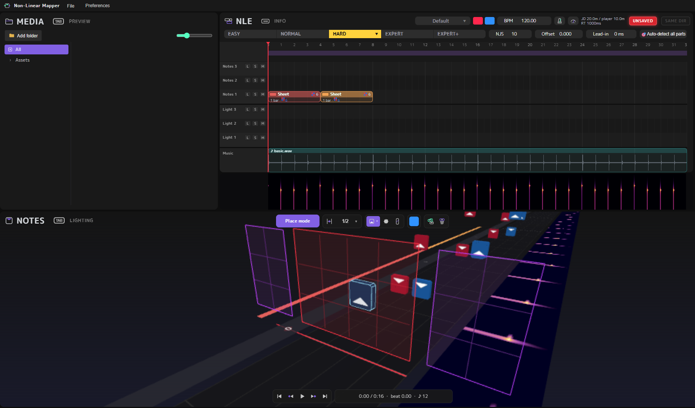

---

## 4. Select and edit, arcs and chains

### Select in Camera-lock mode

To select and edit notes you have placed, press **Q** to switch to **Camera-lock mode**.
The view looks down at the map from the side, and you can click notes to select them.

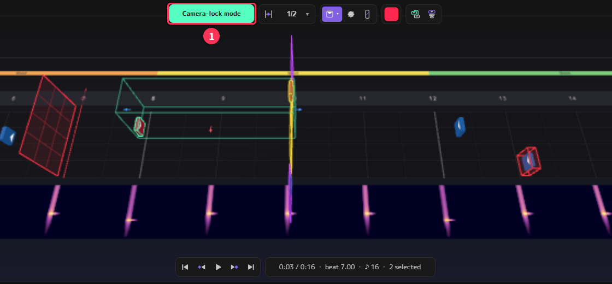

- **Left-click**: select. **Shift + left-click**: add to the selection
- **Left-drag** from an empty spot: select everything inside the box
- Drag the arrows that appear to move the selection
- **X / Delete**: delete. **A**: clear the selection
- Point at the selected notes and press **F** or use **Alt + wheel**: change the color / direction of all selected notes at once
- Rotate the view with **middle-drag**, pan with **Shift + middle-drag**, and zoom with **Ctrl + wheel**

### Arcs and chains

Select **two or more notes of the same color**, then press

- **Ctrl + R** → an **arc** (a line connecting the notes). The original notes stay
- **C** (or Ctrl + T) → a **chain** (a row of small slices). The two original notes become its head and tail

The two buttons at the right end of the toolbar do the same.

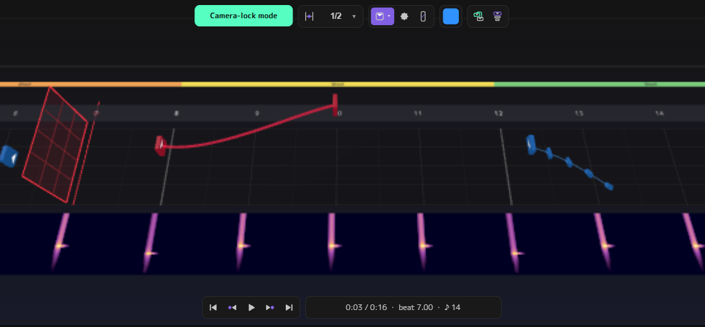

You can change how much an arc curves and how many slices a chain has with the wheel while it is selected
(for the key combinations, see the shortcut list on the screen or the NOTES section of the original manual).

---

## 5. Bombs and walls

In Place mode, choose **Bomb** (①) or **Wall** (②) in the toolbar, then place them.
Pressing **W** also opens a circular menu (pie menu) to choose select / note / bomb / wall.

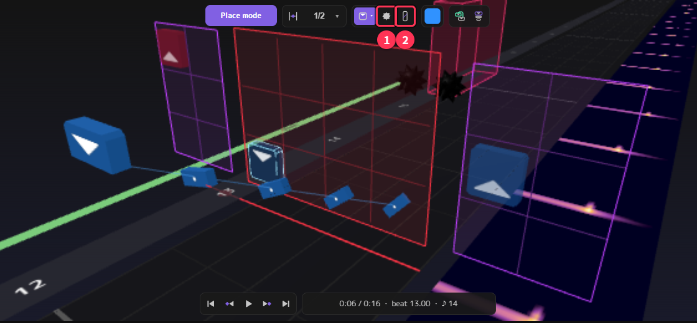

- **Bomb**: click a cell to place it, just like a note
- **Wall**: click four times to set its shape
  1. Click the starting cell
  2. Move the mouse to set the width and click
  3. Set the height and click
  4. Set the depth (length) and click
  To cancel halfway, right-click or press Esc

To resize a wall after placing it, select it in Camera-lock mode and press **S**.

---

## 6. Lighting

Put the mouse over the 3D view and press **Tab** to switch to **LIGHTING** (light editing) (①).
There are 10 lanes, one for each kind of light (RING ZOOM, CENTER, L LASER, etc.).

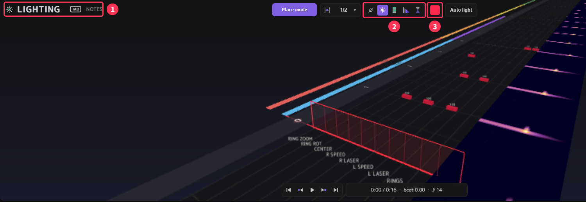

1. Choose the behavior (off / on / flash / fade / transition) with ②
2. Choose the color with the color box ③
3. As with notes, move to the beat and **left-click** a lane (right-click to delete)

The lights you place are gathered into a clip in the **Light 1** row of the NLE.
Press Tab again to go back to NOTES.

A map can be played without lights. You can make the notes first and add lights later.

---

## 7. Check it in the preview

Put the mouse over the top-left area and press **Tab** to switch to **PREVIEW** (①).
You can check notes and lights in a view close to Beat Saber.

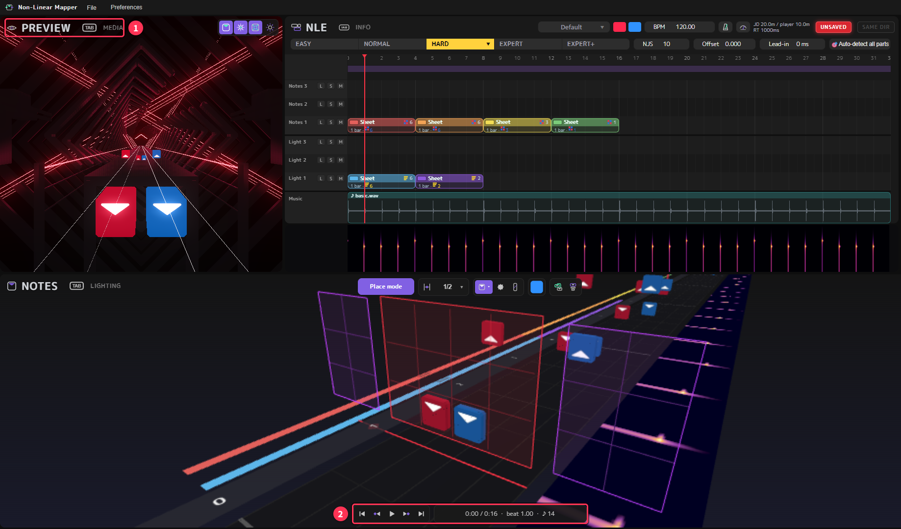

Press **Space** (or the play button ②) to play / stop.
The buttons at the top right of PREVIEW toggle the notes, lights and stage.
Choose the stage (environment) in the "Default" field at the top right of the NLE.

---

## 8. Enter the song info and export

Put the mouse over the NLE and press **Tab** to switch to the **INFO** screen.
This is where you set the song name and the export folder.

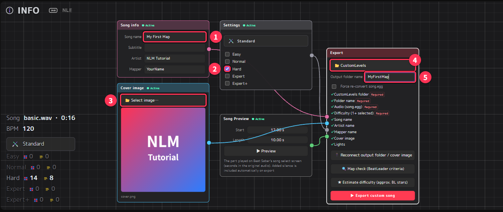

| No. | Place | What to set |
|---|---|---|
| ① | Song info | Enter the song name, subtitle, artist and mapper (your name) |
| ② | Settings | **Check at least one** difficulty (Hard in this example). You cannot export with no checks. What is actually exported is **every difficulty that has notes, lights, etc.**, regardless of the checks |
| ③ | Cover image | The cover shown on the song select screen (you can export without one) |
| ④ | Export | Use **Select output folder** to choose Beat Saber's **CustomLevels folder** |
| ⑤ | Output folder name | The name of the folder created inside CustomLevels (letters and numbers only) |

The CustomLevels folder is `Beat Saber_Data\CustomLevels` inside the folder where Beat Saber is installed.

The **Song Preview** node sets the part played on the song select screen (start and length, in seconds). You can check it with ▶ **Preview**.

The lines between the nodes show which settings are used for the export. Everything is connected from the start, so you can leave them as they are.

### Export

When every "Required" item in the export node's checklist has a ✓, you are ready.
Press **▶ Export custom song**.

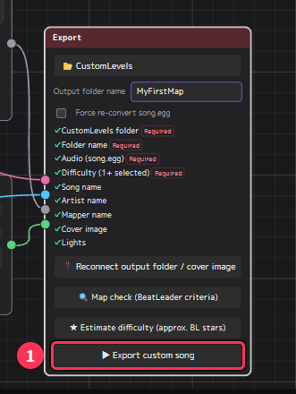

The following files are created in the folder named ⑤ inside CustomLevels:

- `Info.dat` (song info)
- `HardStandard.dat` etc. (one map file for each difficulty with content)
- `song.egg` (the song)
- the cover image

Start Beat Saber and the map appears in the custom songs list.

After editing the map, press **▶ Export custom song** again to overwrite it.
If you have not changed the song, the conversion is skipped from the second time on, so it finishes quickly.

---

## 9. Save the project

The exported files are for Beat Saber, so to continue editing later, save a **project file (`.nlmf`)**.

Save with **Ctrl + S** (or File → Save). The first time, you are asked for the location and file name.

When there are unsaved changes, **UNSAVED** at the top right of the NLE lights up in red.

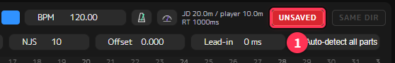

It goes off when you save.

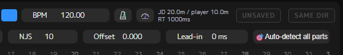

If you close the app, or choose New or Open, with unsaved changes, you are asked to choose "Save and quit (continue) / Quit without saving (continue) / Cancel".

To continue editing, open the `.nlmf` with **File → Open…** (Ctrl + O). You can also double-click the `.nlmf`.
The song, the output folder and the cover image are loaded automatically from their previous locations.
If you moved the files, select them again with "Reconnect output folder / cover image" on the export node of INFO.

---

## 10. Where to go next

Once you are used to the basics, try these features too. They are explained in the [advanced tutorial](tutorial-advanced.en.md)
(faster workflows, making the most of the NLE, building several difficulties, checks before publishing, measuring ★, and more).

- **Clip editing in the NLE**: move, copy, split (C key) and join (Ctrl + G) clips to build repeated choruses and so on efficiently
- **Assets**: right-click a clip with a pattern you use often → "Save to assets", then drag it from MEDIA to another place or another song
- **Copying between difficulties**: click the selected difficulty again to open a menu that sends notes or lights to another difficulty
- **Add folders to MEDIA**: register CustomLevels or your music folder to drag existing songs into the NLE as material
- **Tempo parts**: support for songs whose BPM changes partway through ("Auto-detect all parts" in the NLE)
- **Markers**: place a marker with Ctrl + E and jump between markers with Ctrl + [ / ]
