# チュートリアル：はじめての譜面を作って Beat Saber で遊ぶまで

曲を読み込んでノーツを置き、Beat Saber で遊べる形に書き出して保存するまでを、順番に説明します。
画面は Oz-Co2 版 v1.1.0-oz のものです。

ここで説明するのは基本の流れだけです。各パネルの細かい操作は、原作の
[リファレンスマニュアル](https://helba.flashhub.net/nlm/manual/) を参照してください。

## 目次

1. [画面の見方](#1-画面の見方)
2. [曲を読み込んで BPM を合わせる](#2-曲を読み込んで-bpm-を合わせる)
3. [ノーツを置く](#3-ノーツを置く)
4. [選んで直す・アークとチェーン](#4-選んで直すアークとチェーン)
5. [ボムと壁](#5-ボムと壁)
6. [ライティング](#6-ライティング)
7. [プレビューで確認する](#7-プレビューで確認する)
8. [曲の情報を入れて書き出す](#8-曲の情報を入れて書き出す)
9. [プロジェクトを保存する](#9-プロジェクトを保存する)
10. [この先の機能](#10-この先の機能)

> **画像について**
> 画像はブラウザで撮影したものです。exe 版ではウィンドウの枠（タイトルバー）が付くほか、
> ファイルやフォルダを選ぶ画面は Windows 標準のダイアログになります。
> また、画面の右端にある音量メーターは画像から省いています。

---

## 1. 画面の見方

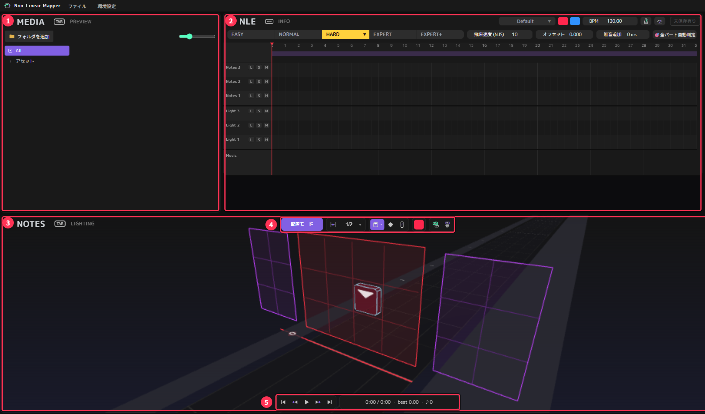

| 番号 | 名前 | 役割 |
|---|---|---|
| ① | **MEDIA / PREVIEW** | MEDIA は曲や素材の一覧です。PREVIEW に切り替えると、Beat Saber に近い見た目のプレビューになります |
| ② | **NLE / INFO** | NLE は時間の流れに沿って譜面や曲を並べるタイムラインです。INFO に切り替えると、曲名や書き出し先を設定する画面になります |
| ③ | **NOTES / LIGHTING** | 3D ビューです。ここでノーツやライトを置きます |
| ④ | ツールバー | 置くもの（ノーツ・ボム・壁）や色・向きを選びます |
| ⑤ | 再生バー | 再生・停止と、現在の時間・拍を表示します |

①〜③の見出しの横にある「TAB」は、**その枠の上にマウスを置いて Tab キーを押すと表示が切り替わる**、という意味です
（例：③の上で Tab を押すと NOTES ⇄ LIGHTING）。

画面の中に浮かんでいるショートカット一覧の小窓は、右上の ✕ で閉じられます（環境設定からまた表示できます）。
この先の画像では、見やすさのために閉じています。

---

## 2. 曲を読み込んで BPM を合わせる

### 曲を読み込む

メニューの **ファイル → 音楽ファイルを読み込む…** を選び、曲のファイルを開きます。

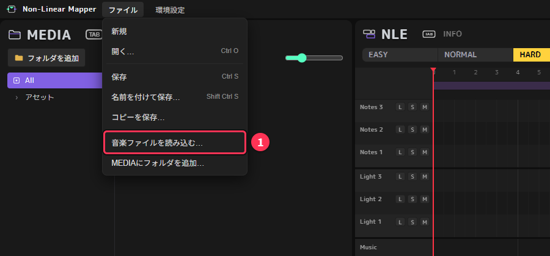

使える形式は ogg / egg / mp3 / wav / flac / m4a などです。
ogg 以外の形式の曲は、書き出すときに ffmpeg で Beat Saber 用の形式（song.egg）に変換します。
ffmpeg を入れていない場合は、README の「ffmpeg」の項を見て先に導入してください。

読み込むと、NLE の一番下の **Music** の段に曲の波形が表示されます。

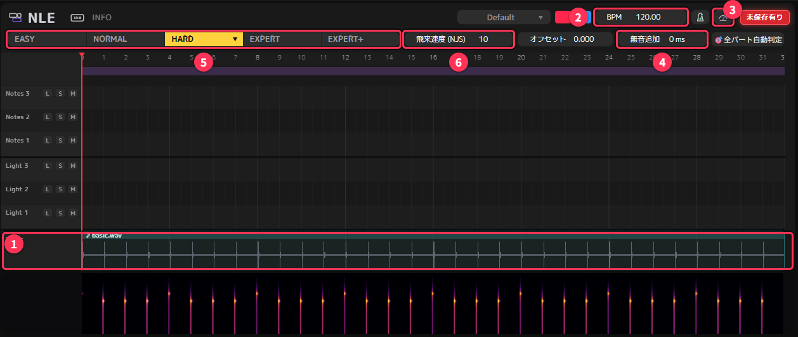

| 番号 | 名前 | 説明 |
|---|---|---|
| ① | Music | 読み込んだ曲の波形。その下の色の帯は周波数の強さ（スペクトログラム）で、曲の盛り上がりが見て分かります |
| ② | BPM | 曲のテンポ。値をクリックすると数字を入力できます |
| ③ | BPM 測定 | 曲を解析して BPM の候補を出します |
| ④ | 無音追加 | 曲の先頭に入れる無音の長さ（ms）。拍の線と曲の頭がずれているときに使います |
| ⑤ | 難易度 | 今どの難易度を編集しているか。クリック、または 1〜5 キーで切り替えます |
| ⑥ | 飛来速度 (NJS) | ノーツが飛んでくる速さ。難易度ごとに別の値を持ちます |

### BPM を合わせる

音楽ファイルには BPM の情報が入っていないので、自分で設定します。
③の **BPM 測定** ボタンを押すと候補が出るので、合うものを選びます。

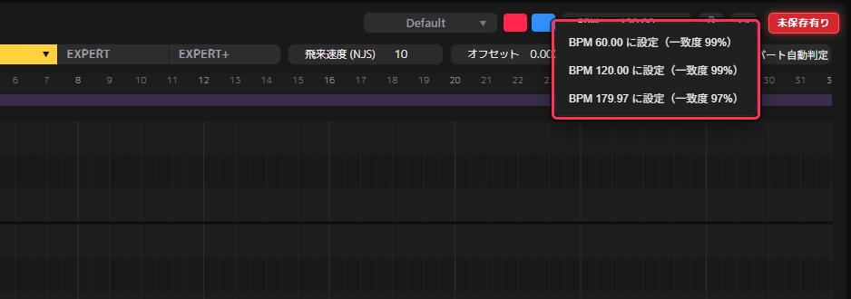

候補には、本当の BPM の半分や 2 倍の値も並びます。曲を聴いて自然なものを選んでください。
BPM が分かっている場合は、②に直接入力しても構いません。

合っているかは、BPM の右にあるメトロノームのボタンを ON にして Space で再生すると、耳で確かめられます。
クリック音と曲の拍が少しずつずれていく場合は BPM が違っています。
最初から一定の量だけずれている場合は、④の **無音追加** で曲の頭をずらして合わせます。

---

## 3. ノーツを置く

### 配置モードの画面

起動した直後の 3D ビューは **配置モード** になっています。
中央の赤い枠が **いまの拍（再生ヘッド）** で、ノーツはこの枠の 4×3 のマスに置きます。

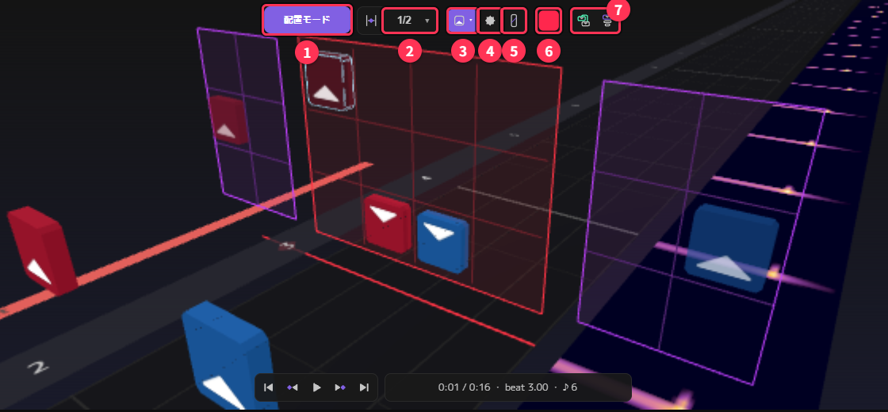

| 番号 | 名前 | 説明 |
|---|---|---|
| ① | モード | 今のモード。Q キーで 配置モード ⇄ カメラ固定モード を切り替えます |
| ② | スナップ | ←/→ キーやホイールで進む拍の細かさ（最初は 1/2 拍）。「,」キーでも変えられます |
| ③ | ノーツ | ノーツを置きます。▾ で切る向きを選べます |
| ④ | ボム | ボムを置きます |
| ⑤ | 壁 | 壁を置きます |
| ⑥ | 色 | 置くノーツの色。F キーで赤 ⇄ 青を切り替えます |
| ⑦ | アーク / チェーン | 選んだノーツからアーク・チェーンを作ります（[4 章](#4-選んで直すアークとチェーン)） |

赤枠の左右にある紫の枠は、赤・青それぞれ直前に置いたノーツを半透明で表示しています。
前のノーツからの振りが無理のない向きになっているかを確かめるのに使います（H キーで表示を切り替え）。

### 置く手順

1. **→ / ← キー**（またはホイール）で、置きたい拍まで進めます
2. **F キー**で色を選びます（Beat Saber と同じく、赤＝左手、青＝右手）
3. ツールバーのノーツボタンの **▾** で切る向きを選びます（**Alt + ホイール** でも回せます）
4. マスにマウスを合わせると、白い枠の半透明のノーツ（置く予定の位置）が表示されます。**左クリック**で置きます

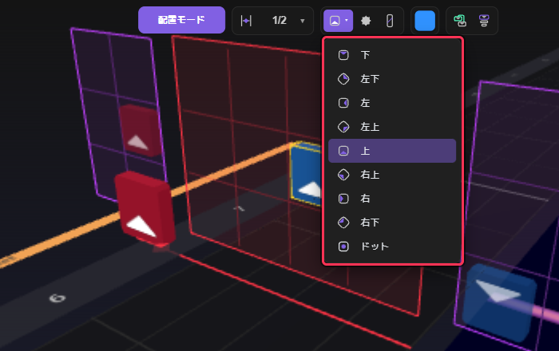

- 間違えたら **右クリック**で消せます。**Ctrl + Z** で元に戻せます（**Shift + Ctrl + Z** でやり直し）
- 同じ拍の同じマスに置くと、色と向きが上書きされます
- 再生しながら（Space）置くこともできます

置いていくと、NLE の **Notes 1** の段に「Sheet」という色付きの帯（クリップ）が 1 小節ごとに自動でできます。
置いたノーツはこのクリップに入ります。クリップはあとから移動・コピー・分割ができますが、
最初のうちは気にしなくて大丈夫です。

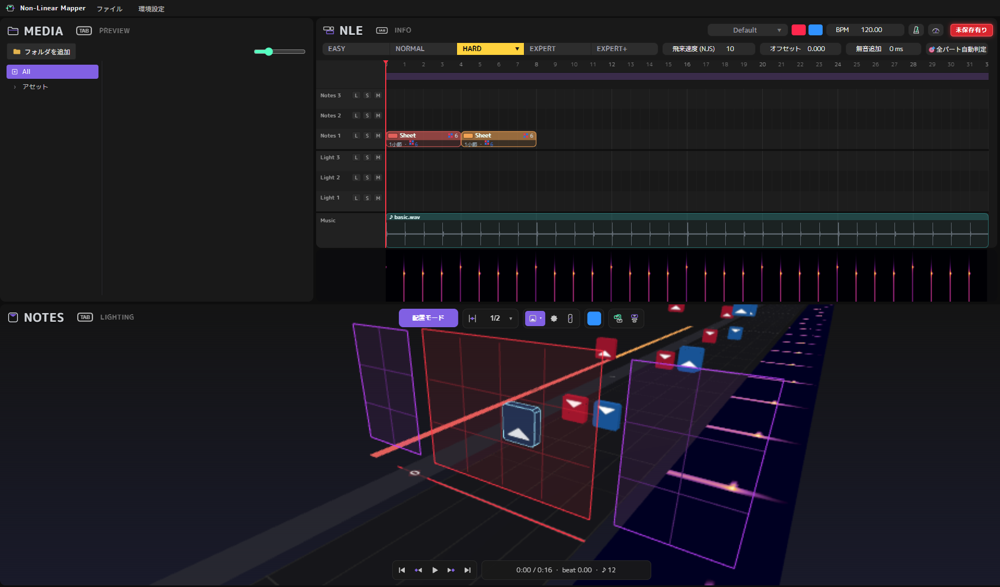

---

## 4. 選んで直す・アークとチェーン

### カメラ固定モードで選ぶ

置いたノーツを選んで直すときは、**Q キー**で **カメラ固定モード** に切り替えます。
譜面を横から見下ろす表示になり、ノーツをクリックして選べるようになります。

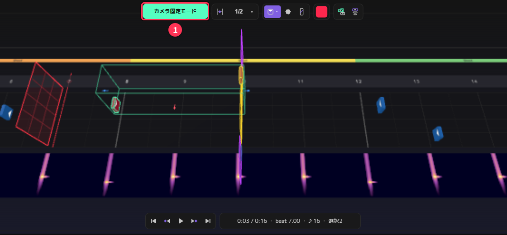

- **左クリック**：選ぶ。**Shift + 左クリック**：選んだものに追加する
- 何もないところから **左ドラッグ**：四角で囲んだものをまとめて選ぶ
- 選んだものは、表示される矢印をドラッグすると動かせます
- **X / Delete**：消す。**A**：選択を解除する
- 選んだノーツにマウスを合わせて **F**・**Alt + ホイール**：選んだノーツ全部の色・向きをまとめて変える
- 視点は **中ドラッグ**で回転、**Shift + 中ドラッグ**で平行移動、**Shift + ホイール**で拡大縮小します

### アークとチェーン

**同じ色のノーツを 2 つ以上**選んでから、

- **Ctrl + R** → **アーク**（ノーツとノーツをつなぐ線）。元のノーツは残ります
- **C**（または Ctrl + T）→ **チェーン**（細かく刻むノーツの列）。元の 2 つのノーツが頭と尾になります

ツールバー右端の 2 つのボタンでも同じことができます。

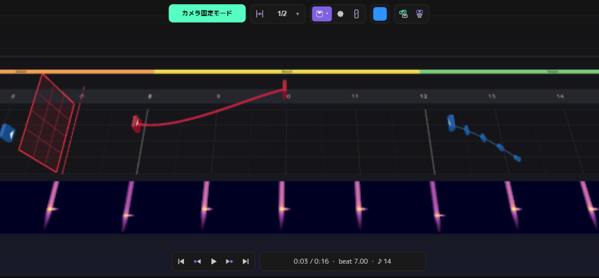

アークの曲がり具合やチェーンの分割数は、選んだ状態でホイールを使って変えられます
（組み合わせるキーは画面のショートカット一覧、または原作マニュアルの NOTES の項を参照）。

---

## 5. ボムと壁

配置モードでツールバーの **ボム**（①）または **壁**（②）を選んでから置きます。
**W キー**を押すと、選択 / ノーツ / ボム / 壁 を選ぶ円形のメニュー（パイメニュー）も出ます。

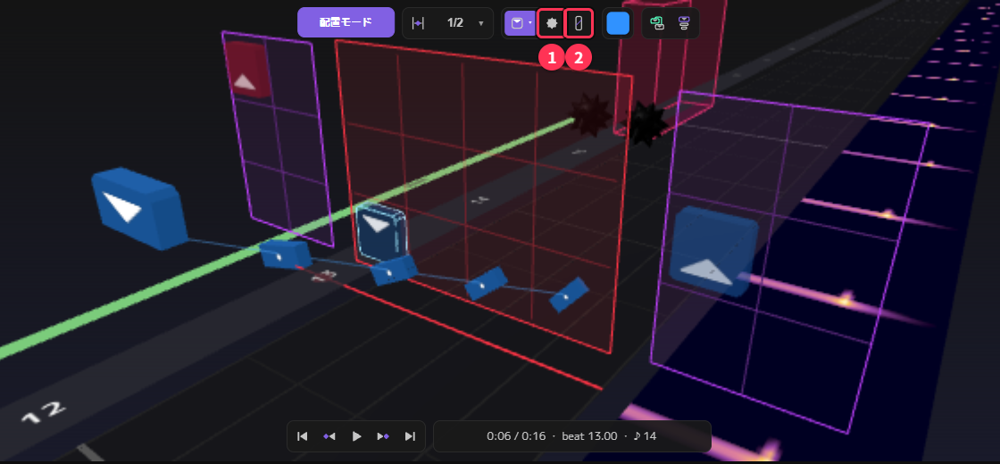

- **ボム**：ノーツと同じく、マスをクリックして置きます
- **壁**：クリックを 4 回して形を決めます
  1. 始まりのマスをクリック
  2. マウスを動かして横幅を決めてクリック
  3. 高さを決めてクリック
  4. 奥行き（長さ）を決めてクリック
  途中でやめるときは右クリックか Esc を押します

置いた後の壁の大きさは、カメラ固定モードで壁を選んで **S キー**を押すと変えられます。

---

## 6. ライティング

3D ビューの上にマウスを置いて **Tab キー**を押すと、**LIGHTING**（ライト編集）に切り替わります（①）。
ライトの種類ごとに 10 本のレーン（RING ZOOM、CENTER、L LASER など）が並んでいます。

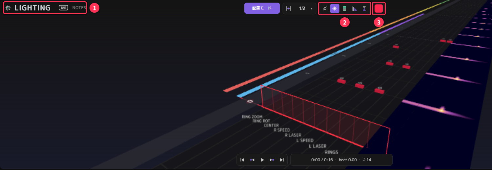

1. ②で動き（消灯 / 点灯 / フラッシュ / フェード / トランジション）を選びます
2. ③の色ボックスで色を選びます
3. ノーツと同じように、置きたい拍まで進めて、レーンを**左クリック**します（右クリックで消去）

置いたライトは、NLE の **Light 1** の段にクリップとしてまとまります。
もう一度 Tab キーを押すと NOTES に戻ります。

ライトは無くても譜面として遊べます。まずはノーツだけ作り、あとから足しても構いません。

---

## 7. プレビューで確認する

左上の枠の上にマウスを置いて **Tab キー**を押すと、**PREVIEW** に切り替わります（①）。
Beat Saber に近い見た目で、ノーツやライトを確認できます。

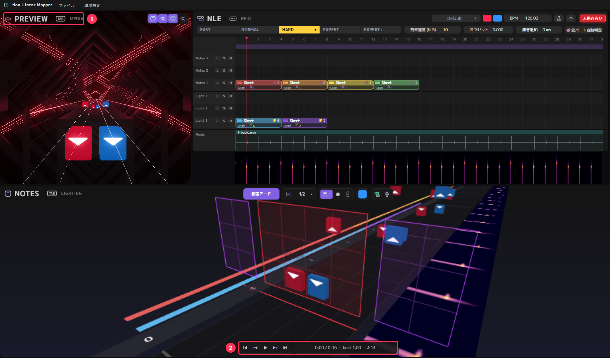

**Space**（または②の再生ボタン）で再生・停止します。
PREVIEW 右上のボタンで、ノーツ・ライト・ステージの表示を切り替えられます。
ステージ（背景）は NLE の右上にある「Default」の欄で選びます。

---

## 8. 曲の情報を入れて書き出す

NLE の上にマウスを置いて **Tab キー**を押すと、**INFO** 画面に切り替わります。
曲名や書き出し先はここで設定します。

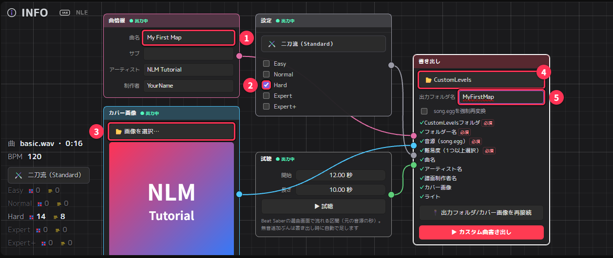

| 番号 | 場所 | 設定すること |
|---|---|---|
| ① | 曲情報 | 曲名・サブタイトル・アーティスト・制作者（あなたの名前）を入力します |
| ② | 設定 | **書き出す難易度にチェック**を入れます。**編集した難易度（この例では Hard）にチェックを入れ忘れると、その譜面は書き出されません** |
| ③ | カバー画像 | 選曲画面に出るジャケット画像を選びます（無くても書き出せます） |
| ④ | 書き出し | **出力フォルダを選択** で、Beat Saber の **CustomLevels フォルダ**を選びます |
| ⑤ | 出力フォルダ名 | CustomLevels の中に作るフォルダの名前です（半角英数字） |

CustomLevels フォルダは、Beat Saber をインストールしたフォルダの中の `Beat Saber_Data\CustomLevels` です。

「試聴」のノードは、選曲画面で流れる部分（開始位置と長さ、秒）の設定です。▶ 試聴 で確認できます。

各ノードの間の線は、どの設定を書き出しに使うかを表しています。最初から全部つながっているので、そのままで大丈夫です。

### 書き出す

書き出しノードのチェック一覧で、「必須」の項目すべてに ✓ が付いていれば準備完了です。
**▶ カスタム曲書き出し** を押します。

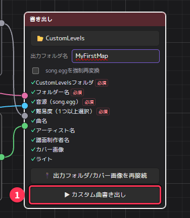

CustomLevels の中の⑤の名前のフォルダに、次のファイルが作られます。

- `Info.dat`（曲の情報）
- `HardStandard.dat` など（チェックした難易度ごとの譜面）
- `song.egg`（曲）
- カバー画像

Beat Saber を起動すると、カスタム曲の一覧に表示されます。

譜面を直したら、もう一度 **▶ カスタム曲書き出し** を押せば上書きされます。
曲を差し替えていなければ、2 回目からは曲の変換を省くので早く終わります。

---

## 9. プロジェクトを保存する

書き出したファイルは Beat Saber 用なので、後から編集を続けるには **プロジェクトファイル（`.nlmf`）** を保存しておきます。

**Ctrl + S**（または ファイル → 保存）で保存します。初めて保存するときは、保存先とファイル名を聞かれます。

保存していない変更があると、NLE 右上の **「未保存有り」** が赤く点灯します。

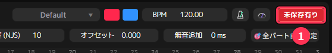

保存すると消灯します。

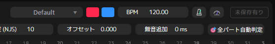

未保存のまま閉じたり、新規・開くを選んだりすると、「保存して終了（続行）／保存せずに終了（続行）／キャンセル」を選ぶ確認が出ます。

続きを編集するときは、**ファイル → 開く…**（Ctrl + O）で `.nlmf` を開きます。`.nlmf` をダブルクリックしても開けます。
曲・出力フォルダ・カバー画像は前回の場所から自動で読み込まれます。
ファイルを移動した場合は、INFO の書き出しノードにある「出力フォルダ/カバー画像を再接続」で選び直してください。

---

## 10. この先の機能

慣れてきたら、次の機能も使ってみてください。詳しくは原作の
[リファレンスマニュアル](https://helba.flashhub.net/nlm/manual/) にあります。

- **NLE でのクリップ編集**：クリップを移動・コピー・分割（C キー）・結合（Ctrl + G）して、サビのくり返しなどを効率よく作れます
- **アセット**：よく使う配置パターンのクリップを右クリック →「アセットへ保存」しておき、MEDIA から別の場所・別の曲へドラッグして使えます
- **難易度間のコピー**：選択中の難易度をもう一度クリックすると、ノーツやライトを別の難易度へ転送するメニューが出ます
- **MEDIA にフォルダを追加**：CustomLevels や音楽フォルダを登録すると、既存の曲を素材として NLE へドラッグできます
- **テンポパート**：曲の途中で BPM が変わる曲に対応します（NLE の「全パート自動判定」）
- **マーカー**：Ctrl + E で目印を置き、Ctrl + [ / ] で行き来できます
